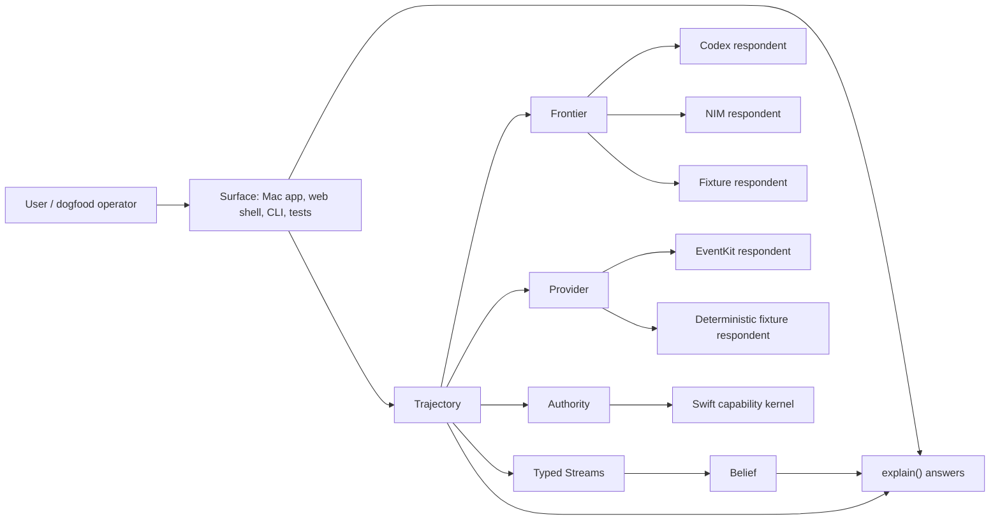

# P12-P17 Compression Architecture

Status: architecture working specification
Audience: systems architecture, product engineering, runtime engineering, ML engineering, frontend engineering
Scope: CalendarPilot after the P12 stage-1 audit; target architecture and migration discipline for P12.5 through P17

This document is not a cleanup plan. It is the architecture specification for compressing CalendarPilot into the smallest governed learning loop that preserves the humane product contract.

---

## 1. Executive Thesis

CalendarPilot is a small, legible, human-governed learning loop that:

```text
believes only what it can cite,
hands the user control of every belief,
acts only under revocable authority,
always undoes,
and earns autonomy only by beating its own incumbent on real behavior.
```

The architecture is six objects:

```text
Trajectory  Stream  Frontier  Authority  Belief  Provider
```

Everything else is one of three things:

```text
projection   a view over the six objects
adapter      an external respondent behind one object
method       behavior that belongs on one object but currently lives elsewhere
```

If a line cannot be explained as one of those three, it is exception management. It does not survive compression.

The controlled variable is **conceptual mass**: the number of things a designer or engineer must hold in their head to predict the system's next behavior. LOC is an output. It is measured, bounded, and reported with the constraint that prevents it from going lower. It is never the target.

The prior audit found **KEEP-B 36, CONSOLIDATE 12, DEFER 4, KEEP-I 2, DELETE 1, ARCHIVE 0**, with 18 humane clusters and zero humane deletions. Almost nothing is dead. The mass is mostly tax paid for missing objects, duplicated respondents, weakly named boundaries, and instruments that do not yet compute enough truth.

---

## 2. How To Use This Document

Use this as the architecture control document for any P12.5-P17 change.

Before proposing a change, answer four questions:

```text
1. Which of the six objects owns this behavior after compression?
2. Which current organ, script, or surface is being shadowed, migrated, contracted, or retired?
3. Which certificate proves safety, evidence quality, and reversibility?
4. Which humane wall is type-enforced, runtime-monitored, or process-gated after the change?
```

A change that cannot answer those questions is not ready for implementation.

A designer should be able to use this document to:

- draw the target component map,
- assign ownership to current code,
- define the contracts between objects,
- decide whether a behavior can be retired,
- identify which evidence must exist before a migration lands,
- reject a LOC-driven shortcut.

---

## 3. Quality Attribute Requirements

The compression architecture optimizes for these quality attributes, in this order.

| Attribute | Scenario | Architectural tactic | Evidence required |
|---|---|---|---|
| Safety | A model proposes an action that affects calendar state | Swift-issued `Authority` must gate the write; provider commit must verify or roll back | authority receipt, provider receipt, rollback handle, replay trace |
| Reversibility | A user revokes authority or undoes a write | `Trajectory.undo()` and `Provider.rollback()` must produce verified receipts | undo/revoke monitor, rollback verification, causal replay rows |
| Legibility | A user asks why the system believes or acted | `explain()` must cite trajectory rows and expose controls | answer contains claim, evidence row ids, confidence, controls, version |
| Evidence quality | A promotion or compression wave changes behavior | wave is graded against frozen instrument, baseline vector, ablation, variance | eight-field experiment record, `INSTRUMENT@sha`, `C-VAR` report |
| Observability | A live backend fails, times out, or rejects schema | respondent failure remains observable through `Frontier` or `Provider` failure modes | replay rows include respondent, failure mode, validation errors, health state |
| Evolvability | A duplicated stack is collapsed | shared protocol preserves all safety-relevant states of source stacks | contraction certificate and tombstone for dropped fields/behaviors |
| Privacy | Live payloads or secrets leave the process | typed redaction chokepoint is the only egress path | redaction tests, secret scans, replay/export inspection |
| Human control | A derived belief changes ranking or autonomy eligibility | `Belief` is cited, versioned, user-controllable, and non-authorizing | belief evidence, activation/correction history, no Authority input path |

Non-goals:

```text
not a LOC quota
not a UI rewrite spec
not a permission to delete monitors
not a promise that 3,000 LOC is reachable
not a replacement for per-wave evidence artifacts
```

---

## 4. Current Architectural Constraints

### 4.1 System State

The architecture starts from the post-P12 tree.

Landed state:

```text
legacy_state removed from served JS
app.js and frontend_state.sample.json deleted
runtime envelopes are v2/r1-only
sim_v2.1 is the default simulator
notification_fatigue runtime residue removed
session.py decomposed 2222 -> 1316 lines, by extraction rather than deletion
```

Current source mass by organ:

```text
frontend       3,923
diffusiongemma 2,727
codex          2,161
environment    1,689
top-level      1,656  (types 733 + replay 514)
providers        962
swift_bridge     832
```

Largest masses are product commitments, not dead code:

```text
codex/live.py              live Codex path
diffusiongemma/live.py     live NIM policy path
frontend session organism  local dogfood state and projection
40 scripts                 lab, release, measurement, and promotion operations
```

Each maps to a missing or incomplete object in the target architecture.

### 4.2 Release Instrument Gap

`make p12-release` currently certifies the deterministic reachable set only. It runs:

```text
check_invariants
signal_estimators
measurement
calibration
provider_capability
reward_heads
curriculum
policy_ablation
secret_scan
```

It does not run:

```text
live-codex-e2e
live-diffusiongemma-e2e
live-eventkit-e2e
swift-ipc-test
browser-e2e
```

Therefore, a green `p12-release` cannot be the safety spine for deleting or contracting live-reachable behavior. P12.5 must either run each live leg or root-list it as an explicit signed exception.

### 4.3 Placeholder Gate Gap

Three release legs do not currently compute enough truth:

```text
reward_heads       reward_purity_violations is a constant 0; decision is constant pass
policy_ablation    every ablation returns promotion_decision pass without replay re-grade
calibration        decision hold exits 0 and is counted as ok by the release harness
```

No P13-P17 "no regression" claim is trustworthy until these legs can fail.

---

## 5. Target Architecture

### 5.1 Object Map

| Object | Owns | Load-bearing messages | Structural wall |
|---|---|---|---|
| `Trajectory` | durable substrate: observations, candidate futures, action envelopes, replay records, scorecards, rollback evidence | `observe`, `propose`, `stage`, `commit`, `verify`, `undo`, `reward`, `project`, `reduce` | every truth is a cited row; undo is a method, not an add-on |
| `Stream` | `Action`, `World`, `Biography`, `Derived` as typed streams with behavior | `Action.reward_reduce()` exists; `Biography.reward_reduce()` does not | reward can only reduce from ActionStream |
| `Frontier` | typed candidate futures from model or fixture respondents | `generate(observation) -> list[Candidate]` with provenance, variance, failure mode, cost, latency | Codex, NIM, and fixture are respondents to one protocol |
| `Authority` | Swift-issued, revocable capability | `grant`, `exercise`, `revoke`, `receipt`, `explain` | signals and beliefs cannot gate authority because no message accepts them |
| `Belief` | evidence-owned derived signal | `value`, `evidence`, `confidence`, `half_life`, `activate`, `disable`, `correct`, `explain`, `version` | uncited scalar beliefs are unconstructible |
| `Provider` | transaction truth at the calendar boundary | `read_observation`, `preview`, `commit`, `verify`, `rollback` | a provider that cannot honor the transaction contract is absent, not stubbed |

### 5.2 Runtime Shape



The surface is intentionally outside the honesty boundary. It renders `explain()` answers; it does not own truth.

### 5.3 Organ-To-Object Migration Map

| Current organ | Target home | Migration action |
|---|---|---|
| `frontend/session.py` and session controllers | `Trajectory.project()` plus surface adapters | make hidden session truth unrepresentable; replace with projections |
| `codex/live.py` | `Frontier` respondent | keep model, delete duplicated stack semantics |
| `diffusiongemma/live.py` | `Frontier` respondent and policy reducer | keep live policy path, normalize provenance/failure modes |
| `environment/action_lifecycle.py` | `Trajectory` + `Provider` + `Authority` | collapse action lifecycle into durable trajectory methods and provider truth |
| `types.py` / `replay.py` | `Trajectory`, `Stream`, `Belief` schemas | split concepts into object-owned contracts |
| `providers/*` | `Provider` respondents | remove non-executable stubs; retain deterministic and EventKit respondents |
| `swift_bridge/*` | `Authority` and `Provider` adapters | keep as capability boundary, not product state |
| release/lab scripts | methods on objects plus thin CLI | freeze instrument first; refactor scripts as a graded wave |

---

## 6. Boundary Contracts

### 6.1 Explanation Contract

Every belief-bearing or decision-bearing object answers:

```text
explain(question) -> Answer{
  claim,
  evidence: [trajectory row ids],
  confidence,
  controls: [activate, disable, correct, revoke, undo],
  version
}
```

Required respondents:

```text
Belief.explain       why this derived signal exists and how to correct it
Authority.explain    why a grant, denial, or revocation occurred
Candidate.explain    why this future was generated and ranked
Provider.explain     what external state was read, written, verified, or rolled back
Trajectory.explain   causal chain for a trace, receipt, reward, or rollback
```

Architecture rule: `explain` ships before frontend replacement. The renderer can be replaced only after honesty lives in the objects.

### 6.2 Authority Contract

Authority is a revocable capability. It accepts no signal and no belief input.

```text
grant(scope, tier, expiry, provenance) -> AuthorityGrant
exercise(grant, operation) -> Receipt | DenialReceipt
revoke(grant) -> RevocationReceipt
receipt(id) -> Receipt
explain(denial_or_grant) -> Answer
```

Architecture rule: no derived signal, profile label, model score, or UI field may directly grant authority. They may explain a recommendation; they may not authorize a write.

### 6.3 Provider Contract

A provider is truthful only if it can execute the five-method transaction:

```text
read_observation() -> RawCalendarObservation
preview(candidate) -> ProviderPreview
commit(candidate, authority_receipt) -> ProviderReceipt
verify(provider_receipt) -> VerificationReceipt
rollback(rollback_handle) -> RollbackReceipt
```

Architecture rule: Google/Microsoft placeholders are absent respondents until they can execute this contract. A stub that looks like a provider is worse than no provider because it creates false architectural reachability.

### 6.4 Frontier Contract

`Frontier` hides implementation duplication but preserves observable model differences.

```text
generate(observation) -> Candidate{
  action_program,
  provenance,
  failure_mode,
  variance,
  cost,
  latency,
  validation_errors,
  respondent
}
```

Architecture rule: collapsing Codex, NIM, and fixture paths is valid only if the merged frontier preserves distinct safety observables, including schema rejection, health failure, timeout, fallback, and validation error states.

### 6.5 Belief Contract

A belief is a governed derived signal:

```text
Belief{
  name,
  value,
  evidence_row_ids,
  confidence,
  half_life,
  estimator_version,
  active_state,
  user_control_history
}
```

Architecture rule: uncited scalar state is illegal. `notification_fatigue` cannot return as a naked profile field. `interruption_tolerance_v1` survives only as a cited, versioned, user-controllable belief.

---

## 7. Invariant Model

The humane walls are enforced three ways.

### 7.1 Type-Enforced Walls

These should become unconstructible to violate:

```text
B1  Belief requires at least one evidence row
B2  Authority accepts no Signal or Belief input
B3  label activation requires user attribution
B4  reward_reduce exists only on Action stream
R1  egress accepts only redacted outbound types
```

### 7.2 Runtime Monitors

These remain runtime monitors because they are liveness or statistical properties:

```text
reward-leakage monitor       scans consumed rows for non-ActionStream provenance
biography-drift monitor      emits conflicts instead of silently overwriting biography
undo/revoke-effectiveness    verifies revoke and rollback effects over time
calibration monitor          tracks estimator calibration and sim-vs-real gaps
```

Architecture rule: these monitors are root-listed and exempt from harvest. Removing one is a behavior-changing promotion that must beat CURRENT on detectability.

### 7.3 Process-Gated Discipline

These are enforced by release and promotion discipline:

```text
stream separation stays visible
replay rows and causal chains stay legible
promotion beats CURRENT beyond noise
promotion survives no_semantic_labels ablation
cold-start holds require real matched examples and explicit feedback
```

---

## 8. Change Discipline

### 8.1 Compression Is A Promotion

Granting autonomy and removing behavior are the same architectural act: both change what the system can do.

```text
                     autonomy promotion            compression wave
incumbent            CURRENT policy                CURRENT behavior set
write                grant action family           delete / merge / migrate behavior
evidence             replay-backed calibrated      dual-run equivalence + variance + rows
reversibility        revocable grant               tombstone + rollback commit
failure mode         social creep                  placebo gate / deterministic illusion
exogenous wait       real feedback volume          equivalence window
```

A behavior-touching compression wave is a promotion of a smaller system. It either beats or ties the incumbent under the certificates below, or it does not land.

### 8.2 Eight-Field Experiment Record

Every wave must produce:

```text
delta        exact LOC spans and cluster ids removed, merged, or migrated
fixed        INSTRUMENT@sha proving the ruler did not move
rows         replay line ids trained, graded, or compared before and after
baseline     pre-wave metric vector
effect       delta metric / seed-resample stddev
regressed    named metric that got worse, even if acceptable
ablation     removed code stubbed or disabled; decision remains stable
rollback     revert SHA and proof baseline vector is restored
```

No prose-only promotion is accepted.

### 8.3 Migration Barrier

For every organ migration, old (`O`) and kernel (`K`) coexist under:

```text
pi_auth(K(o)) = pi_auth(O(o))
pi_reward(K(o)) = pi_reward(O(o))
provenance(K(o)) contains at least provenance(O(o))
```

Presentation, latency, and phrasing may differ. Authority, reward source, and cited evidence may not.

Intermediate invariant:

```text
exactly one of {K, O} holds authority at every coexistence state
```

### 8.4 Contraction Certificates

| Certificate | Applies to | Pass condition |
|---|---|---|
| `B_frontier` | Codex, NIM, fixture frontier collapse | merged frontier preserves safety observable set: provenance, failure mode, variance, cost, latency, validation errors |
| `B_schema` | r0/r1/v1/v2 collapse | total migration on authority, reward-source, provenance, rollback state; loss annotated; impossible rows become denial receipts |
| `B_runtime` | runtime mode collapse | one runtime with injected live backends that are exercised or root-listed |
| `C-VAR` | reducer/promotion-sensitive changes | promotion variance and borderline flip rate do not increase beyond preregistered epsilon |
| `C-B6` | estimator changes | synthetic and real calibration reports emitted at same estimator version; gaps do not widen |

---

## 9. Phase Architecture

### 9.1 Phase Summary

| Phase | Purpose | Irreversible step | Exit evidence |
|---|---|---|---|
| P12.5 | fix the instrument, install monitors, ship `Belief` and `explain` | none; this phase may add LOC | release gate can fail truthfully; live legs run or are root-listed; no destructive verdict lands |
| P13 | build kernel behind freeze and migrate organs | authority handoff per organ | `B_migrate` held through overlap; frontend hidden truth made unrepresentable |
| P16 | verified contractions | duplicated implementation replaced by object protocol | `B_frontier`, `B_schema`, `B_runtime`, `C-VAR` pass |
| P17 | emergent-floor harvest | behavior/support structure retired | next removal fails a certificate; floor reported with binding constraint |

### 9.2 P12.5: Instrument And Missing Object

Required work:

```text
de-placebo reward_heads, policy_ablation, calibration
run-or-root-list live Codex, live NIM, live EventKit, Swift IPC, browser E2E
pin INSTRUMENT@sha
record known-red data-quality flags at pin time
ship Belief
ship explain()
root-list runtime monitors
```

Exit criteria:

```text
gate can fail for real reasons
calibration hold is explicit, not silently passing
reward purity scans consumed rows
policy ablation re-grades instead of returning constants
explain answers cite trajectory rows
no destructive compression has landed
```

### 9.3 P13: Kernel Behind Freeze

Migration order follows observability:

```text
frontend -> codex -> diffusiongemma -> providers -> swift_bridge
```

Frontend rule:

```text
view_state = project(trajectory)
```

`DogfoodSessionState`, static snapshots, and hidden frontend truth retire only after their truth is projectable from trajectory. The shell is replaceable; the honesty is not.

Preserved user-facing capabilities:

```text
feedback capture as ActionStream rows
label activate / disable / correct
biography-drift visibility
authority tier, scope, grant, denial explanations
replay export and causal trace
runtime blocker visibility
dogfood and cold-start evidence capture
undo and rollback visibility
```

### 9.4 P16: Verified Contractions

Contractions are missing polymorphisms, not product amputations:

```text
two live model paths -> one Frontier, both respondents kept
seven runtime modes -> one runtime with injected, exercised backends
old replay schemas -> one runtime schema after total migration
provider stubs -> absent respondents until executable
40 scripts -> object methods + thin CLI, after instrument pin
```

### 9.5 P17: Emergent Floor

P17 removes structure that only supported discarded variation. It is not mechanical harvest.

Stop when the next removal would delete:

```text
a runtime monitor,
a calibration harness,
Belief evidence/control behavior,
Authority revocation or denial truth,
Provider rollback verification,
Trajectory causal legibility,
or a Program A evidence-capture path.
```

---

## 10. LOC Trajectory

Safe migration is a sawtooth because old and new coexist before retirement.

| Point | Expected `/src` LOC | Binding constraint |
|---|---:|---|
| start | ~13,950 | current post-P12 source |
| after P12.5 | ~14,300-14,700 | instrument, monitors, `Belief`, `explain` |
| P13 peak | ~15,500-16,500 | kernel plus organ overlap under `B_migrate` |
| after P13 retire | ~8,500-11,000 | hidden frontend/session truth made unrepresentable |
| after P16 contractions | ~5,000-7,500 | `Frontier`, runtime, schema contractions discharged |
| after P17 | > 3,000, reported | monitors, calibration, `Belief`, rollback, and traceability remain |

The 3,000-line question is answered only in this form:

```text
We reached N LOC.
The next M LOC would delete X.
X is protected by certificate or monitor Y.
Therefore the floor is N, bound by Y.
```

Any claim of "3,000-line architecture" that does not name the detectability, calibration, or rollback capability it deletes is not an architecture claim. It is a budget.

---

## 11. Decision Register

| ID | Decision | Architectural resolution |
|---|---|---|
| D-00 | Target of the program | conceptual mass; LOC is reported output |
| D-01 | Release gate reach | P12.5 must extend `p12-release` to run-or-root-list live legs |
| D-02 | Frontend replacement | hidden truth made unrepresentable before shell replacement |
| D-03 | Humane controls | mandatory as object messages and `explain` controls |
| D-04 | Live Codex | kept as `Frontier` respondent |
| D-05 | Live NIM | kept as `Frontier` respondent |
| D-06 | Runtime modes | collapse to one runtime plus injected, exercised backends |
| D-07 | EventKit | kept as real `Provider` respondent |
| D-08 | Replay schemas | total migration plus denial receipts before old runtime support is removed |
| D-09 | Provider-backed self-play | statistical core stays; cosmetic lab surface may relocate |
| D-10 | Google/Microsoft stubs | removed as absent respondents until transaction contract is real |
| D-11 | Mac app packaging | packaging can relocate; EventKit provider path stays |
| D-12 | Explanatory fields | fields survive only where `explain` or `Belief.evidence` needs them |
| D-13 | Tests and packages | tests die only with their feature; they do not count toward LOC target |
| D-14 | Product break from P12 | only proven change ships; every wave beats or ties CURRENT |

---

## 12. Program A Protection

The `create_prep_block` autonomy runway is resolved by real time and real behavior:

```text
>= 20 matched examples
>= 10 explicit feedback examples
calibration gaps inside preregistered bands
```

Compression may run during that wait, but it may not reset the runway.

Every wave must count before and after:

```text
matched examples
explicit feedback rows
signal-capture paths
feedback row types
calibration row coverage
```

Any decrease is an unsafe transition unless explicitly explained and accepted as a Program A reset.

---

## 13. Architecture Designer Checklist

Use this checklist for every proposed wave.

### Ownership

```text
[ ] Behavior has a named target object.
[ ] Current organ and target object are both identified.
[ ] Adapter/projection/method classification is clear.
[ ] No hidden state remains outside Trajectory without an owner.
```

### Safety

```text
[ ] Authority projection is equivalent or narrower.
[ ] Reward projection is equivalent and ActionStream-only.
[ ] Provenance is preserved or expanded.
[ ] Rollback or tombstone path exists.
[ ] Live legs are run or root-listed.
```

### Evidence

```text
[ ] INSTRUMENT@sha is pinned before the wave.
[ ] Baseline vector is recorded before change.
[ ] Effect is reported against variance, not sign alone.
[ ] Borderline promote/hold flip rate is measured.
[ ] Any regressed metric is named.
[ ] Ablation is real, not a constant report.
```

### Humane Walls

```text
[ ] Beliefs remain cited and user-controllable.
[ ] Authority remains independent of signals and labels.
[ ] Undo/revoke effectiveness remains monitored.
[ ] Biography drift remains visible.
[ ] Calibration remains active.
[ ] Redaction egress remains typed and centralized.
```

### Documentation

```text
[ ] Decision register entry updated if product commitment changes.
[ ] Binding LOC constraint updated if floor changes.
[ ] Retired behavior has tombstone/archive reference.
[ ] Release/run evidence paths are recorded.
```

---

## 14. Open Risks And Design Work

| Risk | Why it matters | Required design answer |
|---|---|---|
| `p12-release` remains deterministic-only | live behavior can be deleted behind green fixtures | run-or-root-list live legs in P12.5 |
| placeholder gates remain pass-by-construction | regressions can be laundered as green | make reward, ablation, and calibration gates compute |
| `Belief` is under-specified in code | derived signals can return as uncited scalars | implement constructor and explain protocol |
| frontend projection is incomplete | hidden UI/session truth can survive replacement | make `view_state = project(trajectory)` complete |
| frontier collapse may erase model-specific failures | lab can measure a fiction | preserve failure_mode/cost/latency/variance |
| schema collapse can thin evidence | old rows can disappear silently | total migration or denial receipts |
| script-to-method refactor can move the ruler | lab reports can improve because instruments changed | freeze instrument and prove bit-identical reports |
| Program A evidence path can reset | autonomy runway loses calendar-time progress | count matched examples and feedback before/after every wave |

---

## 15. Build Sequence

```text
1. P12.5 first.
   Fix the instrument, close live-leg reachability, install monitors,
   ship Belief and explain. LOC rises.

2. Route every wave through the promotion harness.
   Eight-field record, baseline vector, ablation, C-VAR, rollback.

3. Build the six-object kernel behind the freeze.
   Shadow, dual-run, prove B_migrate, hand off authority, retire with tombstones.

4. Contract duplicated architecture under certificates.
   Frontier, runtime, schema, provider respondents, scripts.

5. Harvest to the emergent floor.
   Stop at the first protected monitor, calibration, rollback, evidence,
   or traceability constraint. Report the binding constraint.
```

---

## 16. Summary

CalendarPilot compresses by reifying six objects and making everything else project, adapt, or move home. The safety walls move into type signatures where possible; the statistical and liveness walls remain runtime monitors; the promotion discipline governs every behavior-changing write.

The next correct action is not to delete code. It is to make the ruler truthful, ship the missing `Belief` and `explain` object contract, build the kernel behind the freeze, and migrate organs through equivalence. The line count then falls as a consequence of architecture. The floor is wherever the next deletion would blind the system, weaken reversibility, thin evidence, or increase promotion noise.
