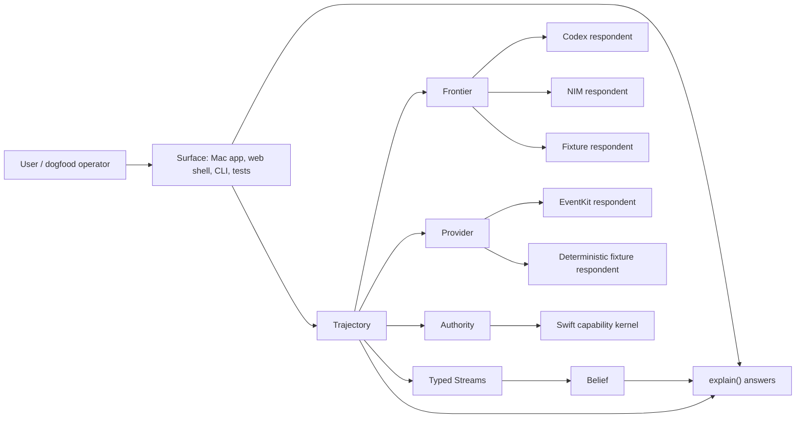

# CalendarPilot Compression Architecture (Step E → P17)

Status: living architecture specification — the single forward document
Audience: systems architecture, product engineering, runtime engineering, ML engineering, frontend engineering
Scope: CalendarPilot after P12; target architecture and migration discipline from Step E through P17
Position: Step E is complete and P12 is closed (run `20260706T220150Z-step-e-complete`); the active phase is P13
Provenance: every P12-era claim here is evidenced in the frozen [P12 Record](P12-RECORD.md) — run ids, SHAs, verdicts, blocker resolutions. This document cites the Record; it does not restate it. The code's current-truth docs live in `calendar-pilot-p12/docs/`.

This document is not a cleanup plan. It is the architecture specification for compressing CalendarPilot into the smallest governed learning loop that preserves the humane product contract.

---

## 1. Executive Thesis

CalendarPilot is a small, legible, human-governed learning loop that:

```text
believes only what it can cite,
hands the user control of every belief,
acts only under revocable authority,
always undoes,
and earns autonomy only by beating its own incumbent on real behavior.
```

The architecture is six objects:

```text
Trajectory  Stream  Frontier  Authority  Belief  Provider
```

Everything else is one of three things:

```text
projection   a view over the six objects
adapter      an external respondent behind one object
method       behavior that belongs on one object but currently lives elsewhere
```

If a line cannot be explained as one of those three, it is exception management. It does not survive compression.

The controlled variable is **conceptual mass**: the number of things a designer or engineer must hold in their head to predict the system's next behavior. LOC is an output. It is measured, bounded, and reported with the constraint that prevents it from going lower. It is never the target.

The stage-1 audit verdicted the whole tree in flow-clusters and found almost nothing dead — the verdict distribution, its coverage legs, and its load-bearing outcomes live in the [P12 Record §4.8](P12-RECORD.md). The mass is mostly tax paid for missing objects, duplicated respondents, weakly named boundaries, and — before Step E — instruments that did not compute enough truth.

---

## 2. How To Use This Document

Use this as the architecture control document for any change from here through P17.

Before proposing a change, answer four questions:

```text
1. Which of the six objects owns this behavior after compression?
2. Which current organ, script, or surface is being shadowed, migrated, contracted, or retired?
3. Which certificate proves safety, evidence quality, and reversibility?
4. Which humane wall is type-enforced, runtime-monitored, or process-gated after the change?
```

A change that cannot answer those questions is not ready for implementation.

A designer should be able to use this document to:

- draw the target component map,
- assign ownership to current code,
- define the contracts between objects,
- decide whether a behavior can be retired,
- identify which evidence must exist before a migration lands,
- reject a LOC-driven shortcut.

---

## 3. Quality Attribute Requirements

The compression architecture optimizes for these quality attributes, in this order.

| Attribute | Scenario | Architectural tactic | Evidence required |
|---|---|---|---|
| Safety | A model proposes an action that affects calendar state | Swift-issued `Authority` must gate the write; provider commit must verify or roll back | authority receipt, provider receipt, rollback handle, replay trace |
| Reversibility | A user revokes authority or undoes a write | `Trajectory.undo()` and `Provider.rollback()` must produce verified receipts | undo/revoke monitor, rollback verification, causal replay rows |
| Legibility | A user asks why the system believes or acted | `explain()` must cite trajectory rows and expose controls | answer contains claim, evidence row ids, confidence, controls, version |
| Evidence quality | A promotion or compression wave changes behavior | wave is graded against frozen instrument, baseline vector, ablation, variance | eight-field experiment record, `INSTRUMENT@sha`, `C-VAR` report |
| Observability | A live backend fails, times out, or rejects schema | respondent failure remains observable through `Frontier` or `Provider` failure modes | replay rows include respondent, failure mode, validation errors, health state |
| Evolvability | A duplicated stack is collapsed | shared protocol preserves all safety-relevant states of source stacks | contraction certificate and tombstone for dropped fields/behaviors |
| Privacy | Live payloads or secrets leave the process | typed redaction chokepoint is the only egress path | redaction tests, secret scans, replay/export inspection |
| Human control | A derived belief changes ranking or autonomy eligibility | `Belief` is cited, versioned, user-controllable, and non-authorizing | belief evidence, activation/correction history, no Authority input path |

Non-goals:

```text
not a LOC quota
not a UI rewrite spec
not a permission to delete monitors
not a promise that 3,000 LOC is reachable
not a replacement for per-wave evidence artifacts
```

---

## 4. Current Architectural Constraints

### 4.1 System State

The architecture starts from the post-P12 tree. What P12 and its Stage D waves landed — the legacy-state weaning, the static/schema/simulator retirements, the session decomposition, the proven EventKit runway — is recorded with per-wave run evidence in the [P12 Record §5](P12-RECORD.md).

Source mass by organ, measured at the C₁ audit (pre-Step E; Step E deliberately added instrument and object-contract code — [Record §6](P12-RECORD.md)). Re-measure at the P13 baseline freeze:

```text
frontend       3,923
diffusiongemma 2,727
codex          2,161
environment    1,689
top-level      1,656  (types 733 + replay 514)
providers        962
swift_bridge     832
```

Largest masses are product commitments, not dead code:

```text
codex/live.py              live Codex path
diffusiongemma/live.py     live NIM policy path
frontend session organism  local dogfood state and projection
40 scripts                 lab, release, measurement, and promotion operations
```

Each maps to a missing or incomplete object in the target architecture.

### 4.2 Release Instrument (Step E outcome — now a standing rule)

At the C₁ audit, `make p12-release` certified the deterministic reachable set only, with the live legs (live Codex, live NIM, live EventKit, Swift IPC, browser E2E, dogfood release) running beside it. Step E closed that gap and finished green with every live leg run or root-listed ([P12 Record §6](P12-RECORD.md)); the gate now also carries the `cvar` and `b_migrate` legs.

Standing rule: a green `p12-release` is the safety spine for deleting or contracting live-reachable behavior only together with the live legs. Every wave that touches live-reachable behavior reruns the affected live legs or carries a signed root-list entry — leg, reason, last passing artifact, owner, next unblock action, accepted-until — in its evidence bundle. A skipped live leg with no root-list entry is a failed instrument gate.

### 4.3 Placebo Gates (resolved by Step E — now a standing rule)

Three release legs were placebo at the C₁ audit — `reward_heads`, `policy_ablation`, and `calibration`; the pre-fix failure modes and the fix evidence are in the [P12 Record §6](P12-RECORD.md). They now compute truth: reward purity scans consumed rows and fails on planted non-ActionStream evidence, ablations re-grade against named frontier/scorecard inputs, and calibration distinguishes pass from insufficient-data hold at release level.

Standing rule: these three legs plus `cvar` and `b_migrate` are protected instrument surfaces. They may be thin only if they say they are thin; a green report with no consumed evidence is not a pass; and any change to them is itself a behavior-changing promotion. No P13-P17 "no regression" claim is trustworthy on a gate that cannot fail.

### 4.4 Canonical Execution Root

There are two roots in this workspace and confusing them has already produced false or
irrelevant test runs:

```text
git/workspace root   Destination/
active app root      Destination/calendar-pilot-p12/
```

Until P13.0 repairs the workspace-level delegate and installs CI at the actual git
root, **every command in this document runs from the active app root**. The
workspace-level `Makefile` is not an accepted access point: it still names the retired
`calendar-pilot-system-framework` snapshot.

Canonical preflight:

```bash
GIT_ROOT="$(git rev-parse --show-toplevel)"
APP_ROOT="$GIT_ROOT/calendar-pilot-p12"
cd "$APP_ROOT"

test "$(pwd -P)" = "$(cd "$APP_ROOT" && pwd -P)"
test -f Makefile
test -d src/calendar_pilot

git -C "$GIT_ROOT" rev-parse HEAD
git -C "$GIT_ROOT" rev-parse HEAD:calendar-pilot-p12
```

Every evidence bundle records both the repository commit and the active-app subtree
hash. A command run from another directory is non-evidence unless its record names the
working directory and proves it reached this same subtree.

### 4.5 Historical Test Lineage And Supersession

The trace covered every archived Markdown file with an explicit `test`, `tests`, or
`testing` reference: 85 of 161 files, representing 60 distinct file contents after
exact snapshot duplicates are collapsed. Most snapshot READMEs and pass notes repeat
one of the canonical sources below. They remain provenance, not executable
instructions. This table is the carried-forward test doctrine; the current commands
in §4.6 supersede all archived command blocks.

| Historical source | Durable rule carried forward | Current home |
|---|---|---|
| Plan 6–9 test matrices | test static walls, compression equivalence, sensor/monitor preservation, controller safety, and process discipline separately | §4.7, §7, contraction certificates |
| `DOGFOODING_FRAMEWORK.md` and `dogfooding.md` | prove process/port ownership, runtime identity, app bundle behavior, occupied-port handling, artifact validation, and secret safety | `make dogfood-release`, §4.8 |
| `ML-E2E.md` | run the deterministic ladder before live legs; test the closed trajectory, not a plausible model response | `make ml-ladder` as smoke only; §4.6–§4.7 |
| `ML-testing.md` | use a unique run directory; test restart/restore, API + rendered browser, contract vectors, Swift IPC, and provider sandbox boundaries | §4.7–§4.9 |
| `P11-test.md` | the trajectory is the test object; release proof is distinct from policy/autonomy promotion | §7–§8 |
| `P12-test.md` | preserve P11, then test streams, reward purity, estimators, calibration, labels, curricula, provider capabilities, and frontend/replay consistency | `make p12-release`, §4.6–§4.7 |
| `P12-next.md` / Step E | pin the instrument; run or root-list every live leg; use the active app root; prove the user-visible app access point for OS permissions | §4.4, §4.8–§4.9 |
| P12 close evidence | a parallel Python/Swift baseline caused a Python timeout; the isolated rerun passed | run deterministic baselines sequentially on this machine |

Git history shows the executable surface accumulating in this order: Python/Swift;
browser/app; Swift IPC and live Codex/NIM/EventKit; deterministic ML ladder,
invariants, and evidence; contract vectors and lab cells; P11 trajectory/variance
checks; then the P12 instrument and wave wrappers. That lineage explains old target
names, but does not make them aliases: the active-app `Makefile` and scripts are the
only command authority now.

Explicit supersessions:

```text
make variance-probe          -> make cvar-report (bootstrap until P13.0; §8.5)
make lab-validate-scenarios  -> curriculum validation inside make p12-release
make loc-report              -> no current target; use the tracked /src count below until P13.0 installs a versioned reporter
archived root Makefiles      -> active app Makefile only
archived p11/p12 test docs   -> this matrix + current scripts
```

### 4.6 Current Executable Gate Map

The command name alone is never the claim. Use the scope and report below.

| Access point | What it currently proves | What it does **not** prove |
|---|---|---|
| `make py-test` | all Python unit/integration tests under `tests/` | Swift, rendered browser, app bundle, live backends |
| `make swift-test` | Swift package tests | Python-to-Swift IPC process behavior |
| `make swift-ipc-test` | Python client ↔ built Swift kernel-server behavior | EventKit mutation |
| `make check-invariants` | invariant scan on the golden replay fixture | the replay produced by the current wave unless passed explicitly |
| `make contract-vectors` | shared contract vectors through Python/Swift paths | frontend or live-model behavior |
| `make frontier-diff` | fixture policy comparison against current tuning | live-model variance or a full promotion decision |
| `make scorecard` | fixture replay/frontier summary and invariant count | a wave release or policy promotion by itself |
| `make ml-ladder` | Python + golden invariants + fixture frontier diff + scorecard | Swift, browser, app, live legs, P12 instruments |
| `make evidence-bundle` | current frontend snapshot, golden-replay invariant report, secret scan | unique wave identity, app/browser/live reach, or before/after evidence |
| `make lab-validate-seeds` | seed-corpus schema/content validation | a completed experiment |
| `make lab-run SEED=… RUNTIME=…` | one explicitly selected lab cell | comparison or promotion |
| `make lab-compare` | reindexes completed lab runs and writes the latest comparison | a release decision |
| `make lab-promote BATCH=…` | evaluates promotion gates and, on pass, updates promoted policy state | a test; this is a state-changing promotion action and runs only after wave/release proof |
| `make browser-e2e` | owned fixture server, API loop, restart/restore, rendered browser controls, screenshot, replay export | app-bundle identity or live backends |
| `make mac-app-build` | app and bundled Swift executables build | launch ownership or functional dogfood |
| `make dogfood-release` | Python, Swift, Swift IPC, fixture browser, app build/sanity, LaunchServices, occupied-port behavior, artifact checks, secret scans; optional EventKit sub-gate | live Codex or live NIM inference unless run separately |
| `make live-codex-e2e` | Codex subscription-auth preflight, live planner reach, runtime provenance, replay, secret safety | NIM or EventKit |
| `make live-diffusiongemma-e2e` | live NIM health, frontier generation, provenance, replay, secret safety | Codex or provider mutation |
| `make replay-offline-tuning-loop` | healthy live NIM self-play → replay → reduction → a second tuned live frontier with measurable effect | human-feedback calibration or policy promotion |
| `PYTHONPATH=src python3 scripts/run_live_nim_schema_gate.py` | records the declared NIM schema-drift, normalization, and unsafe-rejection contract; strict mode also requires credential presence | remote health, an actual model call, or parser execution; there is currently no Make target |
| `make live-eventkit-e2e` | EventKit health; mutation only when explicitly required | app access merely because a CLI binary ran; use §4.9 |
| `make p12-signals`, `p12-measurement`, `p12-calibration`, `p12-provider-capabilities` | one named deterministic P12 instrument leg for focused iteration | the complete P12 or wave decision |
| `make p12-release` | deterministic P12 instruments: invariants, streams, frontier/scorecard, measurement, calibration, provider capabilities, reward heads, curriculum, ablations, Belief/explain, C-VAR bootstrap, `B_migrate` bootstrap, secret scan | browser, app bundle, Swift IPC, live Codex/NIM/EventKit; those are separate run-or-root-list legs |
| `make cvar-report` | frozen-seed deterministic self-consistency with the current default invocation | pre-wave versus post-wave code equivalence until P13.0 |
| `make b-migrate` | current session snapshot ↔ current projector mapping | independent old-organ versus new-kernel equivalence until P13.0 |
| `make wave-harness` | invokes C-VAR bootstrap, `B_migrate` bootstrap, and P12 release | a promotable compression certificate until §8.5 is complete |

The interim canonical source-LOC access point counts tracked Python lines under
`calendar-pilot-p12/src/`, matching the `/src` trajectory in §10:

```bash
git -C "$GIT_ROOT" ls-files -z 'calendar-pilot-p12/src/**/*.py' |
  xargs -0 wc -l
```

It is a scalar inventory, not a conceptual-mass metric or per-wave delta report.
P13.0 must replace it with a versioned JSON reporter that freezes the file list,
per-file counts, total, exclusions, commit, app subtree, and before/after delta.

Two shortcuts are especially dangerous:

```text
make test       = Python + Swift only
make ml-ladder  = deterministic ML smoke only
```

Neither is a release or compression-wave gate. Also, the current report-producing
scripts distinguish `pass`/`hold` in JSON while some return shell success for `hold`.
Until P13.0 changes that behavior, every invocation must assert the report decision,
not merely `$?`:

```bash
make p12-release
jq -e '.decision == "pass" and .ok == true' runs/p12_release/p12_release_report.json

make cvar-report
jq -e '.decision == "pass"' runs/cvar_report.json

make b-migrate
jq -e '.decision == "pass"' runs/b_migrate_report.json
```

### 4.7 Change-To-Gate Matrix

Run the common baseline first, then the rows for every touched surface. The union—not
the cheapest matching row—is the required set.

Common baseline for any behavior-bearing code change:

```bash
make py-test
make check-invariants
make p12-release
jq -e '.decision == "pass" and .ok == true' runs/p12_release/p12_release_report.json
```

Focused suites shorten iteration but never replace the common baseline or a final
`make py-test`. Use these current module groups instead of inventing a phase-era target:

```bash
# contracts, replay, and streams
PYTHONPATH=src:tests python3 -m unittest \
  test_contract_parity test_contract_vectors test_replay test_p12_signal_streams

# frontend projection, API, persistence, runtime, and authority
PYTHONPATH=src:tests python3 -m unittest \
  test_frontend_and_authority test_frontend_server_api \
  test_frontend_session_persistence test_runtime_mode

# providers and EventKit boundary
PYTHONPATH=src:tests python3 -m unittest \
  test_deterministic_provider test_apple_eventkit_provider \
  test_p12_contracts_and_scripts

# Codex and DiffusionGemma respondents
PYTHONPATH=src:tests python3 -m unittest \
  test_codex_tools test_live_codex test_policy

# release instrument and wave certificates
PYTHONPATH=src:tests python3 -m unittest \
  test_step_e_instrument_reports test_wave_harness
```

| Touched surface | Additional required gates | Required evidence focus |
|---|---|---|
| contracts, `types.py`, replay, stream tagging | `make contract-vectors`; focused contract/replay/stream tests | schema versions, migration, row ids, B1–B4 negatives |
| frontend session/projector/persistence/server/static assets | focused frontend tests; `make b-migrate`; `make browser-e2e`; `make dogfood-release` for bundle/runtime reach | full view projection, restart/restore, replay equality, process/port ownership |
| Swift authority/kernel/IPC | `make swift-test`; `make swift-ipc-test`; `make contract-vectors`; `make dogfood-release` if bundled | grant/deny/revoke, exactly-one authority owner, undo ledger, receipt parity |
| deterministic provider or provider transaction code | provider tests; P12 provider-capability leg; `make dogfood-release` if app reachable | preview/commit/verify/rollback, idempotency, denial on unsupported operations |
| EventKit/provider bridge | `make swift-test`; app build; strict app-bundled EventKit procedure in §4.9; affected dogfood-release EventKit sub-gate | `full_access`, sandbox target, commit, verify, undo, rollback verified |
| Codex planner/live respondent | focused Codex tests; `make live-codex-e2e` or signed root-list; `make cvar-report` after P13.0 | model reached, response provenance, failure mode, no secret leakage |
| DiffusionGemma policy/live respondent/frontier | focused policy tests; live NIM schema gate; `make live-diffusiongemma-e2e` or signed root-list; C-VAR after P13.0 | schema rejection, candidate provenance, variance, cost/latency/failure state |
| reward, estimators, calibration, labels, policy ablation | P12 release plus the affected planted negative test; C-B6 for estimator changes | consumed row ids, ActionStream purity, estimator version/parity, pass versus hold |
| release, lab, measurement, promotion, or certificate scripts | negative fixture for every changed decision leg; P12 release; dogfood release; every affected live leg run/root-listed | prove the ruler can turn fail/hold; record old/new instrument hashes |
| packaging, launch, runtime mode, app resources | app build, browser E2E, dogfood release, relevant live app access | bundle contents, owned PID/port, launch state ↔ health agreement, backend identity |
| docs-only | `git diff --check`; link/path scan; execute or dry-run every changed command | no stale filename, root, target, phase, or superseded access point |

Compression-specific test classes inherited from the Plan 6–9 matrices remain
mandatory even when ordinary regression tests pass:

```text
equivalence       old and new decisions/authority/reward/provenance match
wall              forbidden authority/reward/privacy paths remain unconstructible
monitor/sensor    a removed organ does not remove a failure detector
failure injection missing data, stale state, denial, conflict, timeout, rollback
process           experiment record, root-list, regression, ablation, rollback complete
```

### 4.8 Wave Run Protocol And Evidence Bundle

Run baselines sequentially on this machine. Do not parallelize Python and Swift when
freezing a comparison baseline; P12 recorded a timeout under parallel load and a clean
isolated rerun.

```bash
GIT_ROOT="$(git rev-parse --show-toplevel)"
cd "$GIT_ROOT/calendar-pilot-p12"

export WAVE="${WAVE:-wave-name}"
export RUN_ID="$(date -u +%Y%m%dT%H%M%SZ)-p13-$WAVE"
export RUN_DIR="runs/p13_evidence/$RUN_ID"
mkdir -p "$RUN_DIR"/{preflight,baseline,after,focused,live,release,review}

pwd -P > "$RUN_DIR/preflight/cwd.txt"
git -C "$GIT_ROOT" rev-parse HEAD > "$RUN_DIR/preflight/git_sha.txt"
git -C "$GIT_ROOT" rev-parse HEAD:calendar-pilot-p12 > "$RUN_DIR/preflight/app_tree.txt"
git -C "$GIT_ROOT" status --short > "$RUN_DIR/preflight/git_status.txt"
git -C "$GIT_ROOT" ls-files -z 'calendar-pilot-p12/src/**/*.py' |
  xargs -0 wc -l > "$RUN_DIR/preflight/source_loc_before.txt"
```

Required order:

```text
1. preflight: cwd, commit, subtree, runtime versions, instrument pin
2. sequential deterministic baseline
3. freeze baseline artifacts and hashes before code changes
4. focused tests for every touched surface
5. independent old/new B_migrate + C-VAR after P13.0
6. browser/app/live legs selected by §4.7
7. release reports and explicit JSON decision assertions
8. regression, ablation, rollback proof, and experiment-record review
```

Every command record contains:

```text
command, cwd, start/end UTC, exit code, report decision,
access_point, runtime_mode, backend identities,
artifact paths + hashes, commit + app subtree,
environment variable names present (never secret values)
```

A live leg may be root-listed only when it is unaffected or genuinely unavailable.
The ledger is a versioned artifact, not a hard-coded `signed=True` branch:

```text
leg
status: ran | root-listed
reason
last_passing_artifact + hash
owner and sign-off
affected_by_wave: true | false
next_unblock_action
accepted_until: UTC timestamp or exact wave id
```

Expired, unsigned, missing-artifact, or affected root-list entries are holds. A
behavior-changing wave cannot sign its own exception merely by setting a Boolean.

### 4.9 User-Visible And OS-Permission Access Points

Browser evidence must come from the server process the harness started. App evidence
must come from the built `CalendarPilot.app` and must prove that `launch_state.json`,
`/api/health`, PID, port, runtime mode, and backend identities agree. Never attach to a
pre-existing `127.0.0.1:8787` process without proving ownership.

EventKit permission is tied to the user-visible app/bridge identity. A raw Swift binary
or a process launched under an IDE/terminal permission surface is health evidence only;
it is not proof that CalendarPilot's app access point can mutate the calendar.

Strict EventKit access-point procedure:

```bash
cd "$(git rev-parse --show-toplevel)/calendar-pilot-p12"
make mac-app-build

open -n dist/CalendarPilot.app
EVENTKIT_BRIDGE="$PWD/dist/CalendarPilot.app/Contents/Resources/app/bin/CalendarPilotEventKitBridge.app/Contents/MacOS/CalendarPilotEventKitBridge"
test -x "$EVENTKIT_BRIDGE"

CALENDAR_PILOT_SELFPLAY_EVENTKIT_SANDBOX=1 \
CALENDAR_PILOT_SELFPLAY_EVENTKIT_SANDBOX_CALENDAR_ID="CalendarPilot SelfPlay" \
CALENDAR_PILOT_EVENTKIT_BRIDGE="$EVENTKIT_BRIDGE" \
CALENDAR_PILOT_REQUIRE_EVENTKIT=1 \
CALENDAR_PILOT_EVENTKIT_MUTATION=1 \
make live-eventkit-e2e

jq -e '
  .health.configured == true and
  .health.authorization_status == "full_access" and
  .materialization.status == "passed" and
  .materialization.commit.status == "committed" and
  .materialization.undo.status == "reverted" and
  (.materialization.commit.output.candidate.actions | length > 0) and
  all(.materialization.commit.output.candidate.actions[];
    .calendar_id == "CalendarPilot SelfPlay") and
  any(.materialization.replay_records[];
    .record_type == "provider_transaction" and
    .payload.operation == "rollback" and
    .payload.rollback_verified == true)
' runs/eventkit_e2e/eventkit_health.json
```

The assertion binds the provider rollback row and sandbox-calendar target, not only the
top-level success labels. Permission prompts or settings changes are the operator's
access-point checkpoint; the engineering run resumes after `full_access` is visible.

When the EventKit surface changes, include the same app-bundled identity in the
dogfood release rather than accepting its default skipped sub-gate:

```bash
CALENDAR_PILOT_RUN_LIVE_EVENTKIT_RELEASE=1 \
CALENDAR_PILOT_EVENTKIT_RELEASE_BRIDGE="$EVENTKIT_BRIDGE" \
CALENDAR_PILOT_SELFPLAY_EVENTKIT_SANDBOX=1 \
CALENDAR_PILOT_SELFPLAY_EVENTKIT_SANDBOX_CALENDAR_ID="CalendarPilot SelfPlay" \
CALENDAR_PILOT_EVENTKIT_MUTATION=1 \
make dogfood-release
```

Live Codex uses ChatGPT subscription auth through the Codex app-server path. A platform
API key is not a substitute. Live DiffusionGemma requires a successful NIM remote
health preflight. Both harnesses must emit their credential/health preflight artifacts
without logging secret values.

For a DiffusionGemma/NIM change, run both layers. The first command is a lightweight
contract/credential check; only the second supplies remote/model-path evidence:

```bash
CALENDAR_PILOT_REQUIRE_LIVE_NIM=1 \
PYTHONPATH=src python3 scripts/run_live_nim_schema_gate.py \
  --out runs/p12_live_nim_schema_gate.json
jq -e '.decision == "pass"' runs/p12_live_nim_schema_gate.json

make live-diffusiongemma-e2e
```

---

## 5. Target Architecture

### 5.1 Object Map

| Object | Owns | Load-bearing messages | Structural wall |
|---|---|---|---|
| `Trajectory` | durable substrate: observations, candidate futures, action envelopes, replay records, scorecards, rollback evidence | `observe`, `propose`, `stage`, `commit`, `verify`, `undo`, `reward`, `project`, `reduce` | every truth is a cited row; undo is a method, not an add-on |
| `Stream` | `Action`, `World`, `Biography`, `Derived` as typed streams with behavior | `Action.reward_reduce()` exists; `Biography.reward_reduce()` does not | reward can only reduce from ActionStream |
| `Frontier` | typed candidate futures from model or fixture respondents | `generate(observation) -> list[Candidate]` with provenance, variance, failure mode, cost, latency | Codex, NIM, and fixture are respondents to one protocol |
| `Authority` | Swift-issued, revocable capability | `grant`, `exercise`, `revoke`, `receipt`, `explain` | signals and beliefs cannot gate authority because no message accepts them |
| `Belief` | evidence-owned derived signal | `value`, `evidence`, `confidence`, `half_life`, `activate`, `disable`, `correct`, `explain`, `version` | uncited scalar beliefs are unconstructible |
| `Provider` | transaction truth at the calendar boundary | `read_observation`, `preview`, `commit`, `verify`, `rollback` | a provider that cannot honor the transaction contract is absent, not stubbed |

### 5.2 Runtime Shape



The surface is intentionally outside the honesty boundary. It renders `explain()` answers; it does not own truth.

### 5.3 Organ-To-Object Migration Map

| Current organ | Target home | Migration action |
|---|---|---|
| `frontend/session.py` and session controllers | `Trajectory.project()` plus surface adapters | make hidden session truth unrepresentable; replace with projections |
| `codex/live.py` | `Frontier` respondent | keep model, delete duplicated stack semantics |
| `diffusiongemma/live.py` | `Frontier` respondent and policy reducer | keep live policy path, normalize provenance/failure modes |
| `environment/action_lifecycle.py` | `Trajectory` + `Provider` + `Authority` | collapse action lifecycle into durable trajectory methods and provider truth |
| `types.py` / `replay.py` | `Trajectory`, `Stream`, `Belief` schemas | split concepts into object-owned contracts |
| `providers/*` | `Provider` respondents | remove non-executable stubs; retain deterministic and EventKit respondents |
| `swift_bridge/*` | `Authority` and `Provider` adapters | keep as capability boundary, not product state |
| release/lab scripts | methods on objects plus thin CLI | freeze instrument first; refactor scripts as a graded wave |

---

## 6. Boundary Contracts

### 6.1 Explanation Contract

Every belief-bearing or decision-bearing object answers:

```text
explain(question) -> Answer{
  claim,
  evidence: [trajectory row ids],
  confidence,
  controls: [activate, disable, correct, revoke, undo],
  version
}
```

Required respondents:

```text
Belief.explain       why this derived signal exists and how to correct it
Authority.explain    why a grant, denial, or revocation occurred
Candidate.explain    why this future was generated and ranked
Provider.explain     what external state was read, written, verified, or rolled back
Trajectory.explain   causal chain for a trace, receipt, reward, or rollback
```

Architecture rule: `explain` ships before frontend replacement. The renderer can be replaced only after honesty lives in the objects.

### 6.2 Authority Contract

Authority is a revocable capability. It accepts no signal and no belief input.

```text
grant(scope, tier, expiry, provenance) -> AuthorityGrant
exercise(grant, operation) -> Receipt | DenialReceipt
revoke(grant) -> RevocationReceipt
receipt(id) -> Receipt
explain(denial_or_grant) -> Answer
```

Architecture rule: no derived signal, profile label, model score, or UI field may directly grant authority. They may explain a recommendation; they may not authorize a write.

### 6.3 Provider Contract

A provider is truthful only if it can execute the five-method transaction:

```text
read_observation() -> RawCalendarObservation
preview(candidate) -> ProviderPreview
commit(candidate, authority_receipt) -> ProviderReceipt
verify(provider_receipt) -> VerificationReceipt
rollback(rollback_handle) -> RollbackReceipt
```

Architecture rule: Google/Microsoft placeholders are absent respondents until they can execute this contract. A stub that looks like a provider is worse than no provider because it creates false architectural reachability.

### 6.4 Frontier Contract

`Frontier` hides implementation duplication but preserves observable model differences.

```text
generate(observation) -> Candidate{
  action_program,
  provenance,
  failure_mode,
  variance,
  cost,
  latency,
  validation_errors,
  respondent
}
```

Architecture rule: collapsing Codex, NIM, and fixture paths is valid only if the merged frontier preserves distinct safety observables, including schema rejection, health failure, timeout, fallback, and validation error states.

### 6.5 Belief Contract

A belief is a governed derived signal:

```text
Belief{
  name,
  value,
  evidence_row_ids,
  confidence,
  half_life,
  estimator_version,
  active_state,
  user_control_history
}
```

Architecture rule: uncited scalar state is illegal. `notification_fatigue` cannot return as a naked profile field. `interruption_tolerance_v1` survives only as a cited, versioned, user-controllable belief.

---

## 7. Invariant Model

The humane walls are enforced three ways.

### 7.1 Type-Enforced Walls

These should become unconstructible to violate:

```text
B1  Belief requires at least one evidence row
B2  Authority accepts no Signal or Belief input
B3  label activation requires user attribution
B4  reward_reduce exists only on Action stream
R1  egress accepts only redacted outbound types
```

### 7.2 Runtime Monitors

These remain runtime monitors because they are liveness or statistical properties:

```text
reward-leakage monitor       scans consumed rows for non-ActionStream provenance
biography-drift monitor      emits conflicts instead of silently overwriting biography
undo/revoke-effectiveness    verifies revoke and rollback effects over time
calibration monitor          tracks estimator calibration and sim-vs-real gaps
```

Architecture rule: these monitors are root-listed and exempt from harvest. Removing one is a behavior-changing promotion that must beat CURRENT on detectability.

### 7.3 Process-Gated Discipline

These are enforced by release and promotion discipline:

```text
stream separation stays visible
replay rows and causal chains stay legible
promotion beats CURRENT beyond noise
promotion survives no_semantic_labels ablation
cold-start holds require real matched examples and explicit feedback
```

---

## 8. Change Discipline

### 8.1 Compression Is A Promotion

Granting autonomy and removing behavior are the same architectural act: both change what the system can do.

```text
                     autonomy promotion            compression wave
incumbent            CURRENT policy                CURRENT behavior set
write                grant action family           delete / merge / migrate behavior
evidence             replay-backed calibrated      dual-run equivalence + variance + rows
reversibility        revocable grant               tombstone + rollback commit
failure mode         social creep                  placebo gate / deterministic illusion
exogenous wait       real feedback volume          equivalence window
```

A behavior-touching compression wave is a promotion of a smaller system. It either beats or ties the incumbent under the certificates below, or it does not land.

### 8.2 Eight-Field Experiment Record

Every wave must produce:

```text
delta        exact LOC spans and cluster ids removed, merged, or migrated
fixed        INSTRUMENT@sha proving the ruler did not move
rows         replay line ids trained, graded, or compared before and after
baseline     pre-wave metric vector
effect       delta metric / seed-resample stddev
regressed    named metric that got worse, even if acceptable
ablation     removed code stubbed or disabled; decision remains stable
rollback     revert SHA and proof baseline vector is restored
```

No prose-only promotion is accepted.

The Step E **bootstrap** harness is implemented and invoked by release:
`contracts/experiment_record.schema.json` (+ template),
`scripts/run_cvar_report.py`, `scripts/run_b_migrate_dual_run.py`, and the
`cvar`/`b_migrate` legs of `make p12-release`. It proves that the report shapes,
frozen seeds, current projection mapping, and negative-fixture seams exist. It does
not yet prove a P13 code migration: the default C-VAR run compares the current tuning
to itself, the default `B_migrate` run derives both artifacts from one current session,
and the schema's eight top-level keys are not the eight evidence fields named above.
P13.0 (§8.5) closes those gaps before the first behavior-changing wave. Landing
provenance remains in [P12 Record §6](P12-RECORD.md), wave-harness follow-up.

### 8.3 Migration Barrier

For every organ migration, old (`O`) and kernel (`K`) coexist under:

```text
pi_auth(K(o)) = pi_auth(O(o))
pi_reward(K(o)) = pi_reward(O(o))
provenance(K(o)) contains at least provenance(O(o))
```

Presentation, latency, and phrasing may differ. Authority, reward source, and cited evidence may not.

Intermediate invariant:

```text
exactly one of {K, O} holds authority at every coexistence state
```

### 8.4 Contraction Certificates

| Certificate | Applies to | Pass condition |
|---|---|---|
| `B_frontier` | Codex, NIM, fixture frontier collapse | merged frontier preserves safety observable set: provenance, failure mode, variance, cost, latency, validation errors |
| `B_schema` | r0/r1/v1/v2 collapse | total migration on authority, reward-source, provenance, rollback state; loss annotated; impossible rows become denial receipts |
| `B_runtime` | runtime mode collapse | one runtime with injected live backends that are exercised or root-listed |
| `C-VAR` | reducer/promotion-sensitive changes | promotion variance and borderline flip rate do not increase beyond preregistered epsilon |
| `C-B6` | estimator changes | synthetic and real calibration reports emitted at same estimator version; gaps do not widen |

### 8.5 P13.0 — Make The Wave Harness Binding

No authority handoff, organ retirement, behavior-bearing consolidation, or deletion
starts until all of these are true:

```text
[ ] The workspace Makefile delegates to calendar-pilot-p12, or is removed as an access point.
[ ] CI exists at the actual git root and runs the deterministic baseline plus report-decision assertions.
[ ] A new P13 INSTRUMENT@sha and active-app subtree hash are pinned after the documentation/access-point pass.
[ ] A versioned LOC reporter freezes tracked /src files, exclusions, per-file counts, total, commit, app subtree, and delta.
[ ] pass is required for promotion; hold returns a blocking status from the wave gate.
[ ] root-list entries are versioned artifacts with owner/sign-off, hashes, affected_by_wave, and enforced expiry.
[ ] ExperimentRecord requires delta, fixed, rows, baseline, effect, regressed, ablation, rollback.
[ ] ExperimentRecord phase is P13 (then P16/P17 as applicable), not the Step E constant.
[ ] C-VAR consumes frozen pre-wave outputs and independently generated post-wave outputs.
[ ] C-VAR fails when before and after artifacts are the same for a behavior-changing wave.
[ ] B_migrate executes old organ and new kernel independently from identical inputs.
[ ] B_migrate compares authority, reward source, evidence/provenance, rollback, denial, and required projection fields.
[ ] Reward evidence reports unique row identity and human-versus-simulator provenance; synthetic rows cannot count as Program A feedback.
[ ] Every certificate has a planted counterexample that produces fail or hold.
```

P13.0 may change only the ruler, access-point plumbing, and their tests. It produces no
product behavior change and no compression credit. Its exit bundle follows §4.8 and
contains one demonstrated failing fixture for each protected decision surface.

---

## 9. Phase Architecture

### 9.1 Phase Summary

P14 and P15 are intentionally not standalone phases in this architecture. Their old responsibilities are folded into P13 as kernel/organ migration work: first make each surface's hidden truth projectable from `Trajectory`, then replace or retire the old organ under `B_migrate`. P16 starts only after that migration foundation exists; it is the contraction phase, not the continuation of frontend/session peel-apart work.

| Phase | Purpose | Irreversible step | Exit evidence |
|---|---|---|---|
| Step E — **complete** | fix the instrument, install monitors, ship `Belief` and `explain` | none; this phase added LOC as designed | done — exit evidence in [P12 Record §6](P12-RECORD.md): gate fails truthfully, live legs ran or were root-listed, no destructive verdict landed |
| P13 | bind the P13 wave harness, build kernel behind freeze, migrate organs | authority handoff per organ | P13.0 complete; independent `B_migrate` held through overlap; frontend hidden truth made unrepresentable |
| P16 | verified contractions | duplicated implementation replaced by object protocol | `B_frontier`, `B_schema`, `B_runtime`, `C-VAR` pass |
| P17 | emergent-floor harvest | behavior/support structure retired | next removal fails a certificate; floor reported with binding constraint |

### 9.2 Step E: Instrument And Missing Object — COMPLETE

Step E is done and closed P12. The run-by-run chronology, the pinned `INSTRUMENT@sha`, and the known-red data-quality flags recorded at pin time live in the [P12 Record §6 and §8.3](P12-RECORD.md).

Its exit criteria carry forward as standing instrument invariants for every later phase:

```text
the gate can fail for real reasons
calibration hold is explicit, never silently passing
reward purity scans consumed rows
policy ablation re-grades instead of returning constants
explain answers cite trajectory rows
Belief and explain() remain shipped object contracts
the known-red flags pinned in the Record are never silently worsened by a wave
```

### 9.3 P13: Kernel Behind Freeze

P13 begins with P13.0 (§8.5), not object implementation. The canonical access point,
root CI, report-decision semantics, independent before/after certificates, root-list
expiry, and the actual eight-field record must be binding before any organ migration.
The new P13 baseline then pins the post-documentation commit, active-app subtree, exact
LOC vector, deterministic reports, and affected live/app evidence.

Migration order follows observability:

```text
frontend -> codex -> diffusiongemma -> providers -> swift_bridge
```

Frontend rule:

```text
view_state = project(trajectory)
```

`DogfoodSessionState`, static snapshots, and hidden frontend truth retire only after their truth is projectable from trajectory. The shell is replaceable; the honesty is not.

Preserved user-facing capabilities:

```text
feedback capture as ActionStream rows
label activate / disable / correct
biography-drift visibility
authority tier, scope, grant, denial explanations
replay export and causal trace
runtime blocker visibility
dogfood and cold-start evidence capture
undo and rollback visibility
```

### 9.4 P16: Verified Contractions

Contractions are missing polymorphisms, not product amputations:

```text
two live model paths -> one Frontier, both respondents kept
seven runtime modes -> one runtime with injected, exercised backends
old replay schemas -> one runtime schema after total migration
provider stubs -> absent respondents until executable
40 scripts -> object methods + thin CLI, after instrument pin
```

### 9.5 P17: Emergent Floor

P17 removes structure that only supported discarded variation. It is not mechanical harvest.

Stop when the next removal would delete:

```text
a runtime monitor,
a calibration harness,
Belief evidence/control behavior,
Authority revocation or denial truth,
Provider rollback verification,
Trajectory causal legibility,
or a Program A evidence-capture path.
```

---

## 10. LOC Trajectory

Safe migration is a sawtooth because old and new coexist before retirement.

| Point | Expected `/src` LOC | Binding constraint |
|---|---:|---|
| start (landed) | ~13,950 | post-P12 source at the C₁ audit ([Record §8.4](P12-RECORD.md)) |
| after Step E (landed) | ~14,300-14,700 est. | instrument, monitors, `Belief`, `explain`; measure exactly at the P13 baseline freeze |
| P13 peak | ~15,500-16,500 | kernel plus organ overlap under `B_migrate` |
| after P13 retire | ~8,500-11,000 | hidden frontend/session truth made unrepresentable |
| after P16 contractions | ~5,000-7,500 | `Frontier`, runtime, schema contractions discharged |
| after P17 | > 3,000, reported | monitors, calibration, `Belief`, rollback, and traceability remain |

The 3,000-line question is answered only in this form:

```text
We reached N LOC.
The next M LOC would delete X.
X is protected by certificate or monitor Y.
Therefore the floor is N, bound by Y.
```

Any claim of "3,000-line architecture" that does not name the detectability, calibration, or rollback capability it deletes is not an architecture claim. It is a budget.

---

## 11. Decision Register

| ID | Decision | Architectural resolution |
|---|---|---|
| D-00 | Target of the program | conceptual mass; LOC is reported output |
| D-01 | Release gate reach | Step E landed the run-or-root-list discipline; P13.0 makes sign-off, artifact hash, affectedness, and expiry machine-binding (§4.8, §8.5) |
| D-02 | Frontend replacement | hidden truth made unrepresentable before shell replacement |
| D-03 | Humane controls | mandatory as object messages and `explain` controls |
| D-04 | Live Codex | kept as `Frontier` respondent |
| D-05 | Live NIM | kept as `Frontier` respondent |
| D-06 | Runtime modes | collapse to one runtime plus injected, exercised backends |
| D-07 | EventKit | kept as real `Provider` respondent |
| D-08 | Replay schemas | total migration plus denial receipts before old runtime support is removed |
| D-09 | Provider-backed self-play | statistical core stays; cosmetic lab surface may relocate |
| D-10 | Google/Microsoft stubs | removed as absent respondents until transaction contract is real |
| D-11 | Mac app packaging | packaging can relocate; EventKit provider path stays |
| D-12 | Explanatory fields | fields survive only where `explain` or `Belief.evidence` needs them |
| D-13 | Tests and packages | tests die only with their feature; they do not count toward LOC target |
| D-14 | Product break from P12 | only proven change ships; every wave beats or ties CURRENT |

---

## 12. Program A Protection

The `create_prep_block` autonomy runway is resolved by real time and real behavior:

```text
>= 20 matched examples
>= 10 explicit feedback examples
calibration gaps inside preregistered bands
```

Compression may run during that wait, but it may not reset the runway.

Every wave must count before and after:

```text
matched examples
explicit feedback rows
signal-capture paths
feedback row types
calibration row coverage
```

Any decrease is an unsafe transition unless explicitly explained and accepted as a Program A reset.

Program A's state at P12 close — matched examples, feedback volume, and the calibration pass with its pinned low-volume bias — is frozen in the [P12 Record §7](P12-RECORD.md); this section owns the live resolution criteria.

---

## 13. Architecture Designer Checklist

Use this checklist for every proposed wave.

### Ownership

```text
[ ] Behavior has a named target object.
[ ] Current organ and target object are both identified.
[ ] Adapter/projection/method classification is clear.
[ ] No hidden state remains outside Trajectory without an owner.
```

### Safety

```text
[ ] Authority projection is equivalent or narrower.
[ ] Reward projection is equivalent and ActionStream-only.
[ ] Provenance is preserved or expanded.
[ ] Rollback or tombstone path exists.
[ ] Live legs are run or root-listed.
```

### Evidence

```text
[ ] INSTRUMENT@sha is pinned before the wave.
[ ] Baseline vector is recorded before change.
[ ] Effect is reported against variance, not sign alone.
[ ] Borderline promote/hold flip rate is measured.
[ ] Any regressed metric is named.
[ ] Ablation is real, not a constant report.
```

### Execution

```text
[ ] Every command ran from the canonical active app root and recorded cwd, commit, and app subtree.
[ ] The required gates are the union of every touched-surface row in §4.7.
[ ] Deterministic baselines ran sequentially before their artifacts were frozen.
[ ] Every report-producing command has an explicit JSON decision assertion.
[ ] Browser/app evidence proves PID, port, launch state, runtime mode, and backend ownership.
[ ] OS-permission evidence comes from the user-visible app-bundled identity.
[ ] Every affected live leg ran; any unaffected/unavailable exception is a current signed root-list artifact.
```

### Humane Walls

```text
[ ] Beliefs remain cited and user-controllable.
[ ] Authority remains independent of signals and labels.
[ ] Undo/revoke effectiveness remains monitored.
[ ] Biography drift remains visible.
[ ] Calibration remains active.
[ ] Redaction egress remains typed and centralized.
```

### Documentation

```text
[ ] Decision register entry updated if product commitment changes.
[ ] Binding LOC constraint updated if floor changes.
[ ] Retired behavior has tombstone/archive reference.
[ ] Release/run evidence paths are recorded.
```

---

## 14. Open Risks And Design Work

Retired by Step E (evidence: [P12 Record §6](P12-RECORD.md)): the original
deterministic-only P12 reach, the three original pass-by-construction placebo reports,
and the missing `Belief`/`explain` contract. P13.0 still has to make the newer
compression-wave wrappers and access-point plumbing binding (§8.5).

| Risk | Why it matters | Required design answer |
|---|---|---|
| workspace and app roots disagree | a green command can exercise a retired or nonexistent snapshot | one canonical app root now; repair root delegate and install root CI in P13.0 |
| C-VAR and `B_migrate` defaults are self-derived | a behavior-changing wave can compare the new implementation to itself | independent frozen before and generated after paths; planted counterexamples |
| report hold can return shell success | Make/CI can continue after a non-promotable result | promotion wrapper requires JSON `decision: pass` and exits nonzero otherwise |
| static signed root-list entries do not enforce expiry | old live evidence can silently certify a touched path | versioned ledger with hashes, affectedness, sign-off, and enforced expiry |
| frontend projection is incomplete | hidden UI/session truth can survive replacement | make `view_state = project(trajectory)` complete |
| frontier collapse may erase model-specific failures | lab can measure a fiction | preserve failure_mode/cost/latency/variance |
| schema collapse can thin evidence | old rows can disappear silently | total migration or denial receipts |
| script-to-method refactor can move the ruler | lab reports can improve because instruments changed | freeze instrument and prove bit-identical reports |
| Program A evidence path can reset | autonomy runway loses calendar-time progress | count matched examples and feedback before/after every wave |

---

## 15. Build Sequence

```text
1. Step E first. — DONE (P12 Record §6)
   The instrument is truthful and pinned, live-leg reachability is closed,
   Belief and explain are shipped. LOC rose as designed.

2. Complete P13.0 before the first behavior-changing wave.
   Canonical access point, root CI, binding hold semantics, real eight-field record,
   independent C-VAR/B_migrate, validated live-leg ledger.

3. Route every wave through the binding promotion harness.
   Eight-field record, baseline vector, ablation, C-VAR, rollback,
   plus the change-to-gate union in §4.7.

4. Build the six-object kernel behind the freeze.
   Shadow, dual-run, prove B_migrate, hand off authority, retire with tombstones.

5. Contract duplicated architecture under certificates.
   Frontier, runtime, schema, provider respondents, scripts.

6. Harvest to the emergent floor.
   Stop at the first protected monitor, calibration, rollback, evidence,
   or traceability constraint. Report the binding constraint.
```

---

## 16. Summary

CalendarPilot compresses by reifying six objects and making everything else project, adapt, or move home. The safety walls move into type signatures where possible; the statistical and liveness walls remain runtime monitors; the promotion discipline governs every behavior-changing write.

The P12 ruler is truthful for the scope that closed P12, and the `Belief` and
`explain` contracts are shipped ([P12 Record](P12-RECORD.md)). The next correct action
is P13.0: make access-point identity and the compression-wave certificates binding.
Then build the six-object kernel behind the freeze and migrate organs through
independent equivalence (P13), followed by contraction under certificates (P16). The
line count falls as a consequence of architecture. The floor is wherever the next
deletion would blind the system, weaken reversibility, thin evidence, or increase
promotion noise.
