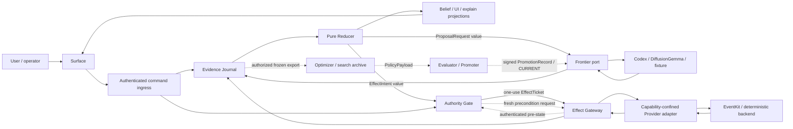

# CalendarPilot Compression Architecture (Step E → P17)

Status: living architecture specification — the single forward document
Audience: systems architecture, product engineering, runtime engineering, ML engineering, frontend engineering
Scope: CalendarPilot after P12; target architecture and migration discipline from Step E through P17
Position: Step E is complete and P12 is closed (run `20260706T220150Z-step-e-complete`); the active phase is P13
Provenance: every P12-era claim here is evidenced in the frozen [P12 Record](P12-RECORD.md) — run ids, SHAs, verdicts, blocker resolutions. This document cites the Record; it does not restate it. The code's current-truth docs live in `calendar-pilot-p12/docs/`.

This document is not a cleanup plan. It is the architecture specification for compressing CalendarPilot into the smallest governed learning loop that preserves the humane product contract.

---

## 1. Executive Thesis

CalendarPilot is a small, legible, human-governed learning loop that:

```text
believes only what it can cite,
hands the user control of every belief,
acts only under revocable authority,
verifies every effect or enters a visible hold,
compensates only when fresh state says compensation is safe,
and earns autonomy only by beating its own incumbent on real behavior.
```

The operational architecture has four roles:

```text
Evidence Journal  Pure Reducer  Authority Gate  Effect Gateway
```

They are deliberately not four equally trusted services. The effect-safety trusted
computing base is smaller: authenticated user/provider ingress, the Authority Gate,
revocation/nonce state, fresh provider preconditions, and the durable claim/outbox plus
ticket verifier inside the Effect Gateway. A Journal or Reducer defect must
still be unable to create an accepted effect.

The other named concepts are different kinds of things and are not promoted into peers:

```text
Frontier                            untrusted proposal port with replaceable respondents
Provider                            remote protocol; credential adapter confined inside Gateway
blob store                          evidence port with replaceable adapter
Stream                              an event classification tag
Belief, UI state, explain           cited projections plus commands/events
Evaluator/Promoter                  an external control plane
Optimizer/Search Archive            a mutually non-writable external control plane
```

There are three loops, separated by artifact and write boundaries:

```text
operational   may propose, authorize, apply, verify/reconcile, and record effects
learning      may emit an immutable PolicyPayload; it cannot mint tickets or self-promote
meta          may emit isolated candidate code; it is deferred beyond P17 readiness
```

Only the operational loop can reach the Effect Gateway. If code cannot be classified as a
role, port/adapter, event, projection, command, or external control-plane function, it is
exception management and does not survive compression.

The controlled variable is **conceptual mass**: the number of things a designer or engineer must hold in their head to predict the system's next behavior. LOC is an output. It is measured, bounded, and reported with the constraint that prevents it from going lower. It is never the target.

The stage-1 audit verdicted the whole tree in flow-clusters and found almost nothing dead — the verdict distribution, its coverage legs, and its load-bearing outcomes live in the [P12 Record §4.8](P12-RECORD.md). The mass is mostly tax paid for missing roles, duplicated respondents, weakly named boundaries, and — before Step E — instruments that did not compute enough truth.

---

## 2. How To Use This Document

Use this as the architecture control document for any change from here through P17.

Before proposing a change, answer four questions:

```text
1. Which role, port, event, projection, or control plane owns this behavior?
2. Which complete action/backend vertical is being shadowed, cut over, or retired?
3. Which binding manifest and certificate prove safety, evidence quality, and reversibility?
4. Which wall is type-enforced, runtime-monitored, or externally process-gated afterward?
```

A change that cannot answer those questions is not ready for implementation.

A designer should be able to use this document to:

- draw the target component map,
- assign ownership to current code,
- define contracts between roles, ports, projections, and control planes,
- decide whether a behavior can be retired,
- identify which evidence must exist before a migration lands,
- distinguish compression equivalence from learning improvement,
- reject a LOC-driven shortcut.

---

## 3. Quality Attribute Requirements

The compression architecture optimizes for these quality attributes, in this order.

| Attribute | Scenario | Architectural tactic | Evidence required |
|---|---|---|---|
| Safety | A model proposes an action that affects calendar state | the Authority Gate independently validates trusted ingress and issues one exact, expiring, one-use `EffectTicket`; the sole Gateway durably claims it before dispatch | standing grant, ticket, authenticated pre-state, claim/outbox, gateway and provider receipts |
| Reversibility | A user revokes authority or requests undo | revoke invalidates unclaimed work; claimed work reconciles; a verified present effect requires a fresh, one-use `CompensationTicket` or enters visible hold | revoke/claim linearization, reconciliation, compensation ticket/receipt or explicit hold, causal Journal rows |
| Legibility | A user asks why the system believes or acted | `explain` is a cited projection with executable controls | claim, event/evidence ids, Reducer version, confidence, controls, version |
| Evidence quality | a compression or learning candidate changes behavior | an external evaluator grades a frozen candidate against a pre-wave `BindingManifest`, fixed instrument, uncertainty rule, and change-class-appropriate frozen evidence | experiment record, `InstrumentBundle@sha`, evidence hashes, evaluator attestation |
| Observability | a model or provider adapter fails, times out, or rejects schema | the port boundary preserves respondent-specific failure/resource states; remote responses are untrusted and provider credentials remain Gateway-confined | Journal rows include respondent, failure mode, validation errors, health, latency, cost |
| Evolvability | A duplicated stack is collapsed | shared protocol preserves all safety-relevant states of source stacks | contraction certificate and tombstone for dropped fields/behaviors |
| Privacy | Live payloads or secrets leave the process | typed redaction chokepoint is the only egress path | redaction tests, secret scans, replay/export inspection |
| Human control | a derived belief changes ranking or autonomy eligibility | Belief is a cited projection with activation/correction commands and no authority path | belief evidence, control history, Gate recomputation from trusted consent/preconditions |
| Evaluator integrity | an optimizer proposes a better harness or policy | optimizer write scope, holdout, evaluator, promoter, thresholds, and binding rules are outside candidate control | rejected mutation/downgrade attacks, sealed holdout attestation, immutable archive |

Non-goals:

```text
not a LOC quota
not a UI rewrite spec
not a permission to delete monitors
not a promise that 3,000 LOC is reachable
not a replacement for per-wave evidence artifacts
not permission for learning/meta candidates to edit the evaluator, Gate, or Gateway
not a ban on explicitly manifested, human-reviewed engineering migrations of the TCB
not a claim that DiffusionGemma is a control primitive
```

---

## 4. Current Architectural Constraints

### 4.1 System State

The architecture starts from the post-P12 tree. What P12 and its Stage D waves landed — the legacy-state weaning, the static/schema/simulator retirements, the session decomposition, the proven EventKit runway — is recorded with per-wave run evidence in the [P12 Record §5](P12-RECORD.md).

Source mass by organ, measured at the C₁ audit (pre-Step E; Step E deliberately added instrument and compatibility-contract code — [Record §6](P12-RECORD.md)). Re-measure at the P13 baseline freeze:

```text
frontend       3,923
diffusiongemma 2,727
codex          2,161
environment    1,689
top-level      1,656  (types 733 + replay 514)
providers        962
swift_bridge     832
```

Largest masses are product commitments, not dead code:

```text
codex/live.py              live Codex path
diffusiongemma/live.py     live NIM policy path
frontend session organism  local dogfood state and projection
40 scripts                 lab, release, measurement, and promotion operations
```

Each maps to a missing or incomplete role, port, projection, or control-plane boundary.

### 4.2 Release Instrument (Step E outcome — now a standing rule)

At the C₁ audit, `make p12-release` certified the deterministic reachable set only, with the live legs (live Codex, live NIM, live EventKit, Swift IPC, browser E2E, dogfood release) running beside it. Step E closed that gap and finished green with every live leg run or root-listed ([P12 Record §6](P12-RECORD.md)); the gate now also carries the `cvar` and `b_migrate` legs.

Standing rule: a green `p12-release` is the safety spine for deleting or contracting live-reachable behavior only together with the live legs. Every wave that touches live-reachable behavior reruns the affected live legs or carries a signed root-list entry — leg, reason, last passing artifact, owner, next unblock action, accepted-until — in its evidence bundle. A skipped live leg with no root-list entry is a failed instrument gate.

### 4.3 Placebo Gates (resolved by Step E — now a standing rule)

Three release legs were placebo at the C₁ audit — `reward_heads`, `policy_ablation`, and `calibration`; the pre-fix failure modes and the fix evidence are in the [P12 Record §6](P12-RECORD.md). They now compute truth: reward purity scans consumed rows and fails on planted non-ActionStream evidence, ablations re-grade against named frontier/scorecard inputs, and calibration distinguishes pass from insufficient-data hold at release level.

Standing rule: these three legs plus `cvar` and `b_migrate` are protected instrument surfaces. They may be thin only if they say they are thin; a green report with no consumed evidence is not a pass; and any change to them is itself a behavior-changing promotion. No P13-P17 "no regression" claim is trustworthy on a gate that cannot fail.

### 4.4 Canonical Execution Root

There are two roots in this workspace and confusing them has already produced false or
irrelevant test runs:

```text
git/workspace root   Destination/
active app root      Destination/calendar-pilot-p12/
```

Until P13.0 repairs the workspace-level delegate and installs CI at the actual git
root, **every command in this document runs from the active app root**. The
workspace-level `Makefile` is not an accepted access point: it still names the retired
`calendar-pilot-system-framework` snapshot.

Canonical preflight:

```bash
GIT_ROOT="$(git rev-parse --show-toplevel)"
APP_ROOT="$GIT_ROOT/calendar-pilot-p12"
cd "$APP_ROOT"

test "$(pwd -P)" = "$(cd "$APP_ROOT" && pwd -P)"
test -f Makefile
test -d src/calendar_pilot

git -C "$GIT_ROOT" rev-parse HEAD
git -C "$GIT_ROOT" rev-parse HEAD:calendar-pilot-p12
```

Every evidence bundle records both the repository commit and the active-app subtree
hash. A command run from another directory is non-evidence unless its record names the
working directory and proves it reached this same subtree.

### 4.5 Historical Test Lineage And Supersession

The trace covered every archived Markdown file with an explicit `test`, `tests`, or
`testing` reference: 85 of 161 files, representing 60 distinct file contents after
exact snapshot duplicates are collapsed. Most snapshot READMEs and pass notes repeat
one of the canonical sources below. They remain provenance, not executable
instructions. This table is the carried-forward test doctrine; the current commands
in §4.6 supersede all archived command blocks.

| Historical source | Durable rule carried forward | Current home |
|---|---|---|
| Plan 6–9 test matrices | test static walls, compression equivalence, sensor/monitor preservation, controller safety, and process discipline separately | §4.7, §7, contraction certificates |
| `DOGFOODING_FRAMEWORK.md` and `dogfooding.md` | prove process/port ownership, runtime identity, app bundle behavior, occupied-port handling, artifact validation, and secret safety | `make dogfood-release`, §4.8 |
| `ML-E2E.md` | run the deterministic ladder before live legs; test the closed trajectory, not a plausible model response | `make ml-ladder` as smoke only; §4.6–§4.7 |
| `ML-testing.md` | use a unique run directory; test restart/restore, API + rendered browser, contract vectors, Swift IPC, and provider sandbox boundaries | §4.7–§4.9 |
| `P11-test.md` | the trajectory is the test object; release proof is distinct from policy/autonomy promotion | §7–§8 |
| `P12-test.md` | preserve P11, then test streams, reward purity, estimators, calibration, labels, curricula, provider capabilities, and frontend/replay consistency | `make p12-release`, §4.6–§4.7 |
| `P12-next.md` / Step E | pin the instrument; run or root-list every live leg; use the active app root; prove the user-visible app access point for OS permissions | §4.4, §4.8–§4.9 |
| P12 close evidence | a parallel Python/Swift baseline caused a Python timeout; the isolated rerun passed | run deterministic baselines sequentially on this machine |

Git history shows the executable surface accumulating in this order: Python/Swift;
browser/app; Swift IPC and live Codex/NIM/EventKit; deterministic ML ladder,
invariants, and evidence; contract vectors and lab cells; P11 trajectory/variance
checks; then the P12 instrument and wave wrappers. That lineage explains old target
names, but does not make them aliases: the active-app `Makefile` and scripts are the
only command authority now.

Explicit supersessions:

```text
make variance-probe          -> make cvar-report (bootstrap until P13.0; §8.5)
make lab-validate-scenarios  -> curriculum validation inside make p12-release
make loc-report              -> no current target; use the tracked /src count below until P13.0 installs a versioned reporter
archived root Makefiles      -> active app Makefile only
archived p11/p12 test docs   -> this matrix + current scripts
```

### 4.6 Current Executable Gate Map

The command name alone is never the claim. Use the scope and report below.

| Access point | What it currently proves | What it does **not** prove |
|---|---|---|
| `make py-test` | all Python unit/integration tests under `tests/` | Swift, rendered browser, app bundle, live backends |
| `make swift-test` | Swift package tests | Python-to-Swift IPC process behavior |
| `make swift-ipc-test` | Python client ↔ built Swift kernel-server behavior | EventKit mutation |
| `make check-invariants` | invariant scan on the golden replay fixture | the replay produced by the current wave unless passed explicitly |
| `make contract-vectors` | shared contract vectors through Python/Swift paths | frontend or live-model behavior |
| `make frontier-diff` | fixture policy comparison against current tuning | live-model variance or a full promotion decision |
| `make scorecard` | fixture replay/frontier summary and invariant count | a wave release or policy promotion by itself |
| `make ml-ladder` | Python + golden invariants + fixture frontier diff + scorecard | Swift, browser, app, live legs, P12 instruments |
| `make evidence-bundle` | current frontend snapshot, golden-replay invariant report, secret scan | unique wave identity, app/browser/live reach, or before/after evidence |
| `make lab-validate-seeds` | seed-corpus schema/content validation | a completed experiment |
| `make lab-run SEED=… RUNTIME=…` | one explicitly selected lab cell | comparison or promotion |
| `make lab-compare` | reindexes completed lab runs and writes the latest comparison | a release decision |
| `make lab-promote BATCH=…` | **frozen for promotion**; the current script can force `--decide promote` after failed gates and evaluates tuning on source-run seeds | a valid promotion until the P13.6 learning prerequisites remove the override and separate search/holdout/live evidence |
| `make browser-e2e` | owned fixture server, API loop, restart/restore, rendered browser controls, screenshot, replay export | app-bundle identity or live backends |
| `make mac-app-build` | app and bundled Swift executables build | launch ownership or functional dogfood |
| `make dogfood-release` | Python, Swift, Swift IPC, fixture browser, app build/sanity, LaunchServices, occupied-port behavior, artifact checks, secret scans; optional EventKit sub-gate | live Codex or live NIM inference unless run separately |
| `make live-codex-e2e` | Codex subscription-auth preflight, live planner reach, runtime provenance, replay, secret safety | NIM or EventKit |
| `make live-diffusiongemma-e2e` | live NIM health, frontier generation, provenance, replay, secret safety | Codex or provider mutation |
| `make replay-offline-tuning-loop` | plumbing only: live NIM self-play → replay → reduction → a second frontier whose output changes | improved behavior, human utility, calibration, or policy promotion |
| `PYTHONPATH=src python3 scripts/run_live_nim_schema_gate.py` | records the declared NIM schema-drift, normalization, and unsafe-rejection contract; strict mode also requires credential presence | remote health, an actual model call, or parser execution; there is currently no Make target |
| `make live-eventkit-e2e` | EventKit health; mutation only when explicitly required | app access merely because a CLI binary ran; use §4.9 |
| `make p12-signals`, `p12-measurement`, `p12-calibration`, `p12-provider-capabilities` | one named deterministic P12 instrument leg for focused iteration | the complete P12 or wave decision |
| `make p12-release` | deterministic P12 instruments: invariants, streams, frontier/scorecard, measurement, calibration, provider capabilities, reward heads, curriculum, ablations, Belief/explain, C-VAR bootstrap, `B_migrate` bootstrap, secret scan | browser, app bundle, Swift IPC, live Codex/NIM/EventKit; those are separate run-or-root-list legs |
| `make cvar-report` | frozen-seed deterministic self-consistency with the current default invocation | pre-wave versus post-wave code equivalence until P13.0 |
| `make b-migrate` | current session snapshot ↔ current projector mapping | independent old-organ versus new-kernel equivalence until P13.0 |
| `make wave-harness` | invokes architecture preservation evals, C-VAR bootstrap, `B_migrate` bootstrap, and P12 release | a promotable compression certificate until §8.5 is complete |
| `make architecture-eval-test` | scenario coverage pins, fail-closed status semantics, one counterexample per predicate, repaired target vectors, safe path handling, report/schema/hash tamper rejection | current-product preservation or live/target conformance by itself |
| `make architecture-evals` | 20 deterministic scenarios over current P12 fixture evidence: 11 binding preservation predicates and 9 historical target predicates, with schema/semantic validation and immutable per-run evidence | live access points, the new four-role topology, machine-binding migration triggers, or P13.0 completion |

Architecture evals use two explicit rails. The **preservation** rail is binding now:
every scenario must report `pass`. `architecture_scenario_set.v1` remains historical
P12 compatibility evidence. Its nine **target-conformance** rows encode the superseded
six-peer topology and their `binding_trigger` strings are descriptive prose, not
executable switches; all remain `gate_mode: observe`. They must not certify a P13
migration. Their `not_reached` results remain visible debt and never contribute to a
pass count.

P13.0 introduces `architecture_scenario_set.v2` and an evaluator-owned, immutable
pre-wave `BindingManifest`. The manifest—not candidate code and not prose—selects the
required target predicates before a wave begins. It records touched action families,
backends, surfaces, old/new invocation identities, scenario/instrument hashes, live
legs, signer, and expiry. Its signer and verification root live outside candidate
control. The evaluator independently derives actual affectedness from the complete diff
(including new/untracked paths) plus a versioned ownership map and fails on every
touched-but-undeclared action, backend, surface, instrument, TCB, or control-plane file.
A candidate cannot edit, repin, downgrade, or select `observe`; any attempted mutation
or scope under-declaration is a gate failure.

P13.0 installs one creation and one verification access point:

```bash
make wave-bind WAVE="$WAVE" CHANGE_CLASS="$CHANGE_CLASS"
make wave-harness MANIFEST="runs/p13_manifests/$WAVE.json"
```

`wave-bind` is run and externally signed before candidate edits. `wave-harness` verifies
the signature, expiry, hashes, declared scope, evaluator-derived affectedness, and
required predicates before it invokes any candidate-controlled code.

The four scenario statuses have fixed meanings: `pass` means observed evidence
satisfies the predicate; `fail` means the evidence contradicts it; `hold` means the
predicate applies but evidence is missing or inconclusive; and `not_reached` means a
nonbinding target prerequisite has not landed. Any non-`pass` preservation result or
binding target result blocks the architecture-eval decision. The top-level decision
may pass with nonbinding target debt only because that debt remains explicitly
reported, not because `not_reached` was treated as success.

`architecture_scenario_set.v1` pins the exact historical preservation and target ids;
dropping a rail or scenario without a version bump remains a gate error. Every invocation
uses a fresh run directory, retains an immutable report, and refreshes a latest-report
pointer. The report records the committed tree, dirty-worktree digest, and hashes for
the runner, adapter, predicates, scenario set, and schema. The gate validates Draft
2020-12 shape, derived decisions/counts, and every artifact hash before returning
success. An arbitrary or pre-existing artifact directory is rejected rather than
recursively deleted.

The interim canonical source-LOC access point counts tracked Python lines under
`calendar-pilot-p12/src/`, matching the `/src` trajectory in §10:

```bash
git -C "$GIT_ROOT" ls-files -z 'calendar-pilot-p12/src/**/*.py' |
  xargs -0 wc -l
```

It is a scalar inventory, not a conceptual-mass metric or per-wave delta report.
P13.0 must replace it with a versioned JSON reporter that freezes the file list,
per-file counts, total, exclusions, commit, app subtree, and before/after delta.

Two shortcuts are especially dangerous:

```text
make test       = Python + Swift only
make ml-ladder  = deterministic ML smoke only
```

Neither is a release or compression-wave gate. Also, the current report-producing
scripts distinguish `pass`/`hold` in JSON while some return shell success for `hold`.
Until P13.0 changes that behavior, every invocation must assert the report decision,
not merely `$?`:

```bash
make p12-release
jq -e '.decision == "pass" and .ok == true' runs/p12_release/p12_release_report.json

make cvar-report
jq -e '.decision == "pass"' runs/cvar_report.json

make b-migrate
jq -e '.decision == "pass"' runs/b_migrate_report.json

make architecture-evals
jq -e '
  .decision == "pass" and
  .rails.preservation.decision == "pass" and
  .rails.preservation.scenario_count == 11
' runs/architecture_evals/architecture_eval_report.json
```

Until the P13 learning migration, no command may use simulator evidence as positive
user-utility promotion credit. This prohibition is transitive: a simulator-derived
reward model, expected-reward field, calibration estimate, or mixed aggregate is still
simulator evidence. Simulator/adversarial rows may expand search, train a separately
reported failure detector, or veto a candidate; they do not enter the human-outcome
estimator.

### 4.7 Change-To-Gate Matrix

Run the common baseline first, then the rows for every touched surface. The union—not
the cheapest matching row—is the required set.

Common baseline for any behavior-bearing code change:

```bash
make py-test
make check-invariants
make p12-release
jq -e '.decision == "pass" and .ok == true' runs/p12_release/p12_release_report.json
make architecture-evals
jq -e '
  .decision == "pass" and
  .rails.preservation.decision == "pass" and
  .rails.preservation.scenario_count == 11
' runs/architecture_evals/architecture_eval_report.json
```

Focused suites shorten iteration but never replace the common baseline or a final
`make py-test`. Use these current module groups instead of inventing a phase-era target:

```bash
# contracts, replay, and streams
PYTHONPATH=src:tests python3 -m unittest \
  test_contract_parity test_contract_vectors test_replay test_p12_signal_streams

# frontend projection, API, persistence, runtime, and authority
PYTHONPATH=src:tests python3 -m unittest \
  test_frontend_and_authority test_frontend_server_api \
  test_frontend_session_persistence test_runtime_mode

# providers and EventKit boundary
PYTHONPATH=src:tests python3 -m unittest \
  test_deterministic_provider test_apple_eventkit_provider \
  test_p12_contracts_and_scripts

# Codex and DiffusionGemma respondents
PYTHONPATH=src:tests python3 -m unittest \
  test_codex_tools test_live_codex test_policy

# release instrument and wave certificates
PYTHONPATH=src:tests python3 -m unittest \
  test_step_e_instrument_reports test_wave_harness test_architecture_evals
```

| Touched surface | Additional required gates | Required evidence focus |
|---|---|---|
| contracts, `types.py`, replay, stream tagging | `make contract-vectors`; focused contract/replay/stream tests | schema versions, migration, row ids, B1–B4 negatives |
| frontend session/projector/persistence/server/static assets | focused frontend tests; `make b-migrate`; `make browser-e2e`; `make dogfood-release` for bundle/runtime reach | full view projection, restart/restore, replay equality, process/port ownership |
| Swift authority/Gateway/IPC | `make swift-test`; `make swift-ipc-test`; `make contract-vectors`; `make dogfood-release` if bundled; required v2 ticket cases after P13.0 | grant/deny/revoke, exact one-use ticket, epoch/nonce, one effect-capable path, receipt parity |
| deterministic Provider/Gateway code | provider tests; P12 provider-capability leg; `make dogfood-release` if app reachable; required v2 lifecycle cases after P13.0 | observe/preview/apply/verify/reconcile/compensate, idempotency, unsupported-operation denial |
| EventKit/provider bridge | `make swift-test`; app build; strict app-bundled EventKit procedure in §4.9; affected dogfood-release EventKit sub-gate; required v2 lifecycle cases after P13.0 | `full_access`, sandbox target, exact ticket, verified effect, restart/reconcile, conflict-aware compensation |
| Codex planner/live respondent | focused Codex tests; `make live-codex-e2e` or signed root-list; `make cvar-report` after P13.0 | model reached, response provenance, failure mode, no secret leakage |
| DiffusionGemma policy/live respondent/frontier | focused policy tests; live NIM schema gate; `make live-diffusiongemma-e2e` or signed root-list; C-VAR after P13.0 | schema rejection, candidate provenance, variance, cost/latency/failure state |
| reward, estimators, calibration, labels, policy ablation | P12 release plus the affected planted negative test; C-B6 for estimator changes | consumed row ids, ActionStream purity, estimator version/parity, pass versus hold |
| release, lab, measurement, promotion, or certificate scripts | negative fixture for every changed decision leg; P12 release; dogfood release; every affected live leg run/root-listed | prove the ruler can turn fail/hold; record old/new instrument hashes |
| packaging, launch, runtime mode, app resources | app build, browser E2E, dogfood release, relevant live app access | bundle contents, owned PID/port, launch state ↔ health agreement, backend identity |
| docs-only | `git diff --check`; link/path scan; execute or dry-run every changed command | no stale filename, root, target, phase, or superseded access point |

Compression-specific test classes inherited from the Plan 6–9 matrices remain
mandatory even when ordinary regression tests pass:

```text
equivalence       verified normal outcomes match; new authority refines/narrows legacy; reward/provenance preserve
wall              forbidden authority/reward/privacy paths remain unconstructible
monitor/sensor    a removed organ does not remove a failure detector
failure injection missing data, stale/forged state, denial, conflict, timeout, crash, duplicate, unknown outcome, compensation hold
process           experiment record, root-list, regression, ablation, rollback complete
```

### 4.8 Wave Run Protocol And Evidence Bundle

Run baselines sequentially on this machine. Do not parallelize Python and Swift when
freezing a comparison baseline; P12 recorded a timeout under parallel load and a clean
isolated rerun.

```bash
GIT_ROOT="$(git rev-parse --show-toplevel)"
cd "$GIT_ROOT/calendar-pilot-p12"

export WAVE="${WAVE:-wave-name}"
export RUN_ID="$(date -u +%Y%m%dT%H%M%SZ)-p13-$WAVE"
export RUN_DIR="runs/p13_evidence/$RUN_ID"
mkdir -p "$RUN_DIR"/{preflight,baseline,after,focused,live,release,review}

pwd -P > "$RUN_DIR/preflight/cwd.txt"
git -C "$GIT_ROOT" rev-parse HEAD > "$RUN_DIR/preflight/git_sha.txt"
git -C "$GIT_ROOT" rev-parse HEAD:calendar-pilot-p12 > "$RUN_DIR/preflight/app_tree.txt"
git -C "$GIT_ROOT" status --short > "$RUN_DIR/preflight/git_status.txt"
git -C "$GIT_ROOT" ls-files -z 'calendar-pilot-p12/src/**/*.py' |
  xargs -0 wc -l > "$RUN_DIR/preflight/source_loc_before.txt"
```

Required order:

```text
1. preflight: cwd, commit, subtree, runtime versions, instrument pin
2. sequential deterministic baseline
3. freeze baseline artifacts and hashes before code changes
4. focused tests for every touched surface
5. independent old/new B_migrate + C-VAR after P13.0
6. browser/app/live legs selected by §4.7
7. release reports and explicit JSON decision assertions
8. regression, ablation, rollback proof, and experiment-record review
```

Every command record contains:

```text
command, cwd, start/end UTC, exit code, report decision,
access_point, runtime_mode, backend identities,
artifact paths + hashes, commit + app subtree,
environment variable names present (never secret values)
```

A live leg may be root-listed only when it is unaffected or genuinely unavailable.
The ledger is a versioned artifact, not a hard-coded `signed=True` branch:

```text
leg
status: ran | root-listed
reason
last_passing_artifact + hash
owner and sign-off
affected_by_wave: true | false
next_unblock_action
accepted_until: UTC timestamp or exact wave id
```

Expired, unsigned, missing-artifact, or affected root-list entries are holds. A
behavior-changing wave cannot sign its own exception merely by setting a Boolean.

### 4.9 User-Visible And OS-Permission Access Points

Browser evidence must come from the server process the harness started. App evidence
must come from the built `CalendarPilot.app` and must prove that `launch_state.json`,
`/api/health`, PID, port, runtime mode, and backend identities agree. Never attach to a
pre-existing `127.0.0.1:8787` process without proving ownership.

EventKit permission is tied to the user-visible app/bridge identity. A raw Swift binary
or a process launched under an IDE/terminal permission surface is health evidence only;
it is not proof that CalendarPilot's app access point can mutate the calendar.

Strict EventKit access-point procedure:

```bash
cd "$(git rev-parse --show-toplevel)/calendar-pilot-p12"
make mac-app-build

open -n dist/CalendarPilot.app
EVENTKIT_BRIDGE="$PWD/dist/CalendarPilot.app/Contents/Resources/app/bin/CalendarPilotEventKitBridge.app/Contents/MacOS/CalendarPilotEventKitBridge"
test -x "$EVENTKIT_BRIDGE"

CALENDAR_PILOT_SELFPLAY_EVENTKIT_SANDBOX=1 \
CALENDAR_PILOT_SELFPLAY_EVENTKIT_SANDBOX_CALENDAR_ID="CalendarPilot SelfPlay" \
CALENDAR_PILOT_EVENTKIT_BRIDGE="$EVENTKIT_BRIDGE" \
CALENDAR_PILOT_REQUIRE_EVENTKIT=1 \
CALENDAR_PILOT_EVENTKIT_MUTATION=1 \
make live-eventkit-e2e

jq -e '
  .health.configured == true and
  .health.authorization_status == "full_access" and
  .materialization.status == "passed" and
  .materialization.commit.status == "committed" and
  .materialization.undo.status == "reverted" and
  (.materialization.commit.output.candidate.actions | length > 0) and
  all(.materialization.commit.output.candidate.actions[];
    .calendar_id == "CalendarPilot SelfPlay") and
  any(.materialization.replay_records[];
    .record_type == "provider_transaction" and
    .payload.operation == "rollback" and
    .payload.rollback_verified == true)
' runs/eventkit_e2e/eventkit_health.json
```

The assertion binds the provider rollback row and sandbox-calendar target, not only the
top-level success labels. Permission prompts or settings changes are the operator's
access-point checkpoint; the engineering run resumes after `full_access` is visible.

When the EventKit surface changes, include the same app-bundled identity in the
dogfood release rather than accepting its default skipped sub-gate:

```bash
CALENDAR_PILOT_RUN_LIVE_EVENTKIT_RELEASE=1 \
CALENDAR_PILOT_EVENTKIT_RELEASE_BRIDGE="$EVENTKIT_BRIDGE" \
CALENDAR_PILOT_SELFPLAY_EVENTKIT_SANDBOX=1 \
CALENDAR_PILOT_SELFPLAY_EVENTKIT_SANDBOX_CALENDAR_ID="CalendarPilot SelfPlay" \
CALENDAR_PILOT_EVENTKIT_MUTATION=1 \
make dogfood-release
```

Live Codex uses ChatGPT subscription auth through the Codex app-server path. A platform
API key is not a substitute. Live DiffusionGemma requires a successful NIM remote
health preflight. Both harnesses must emit their credential/health preflight artifacts
without logging secret values.

For a DiffusionGemma/NIM change, run both layers. The first command is a lightweight
contract/credential check; only the second supplies remote/model-path evidence:

```bash
CALENDAR_PILOT_REQUIRE_LIVE_NIM=1 \
PYTHONPATH=src python3 scripts/run_live_nim_schema_gate.py \
  --out runs/p12_live_nim_schema_gate.json
jq -e '.decision == "pass"' runs/p12_live_nim_schema_gate.json

make live-diffusiongemma-e2e
```

---

## 5. Target Architecture

### 5.1 Four Roles, Not Four Peers

| Role | Owns | May do | Must never do |
|---|---|---|---|
| `EvidenceJournal` | append-only event envelopes and typed `EvidenceRef`s | append, query, snapshot, export authorized views | infer, rank, authorize, mutate a provider, delete audit history |
| `Reducer` | deterministic interpretation of a Journal prefix | `reduce(events, version) -> State`; `decide(state, command) -> Intent[]`; produce cited projections | perform I/O, mint authority, hide uncited state, learn while replaying |
| `AuthorityGate` | consent scope, standing grants, revocation epochs, exact admission | independently validate authenticated ingress and fresh provider preconditions; issue denial or one-use effect/compensation ticket | trust a model score/Belief as consent, reuse a ticket, accept stale pre-state |
| `EffectGateway` | the sole external-effect lifecycle and durable claim/outbox state | claim a ticket once, dispatch idempotently, verify, reconcile ambiguity, require separately authorized compensation, append receipts | accept unticketed effects, retry an unknown effect as new work, call unverified work committed |

The Journal and Reducer are safety-relevant but not sufficient to authorize an effect.
The effect-safety TCB is the trusted ingress/precondition path, Gate, revocation/nonce
state, and the Gateway's verifier, durable claim/outbox state, and capability-confined
credential adapter. The Gate recomputes admissibility; it does not trust a Reducer
conclusion or the untrusted Journal.

### 5.2 Ports, Events, And Projections

| Kind | Named concepts | Rule |
|---|---|---|
| proposal port | `Frontier` with Codex, DiffusionGemma/NIM, and fixture respondents | untrusted; returns candidate sets and complete respondent observables; never tickets or effects |
| effect port | `Provider` remote protocol with deterministic and EventKit adapters | remote responses are untrusted; credential-bearing mutating adapter is capability-confined inside Gateway and unreachable except through ticket-checked calls |
| evidence port | content-addressed blob store | Journal owns reference semantics; adapter owns bytes; missing bytes produce explicit hold |
| event tags | `Action`, `World`, `Biography`, `Derived`, `System` | classify Journal events; only authenticated human Action outcomes contribute positive promotion utility |
| governed projections | `Belief`, UI state, `explain` | cite Journal event/evidence ids and Reducer version; changes are commands followed by events |

DiffusionGemma is an experimental, latency-oriented text-diffusion respondent. Its
blockwise revisions, quality, variance, latency, and cost are observable proposal
evidence. Its faster local generation and different decoding topology do not change
the control topology, reward truth, authority, evaluator, or promotion rule.

### 5.3 Runtime And Control Planes



Arrows leaving Reducer are returned values passed by a stateless caller; Reducer itself
performs no I/O. The dotted planes cannot write each other. The optimizer sees sanitized search traces,
not sealed holdout cases or unrestricted personal calendar blobs. The Evaluator/Promoter
cannot mint effects. Candidate code can write only its isolated workspace.

### 5.4 Current-Code Migration Map

| Current organ | Target classification | Migration action |
|---|---|---|
| `replay.py`, trace and persistence code | `EvidenceJournal` plus blob adapter | define authenticated envelopes, global ids, append-only receipts, evidence refs |
| `frontend/session.py` and controllers | Reducer projections plus surface adapter | shadow every required field; cut over read-side before retiring hidden truth |
| `environment/action_lifecycle.py` | Reducer intent transitions + Gate + Gateway | replace reusable-grant mutation with exact ticket lifecycle and reconciliation |
| `swift_bridge/*` | Gate and Gateway TCB adapters | keep trusted consent/precondition/effect boundary small and independently tested |
| `providers/*` | Provider remote protocol and capability-confined adapters inside Gateway domain | retain deterministic and EventKit; absent rather than stubbed if contract is incomplete |
| `codex/live.py` | Frontier respondent | preserve model-specific failures and provenance; no authority path |
| `diffusiongemma/*` | Frontier respondent plus frozen learning implementation | preserve inference/evidence capture first; later package learning output as immutable `PolicyPayload` |
| `types.py`, signals, stream helpers | event/projection contracts | Stream remains a tag; Belief remains a cited value/projection |
| release/lab scripts | external evaluator, optimizer, and thin access points | freeze the ruler before refactoring; never move evaluator logic into product roles |

---

## 6. Boundary Contracts

### 6.1 Journal And Evidence Contract

```text
JournalEvent{
  event_id, event_type, stream_tag, occurred_at, ingested_at,
  source_identity, source_signature, schema_version,
  content_hash, sequence, causal_parent_ids,
  subject_scope, payload_or_evidence_refs
}

EvidenceRef{
  digest, media_type, schema, size, creation_provenance,
  retention_class, redaction_class, availability_status
}
```

The Journal validates shape/integrity and appends; it does not certify world truth.
Safety-critical ingress is source-authenticated and revalidated by the Gate. Raw bytes
live behind an immutable content-addressed adapter. Missing or unauthorized evidence
is `evidence_unavailable` and produces hold when required, never an empty substitute.

### 6.2 Pure Reducer Contract

```text
reduce(journal_prefix, reducer_version) -> ProjectedState
decide(projected_state, Command) -> Intent[]
project(projected_state, required_field_manifest) -> CitedView
```

Identical prefix, version, and command produce identical state/intents. The Reducer has
no clock, network, secret, model, provider, authority, or mutable global access. Every
durable semantic, safety-, explanation-, or decision-bearing required field cites input
event/evidence ids and the Reducer version. Ephemeral cursor, tab, animation, and loading
state may remain local but cannot become product truth. A model proposal becomes
evidence/intent; it does not become truth by entering the Journal.

### 6.3 Standing Grant And One-Use Ticket

Separate durable consent from effect admission:

```text
StandingGrant{
  grant_id, user_scope, allowed_action_families, provider_scope,
  maximum_tier, issued_at, expires_at, consent_provenance, epoch
}

EffectTicket{
  ticket_id, grant_id, grant_epoch, exact_intent_hash,
  user_scope, provider, action_family, pre_state_hash,
  issued_at, expires_at, nonce, signature
}

CompensationTicket{
  ticket_id, grant_id, grant_epoch, exact_compensation_intent_hash,
  target_effect_receipt_hash, user_scope, provider, fresh_state_hash,
  issued_at, expires_at, nonce, signature
}
```

The Gate independently checks authenticated user consent, source identity, schema,
freshness, scope, caps, conflict/ODD rules, and a fresh provider pre-state. Derived
Beliefs, scores, labels, and expected rewards may support an explanation but cannot
supply consent. Revoke increments the grant epoch and linearizes with ticket claim:
unclaimed tickets and staged work become invalid. A claimed/in-flight ticket is not
proof of an effect and must reconcile. If reconciliation finds no effect, it terminates
`not_applied`; any retry requires fresh preconditions and a new ticket. A verified
present effect can change only through a separately admitted `CompensationTicket`.

### 6.4 Effect Gateway State Machine

```text
staged -> denied | cancelled | authorized
authorized -> cancelled | claimed(ticket_nonce, idempotency_key, durable_outbox)
claimed -> dispatching | reconciling
dispatching -> rejected_not_applied | applied_unverified | applying_unknown
applied_unverified -> verified | applying_unknown
applying_unknown -> reconciling
reconciling -> not_applied | applied_unverified | verified | hold

verified -> compensation_requested
compensation_requested -> compensation_denied | compensation_authorized(CompensationTicket)
compensation_authorized -> compensation_claimed(ticket_nonce, idempotency_key, durable_outbox)
compensation_claimed -> compensating
compensating -> compensated | compensation_unknown | hold
compensation_unknown -> reconcile -> compensated | effect_still_present | hold
```

The durable `claimed` record is the ticket/revoke/duplicate linearization point and is
written before provider dispatch. It carries the exact intent, pre-state, provider,
nonce, and idempotency key needed for crash recovery without trusting the Journal.
Expiry or revoke before claim cancels; after claim, recovery reconciles. A reconciled
`Absent` result becomes `not_applied` and never silently dispatches old work. A provider
rejection is likewise `rejected_not_applied`.

`verified` is the only successful applied-effect state; `committed` may be displayed
only as an alias for verified provider state. A crash after dispatch and before receipt
enters `applying_unknown`. The same idempotency key may be reconciled; a fresh write is
forbidden until outcome is known. Duplicate ticket or delivery cannot double-apply.
Compensation is a new authorized external effect: the Gate compares fresh state, issues
an exact one-use ticket or denial, and the Gateway claims it before dispatch. It never
overwrites later human/provider edits. Conflict or unavailable proof is a visible hold
with an executable resolution route; `effect_still_present` is such a hold, not success
and not authority to mint a replacement ticket. Journal history remains append-only.

### 6.5 Frontier And Provider Ports

```text
Frontier.propose(projected_state, context_refs) -> ProposalSet{
  candidates, provenance, revision_trace, failure_mode,
  variance{metric, unit, samples}, cost{value, unit},
  latency_ms, validation_errors, respondent
}

Provider.observe() -> AuthenticatedObservation
Provider.preview(intent, pre_state_hash) -> Preview
Provider.apply(intent, effect_ticket, idempotency_key) -> ProviderReceipt | Rejected | Unknown
Provider.verify(receipt_or_key) -> VerifiedState | Unknown
Provider.reconcile(idempotency_key) -> VerifiedState | AppliedUnverified | Absent | Unknown
Provider.compensate(verified_effect, compensation_ticket, fresh_state, idempotency_key) -> CompensationReceipt | Rejected | Conflict | Unknown
```

Unknown numeric observables are typed with a reason, never `null`. Codex,
DiffusionGemma/NIM, and fixtures retain respondent identity and failure differences.
Google/Microsoft placeholders are absent until they implement the Provider contract.

### 6.6 Belief, UI, And Explanation Projections

```text
CitedProjection{
  projection_type, subject_id, value_or_claim,
  event_ids, evidence_refs, confidence,
  reducer_version, projection_version, controls
}

explain(question) -> Answer{
  claim, event_ids, evidence_refs, confidence,
  reducer_version, controls, version
}
```

Controls (`activate`, `disable`, `correct`, `revoke`, `compensate`) carry an executable
route, required authority, expected artifact, and resulting receipt. Invoking one emits
a command and then a Journal event; a projection never mutates itself. Uncited scalar
state is illegal. `notification_fatigue` cannot return as a naked field. `explain` and
the versioned required-field manifest ship before read-side/frontend cutover.

---

## 7. Invariant Model

The humane walls are enforced at four distinct trust layers.

### 7.1 Effect-Safety TCB

```text
E1  every external mutation passes the sole Effect Gateway
E2  every apply or compensation effect has its own exact, fresh, precondition-bound ticket
E3  durable ticket claim/outbox is atomic, one-use, idempotent, and revocation-epoch aware
E4  old and new paths may both compute; exactly one path is effect-capable
E5  unknown provider outcome blocks another effect until reconciliation
E6  no successful terminal label exists before provider verification
E7  compensation is separately authorized and cannot overwrite later external edits; conflict becomes hold
E8  Gate admissibility is recomputed from authenticated consent and fresh pre-state
E9  claim is not evidence of application; claimed/in-flight work reconciles after crash or revoke
```

### 7.2 Epistemic And Evaluation Integrity

```text
K1  Journal integrity/order is not mistaken for source truth
K2  every protected projection cites event/evidence ids and Reducer version
K3  global reward-row identity and human/simulator provenance are unforgeable at ingress
K4  simulator evidence can veto but contributes zero positive human-utility credit
K5  learning/meta optimizer cannot write evaluator, holdout, manifest, thresholds, promoter, TCB, or archive history
K6  holdout cases/traces/per-case scores are unavailable to optimizer and candidate
K7  learning/meta artifacts cannot mint tickets or call the Gateway
K8  no off-policy value claim without behavior arm, candidate set, selected action, exposure, selected-action propensity, censoring, and overlap
R1  egress accepts only typed redacted outbound payloads
```

### 7.3 Runtime Monitors

```text
reward-leakage                 detects non-human or non-Action positive promotion credit
biography-drift                emits conflicts instead of overwriting biography
ticket-reuse/revoke-race       detects duplicate claim and invalid epoch outcomes
unknown-effect/reconciliation  detects stuck ambiguity and retry-before-reconcile
compensation-effectiveness     verifies restored state or explicit conflict hold
calibration/shift              tracks estimator calibration, slice drift, and sim-vs-real gaps
monitor-detectability          records planted-counterexample detection latency and hold action
```

These monitors are root-listed and exempt from harvest. Identity is defined by
counterexample detectability, latency, and resulting hold—not module name. Removing or
weakening one is a binding target-eval change.

### 7.4 Process-Gated Discipline

```text
stream/provenance separation stays visible
Journal rows and causal chains stay legible
compression proves equivalence; learning proves positive improvement
hard safety is lexicographically prior and cannot be overridden
promotion survives no_semantic_labels ablation
cold-start holds require real matched examples and explicit feedback
human operator may veto or hold; no operator may force a failed candidate through
```

---

## 8. Change Discipline

### 8.1 Two Promotion Classes, One Artifact State Machine

Compression and learning both move an immutable candidate through
`proposed -> evaluated -> shadowed -> current | hold | rejected -> rolled_back`, and
both use manifests, archives, attestations, and atomic pointer changes. They do not
share an objective or statistical acceptance rule.

| Class | Hard constraints | Product evidence | Required improvement |
|---|---|---|---|
| compression | v2 ticket/Gateway conformance; no broader effects; reward provenance, causal evidence, privacy, and monitor detectability preserved | verified normal cases satisfy equivalence bounds; legacy-unsafe cases may narrow to denial/unknown/hold | every statistical interval lies inside preregistered equivalence bounds and the versioned concept inventory strictly contracts |
| learning | the same hard safety constraints, unchanged | forward human outcomes with protected slice bounds | lower confidence bound of the preregistered primary human outcome exceeds the required improvement |

Ruler-only changes and old/new overlap migrations use the same artifact state machine but
are not compression wins. A ruler change proves planted sensitivity and no product
behavior change. A migration proves equivalence and may temporarily increase mass; it
earns no compression credit until a later retirement/contraction strictly reduces
conceptual mass.

The executable conceptual-mass measure is a versioned inventory of runtime roles,
independently mutable state owners, public protocol surfaces, and control-plane
components. A credited compression deletes or merges at least one named inventory entry,
adds no compensating peer at the same or higher layer, and records the code/contract
tombstone. LOC remains a secondary measured output.

“Not statistically significant” is not equivalence. Sparse, shifted, censored, or
non-identifiable evidence is hold. Safety is lexicographically first; only feasible
candidates enter a Pareto frontier over:

```text
human usefulness up
human burden down (wrong, not-needed, dismissed, ignored, undone, conflicted reported separately)
p95 latency and cost down
conceptual mass down for compression only
```

Engagement is diagnostic, never a positive autonomy objective. A human may veto or
hold; neither a flag nor a CLI argument may force promotion after a failed hard gate.

### 8.2 Experiment Record And Immutable Candidate

Every wave must produce:

```text
delta        exact LOC spans and cluster ids removed, merged, or migrated
fixed        InstrumentBundle@sha proving the ruler did not move
rows         replay line ids trained, graded, or compared before and after
baseline     pre-wave metric vector
effect       delta metric / seed-resample stddev
regressed    named metric that got worse, even if acceptable
ablation     removed code stubbed or disabled; decision remains stable
rollback     revert SHA and proof baseline vector is restored
```

Here `rollback` means reverting a code/payload promotion. External calendar effects use
the reconciliation/compensation contract in §6.4; they are never promised to undo.

The core eight fields remain required. The record envelope also contains:

```text
change_class           ruler | migration | compression | learning
binding_manifest       id and hash
candidate              code/payload id, parent, full content hash, compatibility versions
outcomes               reward vector, source identity, human/simulator provenance, outcome window
statistics             estimand, uncertainty method, equivalence/improvement margins, protected slices
identifiability        identified | not_identifiable with reason
attestations           change-class-required evaluator/promoter artifacts and hashes
```

Fields are conditional and typed by `change_class`; inapplicable fields are explicit,
never fabricated. Ruler records carry planted sensitivity and no-product-change
evidence. Migration/compression records carry frozen, independently generated old/new
artifacts and equivalence/refinement statistics. Only learning records require:

```text
partitions   training/search/holdout/live ids and hashes
behavior     decision/event id, actual behavior payload/arm, eligible candidate set,
             selected candidate/action id, selected-action propensity or deterministic marker,
             exposure/notification state, outcome window, censoring, linked outcome row ids
attestations search, holdout, forward-shadow, and promoter artifacts
```

The learning candidate and its later attestations are separate to avoid a hash cycle:

```text
PolicyPayload{
  payload_id, parent_payload_id, policy/context parameters,
  model/respondent and prompt versions, Reducer/schema compatibility,
  training row-set hash, resource/seed budget, content_hash
}

PromotionRecord{
  payload_hash, InstrumentBundle hash, BindingManifest hash,
  search/holdout/forward-shadow attestations, decision, signer, signature
}
```

`PolicyPayload` is frozen before evaluation. `CURRENT` atomically points to a signed
`PromotionRecord`; runtime verifies it and loads exactly the referenced payload hash.
Rollback restores the prior record pointer. A deliberately bad payload must be rejected
without changing `CURRENT`; a valid payload performs the atomic promotion/rollback drill.
Only after both behave correctly may the mutable aperture expand from declarative data
to one sandboxed, side-effect-free
`propose(projected_state, context_refs) -> ProposalSet` implementation.

The optimizer-readable search archive retains candidate lineage, code/spec, prompts,
selected context references, tool calls, state updates, raw sanitized **search** outputs,
search scores, resource use, and failures. A separate sealed promoter archive retains
holdout/live cases, traces, per-case results, attestations, and every `CURRENT` pointer
transition; none of those case-level artifacts enter the search archive. Summaries are
indexes, never replacements for retrievable diagnostic traces. No prose-only promotion
is accepted.

The Step E **bootstrap** harness is implemented and invoked by release:
`contracts/experiment_record.schema.json` (+ template),
`scripts/run_cvar_report.py`, `scripts/run_b_migrate_dual_run.py`, and the
`cvar`/`b_migrate` legs of `make p12-release`. It proves that the report shapes,
frozen seeds, current projection mapping, and negative-fixture seams exist. It does
not yet prove a P13 code migration: the default C-VAR run compares the current tuning
to itself, the default `B_migrate` run derives both artifacts from one current session,
and the schema's eight top-level keys are not the eight evidence fields named above.
P13.0 (§8.5) closes those gaps before the first behavior-changing wave. Landing
provenance remains in [P12 Record §6](P12-RECORD.md), wave-harness follow-up.

### 8.3 Vertical Migration Barrier

Old (`O`) and new (`N`) receive frozen equivalent inputs and execute independently.
Both may compute proposals and projections; only one is user-visible at a time and only
one may reach the effect-capable gateway selector.

The comparison is a safety-refinement preorder, not raw equality with legacy defects:

```text
verified_normal_outcome(N, x) equivalent_to verified_normal_outcome(O, x)
protected_projection(N, x)    equivalent_to protected_projection(O, x)
authorized_effects(N, x)      subset_of authorized_effects(O, x)
provenance(N, x)               contains provenance(O, x)
reward_source(N, x)            = reward_source(O, x)
legacy committed-without-proof may narrow to unknown | denial | hold, never broaden
effect_capable(O, N) has cardinality exactly 1
```

V2 ticket identities and mechanics conform the new contract; they are not expected to
equal P12 grants/receipts. A normal verified case preserves its protected outcome. A
legacy-unsafe case may become stricter, but every narrowing is named in the manifest and
must preserve explanation, resolution, and causal evidence.

Dual-run never means dual mutation. Read-side cutover occurs and is observed before
effect ownership changes. Handoff is one selector change at the Gateway, not scattered
flags. Retirement is scoped to one action family/backend and occurs only after its own
deterministic and live/sandbox certificates pass.

### 8.4 Contraction Certificates

| Certificate | Applies to | Pass condition |
|---|---|---|
| `B_frontier` | Codex, NIM, fixture frontier collapse | merged frontier preserves safety observable set: provenance, failure mode, variance, cost, latency, validation errors |
| `B_schema` | r0/r1/v1/v2 collapse | total migration on tickets, reward-source, provenance, compensation/reconciliation state; loss annotated; impossible rows become denial receipts |
| `B_runtime` | runtime mode collapse | one runtime with injected live backends that are exercised or root-listed |
| `C-VAR` | reducer/promotion-sensitive changes | independent pre/post outputs; compression equivalence intervals and borderline flip rate stay inside preregistered bounds |
| `C-B6` | estimator changes | simulator and human calibration remain separate at one estimator version; protected human slices do not regress |

### 8.5 P13.0 — Make The Wave Harness Binding

The versioned `InstrumentBundle` pins evaluator and reward-reducer code, scenario
generators, change-class evidence partitions, thresholds/equivalence margins, resource
and time budgets, runtime/compiler/fixture/model identities, report schemas, planted
counterexamples, the ownership/affectedness map, and the manifest signer verification
root. Changing any member starts a new instrument epoch before candidate work.

No authority handoff, vertical retirement, behavior-bearing consolidation, or deletion
starts until all of these are true:

```text
[ ] The workspace Makefile delegates to calendar-pilot-p12, or is removed as an access point.
[ ] CI exists at the actual git root and runs the deterministic baseline plus report-decision assertions.
[ ] A new P13 InstrumentBundle@sha and active-app subtree hash are pinned after the documentation/access-point pass.
[ ] A versioned LOC reporter freezes tracked /src files, exclusions, per-file counts, total, commit, app subtree, and delta.
[ ] pass is required for promotion; hold returns a blocking status from the wave gate.
[ ] root-list entries are versioned artifacts with owner/sign-off, hashes, affected_by_wave, and enforced expiry.
[ ] architecture_scenario_set.v1 is frozen as history; v2 describes the four-role topology without a fixed scenario-count ceiling.
[ ] `make wave-bind` and `make wave-harness MANIFEST=...` create/verify an externally signed BindingManifest and fail undeclared affectedness.
[ ] Learning/meta optimizer write scope is allowlisted; TCB, evaluator, manifest, promoter, sealed archive history are read-only or unavailable.
[ ] An engineering wave that changes TCB code declares exact TCB paths, runs isolated, and requires external evaluation plus independent human review.
[ ] Evaluator mutation, manifest downgrade, and candidate write-boundary attacks are planted failures.
[ ] ExperimentRecord requires delta, fixed, rows, baseline, effect, regressed, ablation, rollback.
[ ] ExperimentRecord carries change class and its conditional candidate/evidence hashes, outcome provenance, uncertainty, slices, and identifiability.
[ ] ExperimentRecord phase is P13 (then P16/P17 as applicable), not the Step E constant.
[ ] C-VAR consumes frozen pre-wave outputs and independently generated post-wave outputs.
[ ] C-VAR fails when before and after artifacts are the same for a behavior-changing wave.
[ ] B_migrate can invoke independently named producer commands and rejects identical/self-derived artifacts using planted old/new producers.
[ ] Each P13.2+ manifest binds the actual old/new commands and comparison vector for intents, projections, admission/refinement, reward, evidence, reconciliation, and compensation.
[ ] Reward evidence reports global row identity and source-authenticated human-versus-simulator provenance.
[ ] Every certificate has a planted counterexample that produces fail or hold.
```

The following are P13.6 learning-promotion prerequisites, not blockers for the first
operational shadow. `lab-promote` remains frozen until every item passes:

```text
[ ] Search, family-disjoint sealed holdout, and forward-time no-effect live-shadow partitions are distinct and hashed in InstrumentBundle.
[ ] Holdout access, promotion override, evaluator mutation, and optimizer write-boundary attacks are planted failures.
[ ] Simulator evidence has zero direct or transitive positive human-utility promotion credit; synthetic rows cannot count as Program A feedback.
[ ] `lab-promote` cannot force promotion after a failed gate; changing thresholds requires a new pre-search instrument epoch.
[ ] Training/search rows are disjoint from sealed holdout; the tuning-loop control-note check is labeled plumbing, not improvement.
[ ] Decision logs capture decision/event id, actual behavior payload/arm, eligible set, selected candidate/action id, selected-action propensity/determinism, exposure, context/pre-state hash, outcome window, censoring, and linked outcome row ids.
[ ] Missing overlap/propensity reports `not_identifiable` and blocks an off-policy improvement claim.
[ ] A deliberately bad PolicyPayload is rejected without changing CURRENT; a valid payload completes signed promotion and atomic rollback.
```

An invisible no-effect live shadow proves distribution coverage, conformance, latency,
and cost—not downstream human effect outcomes. With explicit consent, blinded exposure
to recommendation-only candidate proposals may estimate preference/usefulness and must
log exposure/censoring; any randomized exploration is limited to equally safe,
recommendation-only alternatives and records its propensity. Calendar effects are never
randomized. Undo, conflict, and downstream-effect claims require a later,
separately authorized limited canary through the normal Gate/Gateway; they cannot be
inferred from invisible shadow or simulator rows.

The v2 target rail is executable only through the frozen `BindingManifest`. Its initial
scenario families include, without a hard count ceiling:

```text
Reducer determinism and cited required fields
trusted-ingress forgery and stale-precondition rejection
effect and compensation ticket exact intent/pre-state binding, single claim, and duplicate delivery
crash before claim, after durable claim-before-dispatch, and after dispatch-before-receipt
verify ambiguity, reconcile-before-retry, and restart reconciliation
revoke/claim race linearization, reconciled-absent `not_applied`, and invalid grant epoch
external edit before compensation and visible compensation hold
no learning/meta effect path
Frontier respondent provenance/failure/variance/cost/latency preservation
optimizer write-boundary and evaluator/instrument mutation rejection
BindingManifest downgrade/scope-under-declaration and holdout-exposure rejection
promotion-override rejection
global reward identity and transitive human/simulator separation
monitor counterexample detectability, detection latency, and resulting hold
```

V1 preservation plus a v2 report does not complete P13.0, begin migration, authorize a
handoff, or earn compression credit. Deterministic adapters do not substitute for the
app-bundled EventKit identity or live model access points.

P13.0 may change only the ruler, access-point plumbing, and their tests. It produces no
product behavior change and no compression credit. Its exit bundle follows §4.8 and
contains one demonstrated failing fixture for each protected decision surface.

---

## 9. Phase Architecture

### 9.1 Phase Summary

P14 and P15 remain folded into P13. P13 is no longer horizontal kernel/organ work: it
proves one complete action/backend vertical, then repeats that certificate. P16 contracts
duplication only after operational cutover. P17 finds the evidence-bound floor. Recursive
meta-optimization is explicitly outside P13–P17 and must earn a later phase.

| Phase | Purpose | Irreversible step | Exit evidence |
|---|---|---|---|
| Step E — **complete** | fix the instrument, install monitors, ship `Belief` and `explain` | none; this phase added LOC as designed | done — exit evidence in [P12 Record §6](P12-RECORD.md): gate fails truthfully, live legs ran or were root-listed, no destructive verdict landed |
| P13 | bind evaluator; migrate complete action/backend verticals; package existing learning as proposals | read-side then sole-Gateway handoff per vertical | P13.0 complete; v2 BindingManifest pass; deterministic and app-bundled EventKit certificates; old truth retired only for proven verticals |
| P16 | verified contractions | duplicated implementation replaced by a port/adapter or thin access point | `B_frontier`, `B_schema`, `B_runtime`, `C-VAR` pass after operational cutover |
| P17 | emergent-floor harvest | behavior/support structure retired | next removal fails a certificate; floor reported with binding constraint |

### 9.2 Step E: Instrument And Missing Compatibility Contract — COMPLETE

Step E is done and closed P12. The run-by-run chronology, the pinned `INSTRUMENT@sha`, and the known-red data-quality flags recorded at pin time live in the [P12 Record §6 and §8.3](P12-RECORD.md).

Its exit criteria carry forward as standing instrument invariants for every later phase:

```text
the gate can fail for real reasons
calibration hold is explicit, never silently passing
reward purity scans consumed rows
policy ablation re-grades instead of returning constants
explain answers cite evidence rows
the existing Belief type and explain behavior remain shipped compatibility contracts
the known-red flags pinned in the Record are never silently worsened by a wave
```

### 9.3 P13: One Complete Vertical At A Time

P13 begins with P13.0 (§8.5), not role implementation. The canonical access point,
root CI, report-decision semantics, independent before/after certificates, root-list
expiry, and the actual experiment record must be binding before any behavior migration.
The new P13 baseline then pins the post-documentation commit, active-app subtree, exact
LOC vector, deterministic reports, and affected live/app evidence.

The first unit is `create_prep_block`, not a shared framework or an organ. Execute these
barriers in order:

```text
P13.0  isolate evaluator/promoter; add BindingManifest and scenario-set v2; freeze instrument
P13.1  define Journal vocabulary, pure Reducer, required-field manifest, and effect state machine
P13.2  shadow deterministic create_prep_block end to end; incumbent remains visible/effect-capable
P13.3a cut over cited UI/explain read-side; observe while incumbent still owns effects
P13.3b introduce effect/compensation tickets and switch deterministic effects at one Gateway selector
P13.4  repeat crash/race/reconcile/compensation certificate through app-bundled sandbox EventKit
P13.5  retire old truth only for create_prep_block + proven backend; repeat per action/backend
P13.6  migrate the preserved learning path to immutable proposal-only PolicyPayloads
```

The P13.2 shadow includes the whole causal path:

```text
authenticated observation
-> Frontier proposal
-> Reducer intent/state
-> Gate denial or domain-separated non-consumable ShadowAdmissionDecision
-> Provider preview or cited projection of the incumbent receipt (no new dispatch)
-> Journal comparison evidence
-> required UI projection
-> explanation and executable control route
```

`ShadowAdmissionDecision` is cryptographically audience/domain separated and cannot be
accepted by a production Gateway. P13.2 forces stale/forged input, denial, projection,
and explanation cases while the incumbent alone mutates. P13.3b is the first valid
ticket claim/dispatch; its isolated deterministic effect suite forces duplicate delivery,
crash before/after claim and dispatch, verify ambiguity, revoke/claim race, restart
reconciliation, reconciled absence, and an out-of-band edit before separately authorized
compensation. Deterministic handoff does not authorize EventKit handoff.

During P13.3a, only controls already proven on the incumbent may render as actionable;
they route through one compatibility selector to the incumbent effect path and their
receipts return to the Journal. New-only revoke/reconcile/compensation controls remain
truthfully unavailable until their Gate/Gateway routes cut over atomically in P13.3b.
No control can choose old versus new authority ad hoc.

`DogfoodSessionState`, static snapshots, and hidden frontend truth retire only durable,
semantic, safety-, explanation-, and decision-bearing field by field after the required
view is reconstructible from Journal + Reducer. The shell is replaceable; cited honesty
is not. Until P13.6 the existing learning path is frozen to inference and evidence
capture: no new `CURRENT`/PolicyTuning promotion, authority broadening, self-promotion,
or simulator-positive promotion credit is allowed.

Preserved user-facing capabilities:

```text
feedback capture as authenticated human Action events
label activate / disable / correct
biography-drift visibility
authority tier, scope, grant, denial explanations
replay export and causal trace
runtime blocker visibility
dogfood and cold-start evidence capture
revoke, compensation, reconciliation, and hold visibility
```

### 9.4 P16: Verified Contractions

Contractions are missing polymorphisms, not product amputations:

```text
two live model paths -> one Frontier, both respondents kept
seven runtime modes -> one runtime with injected, exercised backends
old replay schemas -> one Journal schema after total migration
provider stubs -> absent respondents until executable
40 scripts -> external evaluator/optimizer functions + thin access points, after instrument pin
```

Frontier contraction happens after the operational vertical is stable. DiffusionGemma
remains a replaceable experimental respondent; its latency/diversity benefit must be
measured against quality and resource trade-offs, never assumed from model family.

### 9.5 P17: Emergent Floor

P17 removes structure that only supported discarded variation. It is not mechanical harvest.

Stop when the next removal would delete:

```text
a runtime monitor,
a calibration harness,
Belief evidence/control behavior,
Gate revocation or denial truth,
Gateway reconciliation/compensation verification,
Journal/Reducer causal legibility,
or a Program A evidence-capture path.
```

---

## 10. LOC Inventory

Safe migration is a sawtooth because old and new coexist before retirement. Projected
endpoints were removed: after changing the topology, invented ranges would recreate the
Goodhart pressure this document rejects.

| Point | Tracked `/src` Python LOC | Status / binding constraint |
|---|---:|---|
| C₁ historical audit | ~13,950 | historical only; [Record §8.4](P12-RECORD.md) |
| review inventory, commit `5c2bee3` | 14,357 | interim scalar from §4.6; not the versioned P13 baseline |
| P13.0 freeze | report exactly | versioned reporter pins file list, exclusions, commit, subtree, per-file counts, total |
| each vertical before/peak/after | report exactly | overlap is allowed; retirement requires the vertical certificate |
| P16/P17 | report exactly | floor is discovered by the first failed protected subtraction |

The 3,000-line question is answered only in this form:

```text
We reached N LOC.
The next M LOC would delete X.
X is protected by certificate or monitor Y.
Therefore the floor is N, bound by Y.
```

Any claim of "3,000-line architecture" that does not name the detectability, calibration, reconciliation, or compensation capability it deletes is not an architecture claim. It is a budget.

---

## 11. Decision Register

| ID | Decision | Architectural resolution |
|---|---|---|
| D-00 | Target of the program | conceptual mass; LOC is reported output |
| D-01 | Release gate reach | Step E landed the run-or-root-list discipline; P13.0 makes sign-off, artifact hash, affectedness, and expiry machine-binding (§4.8, §8.5) |
| D-02 | Core topology | four roles: Journal, Reducer, Gate, Gateway; ports/tags/projections are not peer services |
| D-03 | Trust boundary | effect TCB is authenticated ingress/preconditions + Gate + epoch/nonce + Gateway durable claim/outbox/verifier and confined credential adapter; evaluator integrity is a separate plane |
| D-04 | Authority | standing consent Grant is separate from exact, expiring, one-use effect and compensation tickets |
| D-05 | First migration unit | complete `create_prep_block` vertical; read-side cutover precedes deterministic and then EventKit effect handoff |
| D-06 | Acceptance | compression proves equivalence; learning proves positive human improvement; hard safety is lexicographically first |
| D-07 | Architecture evals | v1 is historical preservation; v2 + immutable BindingManifest governs P13 targets |
| D-08 | Learning promotion | frozen PolicyPayload + signed PromotionRecord; failed hard gates cannot be overridden |
| D-09 | Simulator evidence | may expand search, train separate failure detectors, or veto; zero direct/transitive positive promotion credit |
| D-10 | Meta-optimization | post-P17 option, not a P13–P17 phase; joint model/evaluator evolution is out of scope |
| D-11 | Model respondents | Codex and DiffusionGemma/NIM remain replaceable Frontier respondents |
| D-12 | Provider boundary | EventKit stays real; incomplete Google/Microsoft adapters are absent, not stubs |
| D-13 | Frontend/explain | hidden truth becomes a cited projection before shell/read-side retirement |
| D-14 | Schema migration | total ticket/reward/provenance/reconciliation migration before old support removal |
| D-15 | Tests and packages | tests die only with their feature; they do not count toward LOC target |
| D-16 | Product break from P12 | only externally graded change ships; compression ties within equivalence, learning improves beyond uncertainty |

---

## 12. Program A Protection

The `create_prep_block` autonomy runway is resolved by real time and real behavior:

```text
>= 20 matched examples
>= 10 explicit feedback examples
calibration gaps inside preregistered bands
```

These counts are eligibility to evaluate, not statistical proof of improvement. A
learning promotion still requires the preregistered forward human-outcome test and
protected-slice bounds in §8.1. Compression may run during the wait but may not reset
the runway.

Every wave must count before and after:

```text
matched examples
explicit feedback rows
signal-capture paths
feedback row types
calibration row coverage
```

Any decrease is an unsafe transition unless explicitly explained and accepted as a Program A reset.

Program A's state at P12 close — matched examples, feedback volume, and the calibration pass with its pinned low-volume bias — is frozen in the [P12 Record §7](P12-RECORD.md); this section owns the live resolution criteria.

---

## 13. Architecture Designer Checklist

Use this checklist for every proposed wave.

### Ownership

```text
[ ] Behavior is classified as role, port/adapter, event, projection, command, or control-plane function.
[ ] The exact action family/backend vertical and old/new invocation identities are named.
[ ] The candidate write aperture is explicit and allowlisted.
[ ] Any engineering TCB edit is manifest-declared, isolated, externally evaluated, and independently reviewed.
[ ] Every durable semantic, safety-, explanation-, and decision-bearing field is in the Journal + Reducer manifest; ephemeral UI state owns no product truth.
```

### Safety

```text
[ ] Old/new may both compute; exactly one path is user-visible and effect-capable.
[ ] StandingGrant plus one-use effect/compensation ticket semantics conform v2 and refine legacy authority without broadening effects.
[ ] Stale, duplicate, crash-before/after-claim, unknown, revoke-race, reconciled-absent, restart, and compensation-conflict cases pass.
[ ] Reward provenance is source-authenticated; simulator contributes zero positive promotion credit.
[ ] Provenance is preserved or expanded.
[ ] Reconciliation plus conflict-aware compensation/hold path exists.
[ ] Live legs are run or root-listed.
```

### Evidence

```text
[ ] InstrumentBundle@sha and immutable BindingManifest are pinned before the wave.
[ ] Baseline vector is recorded before change.
[ ] Change class selects equivalence or positive-improvement statistics.
[ ] For learning only: search, sealed holdout, and forward-shadow partitions are disjoint and attested.
[ ] Effect is reported with uncertainty, protected slices, and identifiability—not sign alone.
[ ] Borderline promote/hold flip rate is measured.
[ ] Any regressed metric is named.
[ ] Ablation is real, not a constant report.
[ ] Failed gates cannot be overridden; rollback restores the prior immutable pointer/artifact.
```

### Execution

```text
[ ] Every command ran from the canonical active app root and recorded cwd, commit, and app subtree.
[ ] The required gates are the union of every touched-surface row in §4.7.
[ ] Deterministic baselines ran sequentially before their artifacts were frozen.
[ ] Every report-producing command has an explicit JSON decision assertion.
[ ] Browser/app evidence proves PID, port, launch state, runtime mode, and backend ownership.
[ ] OS-permission evidence comes from the user-visible app-bundled identity.
[ ] Every affected live leg ran; any unaffected/unavailable exception is a current signed root-list artifact.
[ ] For learning/meta: optimizer mutation, holdout access, manifest downgrade, and promotion-override attacks were rejected.
```

### Humane Walls

```text
[ ] Beliefs remain cited and user-controllable.
[ ] Gate recomputes admissibility from trusted consent/preconditions, independent of signals and labels.
[ ] Revoke/reconcile/compensation effectiveness remains monitored.
[ ] Biography drift remains visible.
[ ] Calibration remains active.
[ ] Redaction egress remains typed and centralized.
[ ] Learning/meta paths have no Effect Gateway reachability.
```

### Documentation

```text
[ ] Decision register entry updated if product commitment changes.
[ ] Binding LOC constraint updated if floor changes.
[ ] Retired behavior has tombstone/archive reference.
[ ] Release/run evidence paths are recorded.
```

---

## 14. Open Risks And Design Work

Retired by Step E (evidence: [P12 Record §6](P12-RECORD.md)): the original
deterministic-only P12 reach, the three original pass-by-construction placebo reports,
and the missing `Belief`/`explain` contract. P13.0 still has to make the newer
compression-wave wrappers and access-point plumbing binding (§8.5).

| Risk | Why it matters | Required design answer |
|---|---|---|
| workspace and app roots disagree | a green command can exercise a retired or nonexistent snapshot | one canonical app root now; repair root delegate and install root CI in P13.0 |
| C-VAR and `B_migrate` defaults are self-derived | a behavior-changing wave can compare the new implementation to itself | independent frozen before and generated after paths; planted counterexamples |
| report hold can return shell success | Make/CI can continue after a non-promotable result | promotion wrapper requires JSON `decision: pass` and exits nonzero otherwise |
| static signed root-list entries do not enforce expiry | old live evidence can silently certify a touched path | versioned ledger with hashes, affectedness, sign-off, and enforced expiry |
| v1 target `binding_trigger` is inert prose | all nine target debts can remain `observe/not_reached` while the top-level gate passes | v2 plus evaluator-owned immutable BindingManifest before migration |
| BindingManifest can under-declare the diff | a signed but incomplete scope can omit binding cases | evaluator derives affectedness from full diff + ownership map and fails every undeclared touch |
| `lab-promote --decide promote` can bypass failed gates | a human/agent can write `CURRENT` after a hard failure | remove force-promote path; allow only veto/hold; new threshold means new instrument epoch |
| training and evaluation reuse lab runs/seeds | autonomous search can optimize its evaluator | disjoint search, family-disjoint sealed holdout, and frozen forward live shadow |
| simulator reward has positive training weight | policy can learn to please its model of the user | separate ledgers; simulator can veto/train failure detector but has zero positive promotion credit |
| tuning control-note counts as effect | plumbing change can masquerade as improvement | label current loop bootstrap-only; require human-outcome uncertainty rule |
| off-policy value lacks exposure/propensity/overlap | counterfactual improvement is not identifiable | log eligible set, selection/exposure, propensity, window, censoring; otherwise hold |
| Journal integrity is mistaken for truth | a signed/ordered false input can authorize harm | source-authenticated ingress and independent Gate precondition/admissibility check |
| reusable grants or duplicate delivery | two paths can exercise one broad capability or double-apply | standing grant + exact one-use ticket + atomic nonce/epoch plus durable claim/outbox/idempotency state |
| claimed ticket is mistaken for applied effect | revoke/crash before dispatch can trigger false compensation | reconcile claimed/in-flight work; absent becomes not_applied; verified presence alone permits compensation request |
| provider outcome is unknown after dispatch | retry can duplicate an effect; committed label can lie | explicit unknown/reconcile state; block retry; verified is sole success state |
| compensation bypasses authority or meets later edits | an automatic rollback can be an unauthorized destructive write | fresh-state compare + separate one-use CompensationTicket; conflict becomes visible manual hold |
| Provider credentials escape Gateway | untrusted proposal/product code can bypass ticket checks | capability-confined adapter reachable only through Gateway ticket-checked RPC |
| frontend projection is incomplete | hidden UI/session truth can survive replacement | complete cited `project(Journal, Reducer, required_fields)` before read cutover |
| frontier collapse may erase model-specific failures | lab can measure a fiction | preserve failure_mode/cost/latency/variance |
| schema collapse can thin evidence | old rows can disappear silently | total migration or denial receipts |
| script refactor can move the ruler | lab reports can improve because instruments changed | keep evaluator external; freeze instrument and prove bit-identical reports |
| Program A evidence path can reset | autonomy runway loses calendar-time progress | count matched examples and feedback before/after every wave |

---

## 15. Build Sequence

```text
1. Step E first. — DONE (P12 Record §6)
   The instrument is truthful and pinned, live-leg reachability is closed,
   Belief and explain are shipped. LOC rose as designed.

2. Complete P13.0 before the first behavior-changing wave.
   Canonical access point, root CI, scenario-set v2, immutable BindingManifest,
   evaluator/write isolation, manifest affectedness, real experiment record,
   independent C-VAR/B_migrate, validated live-leg ledger.

3. Route every wave through the binding promotion harness.
   Correct change class, conditional evidence hashes, baseline, uncertainty, slices,
   ablation, rollback, plus the change-to-gate union in §4.7.

4. Shadow the deterministic create_prep_block vertical end to end.
   Journal, Reducer, UI/explain, non-consumable admission decision, provider preview;
   incumbent remains the only visible and effect-capable path.

5. Cut over its read side, then deterministic effects at the sole Gateway selector.
   Prove effect and compensation tickets, claim/outbox, stale/duplicate/crash,
   unknown/revoke/restart/reconciled-absent cases.

6. Repeat the same vertical through app-bundled sandbox EventKit.
   Retire old truth only for the proven action/backend; repeat per vertical.

7. Migrate the preserved learning path to immutable proposal-only PolicyPayloads.
   Repair promotion override; separate search/holdout/live evidence; simulator never
   supplies positive promotion credit; sign PromotionRecord before CURRENT changes.

8. Contract duplicated architecture under certificates.
   Frontier, runtime, schema, provider respondents, scripts.

9. Harvest to the emergent floor.
   Stop at the first protected monitor, calibration, reconciliation, evidence,
   or traceability constraint. Report the binding constraint.

10. Do not begin recursive meta-optimization in P13-P17.
    A later phase may be proposed only after isolation attacks, rejected-bad/accepted-good payloads,
    atomic rollback, and a forward no-effect shadow are proven with a fixed base model.
```

---

## 16. Summary

CalendarPilot compresses around four causal roles: append-only evidence, pure
interpretation, exact authority admission, and one truthful effect gateway. Ports remain
replaceable; event tags remain tags; Belief/UI/explain remain cited projections. The
small effect TCB is surrounded by increasingly capable but untrusted proposal machinery.

The P12 ruler is truthful for the scope that closed P12, and the `Belief` and
`explain` contracts are shipped ([P12 Record](P12-RECORD.md)). The next correct action
is P13.0: repair access-point identity, isolate evaluator/promoter from optimizer,
replace inert v1 target prose with v2 + BindingManifest, and make the wave certificates
binding. Then migrate one complete `create_prep_block` vertical through read-side,
deterministic-effect, and app-bundled EventKit barriers before generalizing (P13).
Learning becomes frozen proposal payloads plus signed promotion records only after that operational path is stable;
meta-optimization remains a post-P17 option. Contraction follows evidence (P16), and
line count falls as a consequence. The floor is where the next subtraction would blind
the system, weaken compensation/control, thin evidence, or corrupt evaluation.

---

## 17. Research Basis And Transfer Limits

This topology uses the cited work as constraints, not as permission to copy a research
prototype into a calendar effect path.

| Source | Principle retained | Transfer limit |
|---|---|---|
| [Meta-Harness](https://arxiv.org/abs/2603.28052) | preserve full search code/traces/scores; let the proposer retrieve adaptively; keep the base model fixed; use a search set, hidden final test, and Pareto frontier | its filesystem is a search interface, not authority or unrestricted access to personal calendar blobs |
| [Harness Engineering for Self-Improvement](https://lilianweng.github.io/posts/2026-07-04-harness/) | separate evolving mechanism from evaluator/permissions; preserve negative results; guard against drift, diversity collapse, and reward hacking | recursive improvement remains unsafe until write, evaluator, permission, and holdout boundaries are machine-enforced |
| [autoresearch](https://github.com/karpathy/autoresearch) | frozen preparation/evaluation, fixed resource budget, one narrow mutable aperture, comparable experiments | one scalar metric is insufficient for human-facing effects; safety constraints precede the product vector |
| [DiffusionGemma](https://blog.google/innovation-and-ai/technology/developers-tools/diffusion-gemma-faster-text-generation/) | blockwise text refinement may improve local interactive latency/diversity and should expose revision traces | the model is experimental and trades quality for speed; it remains one untrusted Frontier respondent |
| [I. J. Good, “Speculations Concerning the First Ultraintelligent Machine”](https://vtechworks.lib.vt.edu/bitstream/handle/10919/89424/TechReport05-3.pdf) | meaning is useful as economical, regenerable structure; learning depends on embodied input/output and experiment; recursive improvement magnifies control defects | cited projections may compress meaning but never replace retrievable raw evidence; control and evaluation stay outside the improving surface |

The resulting rule is simple: retain raw causal experience, compress its meaning into
cited projections, expose only a narrow proposal aperture to learning, and keep the
ruler and effect capability outside that aperture.
