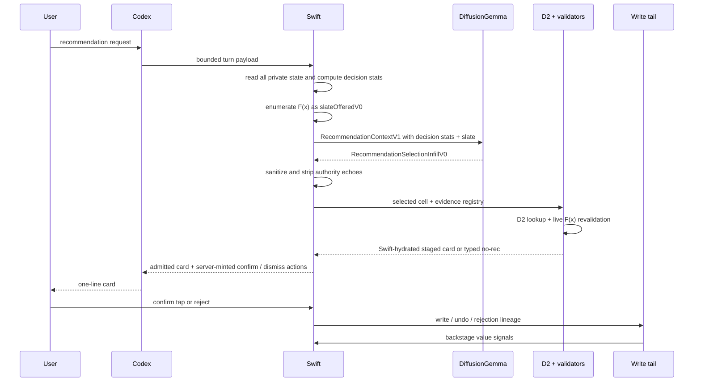
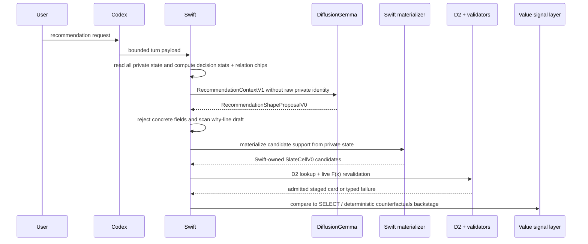

# plan-4-revised.md — Recommendation Manufacturing Architecture

**Governing doctrine:** The cook composes recommendations from a Swift-furnished pantry; Swift owns every liability-bearing mechanic — inventory, evidence, feasible support, validation, provenance, admission, writes, and invisible measurement; the waiter only takes the order and serves what Swift admits; and the most capable component is never the most sovereign.

**Architecture law:**

```text
Codex may relay and serve.
DiffusionGemma may compose and propose.
Swift must validate, admit, write, and measure.
Codex and DiffusionGemma must never grade, admit, or launder their own outputs.
```

**Internal role map.** This map is for the engineering team only. Do not surface it in user-facing copy, onboarding, card text, accessibility labels, marketing, or UX instrumentation. The map is made once here; the rest of the plan names components directly.

| Component | Internal role | Owner | Owns | Borrows | Interface / contract | Freshness / TTL | Trust boundary | Failure mode |
|---|---|---|---|---|---|---|---|---|
| Codex | Waiter: order taker and server | Carrier / dialogue layer | Turn capture, bounded clarification, request relay, admitted-card presentation, dismissal / reroll relay | Swift request context, Swift-staged card, server-minted actions | `POST /v1/carrier/turn`, `RecommendationTurnRequestV0`, `RecommendationTurnResponseV0` | Per turn; no ambient freshness authority | No admission, no grading, no writes, no provenance, no source strength | Over-talks, asks an unnecessary question, echoes authority-looking text, or serves a card Swift did not admit. Guard: response payload may carry only Swift-staged artifacts and server-minted actions. |
| DiffusionGemma | Cook: expensive composition of ingredients into a recommendation shape | Model provider / analysis lane | Semantic composition, contrast, why-line drafting, unresolved-need detection, non-authority proposal payloads, optional shadow telemetry | Swift-furnished decision-sufficient statistics, relation chips, feasible slate cells in SELECT, and shape constraints in PROPOSE | `RecommendationSelectionInfillV0` for SELECT; `RecommendationShapeProposalV0` for PROPOSE shadow; optional `RecommendationCompositionTelemetryV0` | Per analysis call; context-bound; cannot create freshness | No identity, no title, no write time, no calendar target, no source kind / strength, no evidence hash, no provenance, no fingerprint, no verdict, no action | Hallucinates, overclaims personalization, proposes an unsupported shape, or copies authority fields. Guard: allowlist reconstruction, PII/copy scan, D2 lookup, live revalidation. |
| Swift | Restaurant, pantry, equipment, health code, and register | Swift application / calendar backend | Raw user and calendar state, decision-sufficient statistics, feasible support `F(x)`, evidence receipts, source registry, validators, D2, provenance, fingerprints, write gates, undo, lineage, value signals, metrics | Non-authority model proposals and user confirmation | `RecommendationContextV1`, `SlateCellV0`, `D2BindingInputV0`, `D2BindingOutputV0`, `ProposalEnvelopeV0`, `AllowedActionV0`, `RecommendationValueSignalV0` | Live at admission and confirm; TTLs by source; no stale context may confer authority | Admission-critical owner of all liability-bearing state | Over-prunes, silently truncates, leaks identifying data, admits stale support, or treats missing measurement as zero. Guard: no silent truncation, no silent redaction collapse, `support(staged) ⊆ F(x_live)`, `.notMeasured` semantics. |
| Relational Prep Station | Swift-owned prep table | Swift application / reducers | Relation chips among events and candidate windows; topology; heuristic flags; coverage and suppression metadata | Raw Swift state and closed Swift tags | `RelationChipV0`, `RelationChipSetV0`, `RelationChipCoverageV0` | Recomputed per run; TTL no longer than the underlying evidence | Consultable conditioning only unless an owner-gated `F(x)` change explicitly promotes a predicate | Becomes a semantic graph, fingerprints a standing meeting, or steers admission by implication. Guard: no support, provenance, source strength, admission, or writes; parity tests for any `F(x)`-moving change. |

---

## Table of contents

1. [Executive decision](#1-executive-decision)
2. [Named failure mode: premature semantic compression](#2-named-failure-mode-premature-semantic-compression)
3. [Capability is separated from authority](#3-capability-is-separated-from-authority)
4. [Authorship decision: PROPOSE-AND-REVALIDATE](#4-authorship-decision-propose-and-revalidate)
5. [Pantry membrane: decision-sufficient, non-identifying statistics](#5-pantry-membrane-decision-sufficient-non-identifying-statistics)
6. [Relational Prep Station: Swift-owned consultable context](#6-relational-prep-station-swift-owned-consultable-context)
7. [Canonical contracts](#7-canonical-contracts)
8. [D2 and the admission wall](#8-d2-and-the-admission-wall)
9. [End-to-end flows](#9-end-to-end-flows)
10. [Backstage value-signal layer](#10-backstage-value-signal-layer)
11. [Swift-owned scoring, discrimination, and measurement](#11-swift-owned-scoring-discrimination-and-measurement)
12. [Privacy, redaction, and copy honesty](#12-privacy-redaction-and-copy-honesty)
13. [User experience invariants](#13-user-experience-invariants)
14. [Migration sequence](#14-migration-sequence)
15. [Test matrix](#15-test-matrix)
16. [Definition of done](#16-definition-of-done)
17. [Changelog](#17-changelog)
18. [Deliberately preserved safety invariants](#18-deliberately-preserved-safety-invariants)
19. [Self-audit](#19-self-audit)

---

## 1. Executive decision

CalAgent is an information-manufacturing system, not a retrieval system. The output is not a slot and not a pre-enumerated cell. The output is a composed recommendation: why this, now, for this user, under this calendar state, with this evidence basis. The shape of the recommendation — what, when, why, and fit — is the product.

The target architecture is **Evidence-Ledger Composition behind PROPOSE-AND-REVALIDATE**:

```text
Swift considers all user/calendar state
  -> Swift emits decision-sufficient, non-identifying statistics and relation chips
  -> DiffusionGemma proposes a recommendation shape, not a write artifact
  -> Swift independently materializes candidate support
  -> Swift validates, admits, hydrates, fingerprints, stages, and writes only after user confirmation
  -> Swift measures correctness and value backstage
```

The public migration default remains **SELECT** until PROPOSE proves itself in shadow. SELECT is safe because Swift enumerates `slateOfferedV0` and DiffusionGemma can return only `selectedSlotIndex` plus non-authority framing. SELECT is also insufficient as the long-term product posture because it forces Swift to pre-compress the action space before composition. PROPOSE-AND-REVALIDATE is the target because the product wins only when the recommendation shape itself is a felt decision variable.

The permanent safety line is unchanged:

```text
support(staged) ⊆ F(x_live)
```

The model may become more capable, receive better conditioning, and propose richer shapes. None of those changes increases model authority. Swift remains the sole owner of feasible support, admission, provenance, fingerprints, writes, and measurement.

---

## 2. Named failure mode: premature semantic compression

**Premature semantic compression** is the design failure where Swift compresses user/calendar intent into categories, candidate universes, scoring features, templates, semantic graphs, or fixed slates before the system has room to compose the best recommendation.

Selection-only is a form of this failure when it becomes the final architecture. In SELECT, Swift owns the candidate universe before DiffusionGemma composes. If the optimal recommendation shape is not already present in `slateOfferedV0`, the model can only make the available choices sound better. That is retrieval, not manufacturing.

The cure is not raw data egress and not model authority. The cure is a narrower and stronger split:

1. Swift considers the full private state every run.
2. Swift transmits only decision-sufficient, non-identifying statistics and relation chips.
3. DiffusionGemma composes a shape in a high-dimensional recommendation space.
4. Swift independently materializes and validates support for that shape.
5. Only Swift-admitted artifacts can reach the confirm tap.

This preserves ambiguity long enough for composition while keeping identity and authority behind the membrane.

---

## 3. Capability is separated from authority

The load-bearing property is not that DiffusionGemma is limited. The load-bearing property is that capability and authority are deliberately separated.

The high-FLOP actor is allowed to compose meaning and is denied sovereignty. The cheap exact wall owns correctness. This is the generator/verifier asymmetry with a decidable correctness verifier: DiffusionGemma can propose a bad recommendation shape, overfit a why-line, or hallucinate a relation; it cannot put garbage on the real calendar because Swift owns the pantry, the validation equipment, admission, provenance, fingerprints, and writes.

This is a trust feature. The part brilliant enough to compose the user's day is never allowed to change it. That is the reason a user can hand over calendar context without dread.

The confirm tap is therefore not plumbing. It is the moment authority returns to the user. Everything before the tap earns it. Nothing after the tap asks for attention except instant undo and clear failure recovery.

### 3.1 Authority boundaries by surface

| Surface | Free Swift-side computation? | Crosses membrane as conditioning? | Touches admission authority? | Admission-critical? | Rule |
|---|---:|---:|---:|---:|---|
| Raw calendar reads, notes, titles, locations, attendees | yes | no | yes, through Swift validators only | yes when used for support | Stored and reasoned over by Swift; never transmitted raw. |
| Decision-sufficient statistics | yes | yes, when non-identifying | no | no | Conditioning only; must carry coverage and redaction-loss metadata. |
| Relation chips | yes | yes, when non-identifying and approved | no | no | Consultable context only; no support/provenance/source strength. |
| `SlateCellV0` in SELECT | yes | yes | yes, but only as Swift-authored support | yes in D2 | Model may read and select index; Swift owns every write-bearing field. |
| `RecommendationShapeProposalV0` in PROPOSE | no, model-authored | yes, return payload | no | no | Shape hints only; no concrete identity, time, evidence, provenance, verdict, or action. |
| D2 binding | yes | no | yes | yes | Single in-process Swift seam. |
| Value signals | yes | no | no direct admission | no | Backstage measurement only; never user-visible and never model authority. |
| Confirm action | yes | served by Codex/UI only after staging | yes | yes | Server-minted; user tap required. |

---

## 4. Authorship decision: PROPOSE-AND-REVALIDATE

The architecture names and rejects two tempting extremes before adopting the target.

### 4.1 Position A: AUTHOR

In AUTHOR, DiffusionGemma authors a full proposal and Swift admits only what it can mechanically verify:

```text
model-authored proposal
  -> Swift checks support(staged) ⊆ ADMISSIBLE
  -> admit or reject
```

This pays only if the verifier can mechanically prove every liability-bearing field. It is rejected for this product because a full calendar proposal carries identity, concrete time, title, calendar target, evidence basis, source classification, provenance, fingerprint, verdict, and action. Those fields are too close to authority. Letting the model author them and relying on rejection would train engineers to route life-state through the wrong owner.

### 4.2 Position B: SELECT

In SELECT, Swift enumerates the slate and DiffusionGemma selects:

```text
Swift: F(x) = [SlateCellV0]
DiffusionGemma: selectedSlotIndex + why + hints
Swift: hydrate selected cell and revalidate live
```

SELECT is the safe public default during migration. It is correct precisely when the optimal recommendation is already in Swift's enumerated set. It is also the right baseline for dogfood and public fallback because it keeps `support(staged) ⊆ F(x_live)` obvious and testable.

SELECT is not the final manufacturing posture. It cannot compose a recommendation whose shape was not pre-enumerated. It therefore cures hallucination by reintroducing premature semantic compression through the back door.

### 4.3 Position C: PROPOSE-AND-REVALIDATE

In PROPOSE-AND-REVALIDATE, DiffusionGemma proposes a recommendation shape and Swift independently materializes it:

```text
DiffusionGemma: desired outcome + time-window/duration hints + affordances + evidence-to-consider + unresolved needs
Swift: materialize candidates from private state
Swift: validate support, D2-bind evidence, hydrate copy, fingerprint, stage, and write only after tap
```

DiffusionGemma never proposes concrete write artifacts. The proposal shape must not contain:

```text
title
start
end
calendarTarget
source kind
source strength
evidence hash
provenance
fingerprint
validation verdict
AllowedActionV0
calendar write action
calendar object identifier
raw person/place/title strings
```

Swift treats the shape as importance sampling over a search space too large to enumerate exhaustively. It pays only when the action space is high-dimensional: when the recommendation's shape is a felt decision variable, not merely a choice among five free slots.

### 4.4 First-principles defense

The product's value is concentrated in the why-line. The acceptance test is:

```text
Would this why-line be wrong on a different day?
```

If the answer is no, the system did not compose; it vended. A why-line like “You have a free 30 minutes” is stable across days and therefore weak. A why-line like “Your afternoon has a hard social block followed by a narrow low-friction gap, so a quiet reset now protects the evening” is true only under today's state. That is composition.

PROPOSE-AND-REVALIDATE is justified only when it produces why-lines that are true today and shapes that Swift would not have reliably enumerated in SELECT. If the best shape is already represented in `slateOfferedV0`, SELECT is cheaper, safer, and correct.

### 4.5 Migration rule

Public traffic remains on SELECT until PROPOSE passes all gates:

```text
SELECT public default
PROPOSE shadow only
same D2 wall
same live F(x) revalidation
admit-rate parity
why-line-true-today audit
edit-distance / rejection / survival-at-T measurement
owner gate before any public selection-moving change
```

---

## 5. Pantry membrane: decision-sufficient, non-identifying statistics

Swift considers all user and calendar data every run. What crosses the membrane to DiffusionGemma is not “raw data, safely redacted.” What crosses is the set of **decision-sufficient, non-identifying statistics**: the axes that move the recommendation, never the axes that name the user's life.

Example:

```text
Swift raw state: "Dinner with Marcus, recurring, emotionally loaded, not movable."
Model-visible statistics: { socialLoad: high, movable: low, energyCost: high, recoveryNeed: high }
Forbidden egress: Marcus, dinner title, venue, attendee identity, notes, exact relationship label.
```

This dissolves the redaction paradox. Redaction is self-defeating only when it removes the axes carrying the utility gradient. The membrane must preserve the decision gradient while removing identity. It is not a privacy tax on a fuller pantry; it is the discipline of transmitting sufficient statistics for the decision and nothing that names a life.

### 5.1 Contract: `DecisionSufficientStatisticV0`

```swift
struct DecisionSufficientStatisticV0: Codable, Hashable {
  var schemaVersion: Int
  var statisticID: DecisionStatisticIDV0
  var sourceReceiptHashes: [EvidenceHashV0]
  var axis: DecisionAxisV0
  var valueBand: DecisionValueBandV0
  var coverage: MeasurementCoverageV0
  var redactionRisk: RedactionRiskBandV0
  var computedAt: Date
  var expiresAt: Date?
  var owner: StatisticOwnerV0 // Swift reducer or validator identifier
}

enum DecisionAxisV0: String, Codable {
  case energyCost
  case socialLoad
  case mobility
  case setupFriction
  case recoveryNeed
  case deadlinePressure
  case gapTopology
  case travelRisk
  case recurrenceRigidity
  case interruptionRisk
  case calendarDensity
  case daypartFit
  case durationFit
  case userStatedConstraint
}

enum DecisionValueBandV0: String, Codable {
  case unavailable
  case low
  case medium
  case high
  case mixed
  case notMeasured
}
```

Owner: Swift reducers and validators.

Interface: `RecommendationContextV1.decisionStats`.

Owns vs borrows: Each statistic borrows from raw Swift state and evidence receipts; it owns only a banded, non-identifying projection.

Freshness / TTL: No statistic may outlive its source receipt. Calendar-derived statistics revalidate on live calendar change. History-derived statistics carry reducer version and coverage.

Trust boundary: Conditioning only. A statistic cannot mint support, provenance, source strength, or admission.

Failure mode: A statistic collapses identity into a low-cardinality band, drops a decision-moving axis, or silently emits `notMeasured` as zero.

### 5.2 No silent truncation and no silent redaction collapse

Context building must fail closed or emit typed measurement when the model-visible packet loses decision-sufficient signal:

```swift
struct ContextProjectionHealthV0: Codable, Hashable {
  var schemaVersion: Int
  var contextID: RecommendationContextIDV0
  var rawCandidateCount: Int
  var projectedCandidateCount: Int
  var retainedStatisticCount: Int
  var droppedStatisticCountByReason: [ProjectionDropReasonV0: Int]
  var redactionCollisionGroupCount: Int
  var redactionLossBand: ScoreBandV0
  var compactionOverflowBand: ScoreBandV0
  var measurementStatus: MeasurementStatusV0
}

enum ProjectionDropReasonV0: String, Codable {
  case canvasBudgetExceeded
  case identityRisk
  case coverageInsufficient
  case staleSource
  case lowDecisionGradient
  case unsupportedAxis
}
```

Rules:

- Silent truncation is a context-builder failure.
- Silent redaction collapse is a context-builder failure.
- `redactionLossBand` may be computed Swift-side without becoming model-visible.
- A new model-visible band requires owner approval, copy-honesty coverage, and PII review.
- Missing coverage is `.notMeasured`, never zero.

### 5.3 Privacy floor on raw content

Raw event titles, free-text notes, attendee names, exact locations, and low-cardinality identity facts remain Swift-only. Free-text notes never cross the membrane. A closed-vocabulary notes affordance extractor remains owner-gated and may emit only audited flags with coverage and redaction-risk metadata; it may not emit substrings.

---

## 6. Relational Prep Station: Swift-owned consultable context

The previous blanket “no Substrate 2.5” position is narrowed. A distinct model-authored semantic substrate remains rejected. A Swift-owned relational prep station is allowed.

The prep station computes relations among events, gaps, and candidate windows and hands DiffusionGemma relation chips as consultable context. Relation chips are feature engineering over a frozen model, not representation learning. Nothing learns inside this layer. It computes, suppresses, expires, and reports coverage.

Relation chips never carry support, provenance, source strength, admission, verdicts, fingerprints, actions, or writes.

### 6.1 Contract: `RelationChipV0`

```swift
struct RelationChipV0: Codable, Hashable {
  var schemaVersion: Int
  var chipID: RelationChipIDV0
  var relationClass: RelationClassV0
  var subjects: [RelationSubjectDigestV0]
  var relationKind: RelationKindV0
  var valueBand: DecisionValueBandV0
  var evidenceHashes: [EvidenceHashV0]
  var coverage: MeasurementCoverageV0
  var visibility: RelationVisibilityV0
  var heuristic: Bool
  var computedAt: Date
  var expiresAt: Date?
}

enum RelationClassV0: String, Codable {
  case nonSemanticToNonSemantic
  case semanticToNonSemantic
  case semanticToSemantic
}

enum RelationVisibilityV0: String, Codable {
  case swiftOnly
  case modelConditioning
  case suppressedIdentityRisk
  case notMeasured
}
```

Owner: Swift.

Interface: `RecommendationContextV1.relationChips` after suppression.

Owns vs borrows: Borrows Swift event/gap/candidate state; owns only non-identifying relation chips.

Freshness / TTL: Recomputed per run. TTL cannot exceed the shortest underlying source TTL. Any chip touching live free/busy is invalidated by calendar change.

Trust boundary: Conditioning only unless a separate owner-gated `F(x)` predicate change is approved and parity-tested.

Failure mode: A chip becomes a semantic graph edge, launders source strength, identifies a standing meeting, or changes feasibility by implication.

### 6.2 Relation priority

Build relation classes in this order.

#### 6.2.1 Priority 1: non-semantic ↔ non-semantic

This is time/space/conflict topology: gaps, adjacency, travel buffers, recurrence topology, density, conflict windows, open-block fragmentation, and candidate-window geometry.

This class is both reliably computable Swift-side and decision-relevant. Build it first.

Examples:

```text
{ relationKind: adjacentDenseBlock, valueBand: high }
{ relationKind: gapBeforeShort, valueBand: medium }
{ relationKind: travelRiskAfter, valueBand: high }
{ relationKind: recurrenceRigidity, valueBand: high }
```

These chips can move composition but cannot admit support. If a topology relation changes offered feasibility, it is no longer a chip; it is an owner-gated `F(x)` policy change.

#### 6.2.2 Priority 2: semantic ↔ non-semantic

This class links a kind of event or activity to a time/topology need, for example “this kind of event tends to need a buffer.” It can be high value, but it is a learned claim and there is no learner today.

Ship it only as an explicitly flagged heuristic:

```text
heuristic: true
coverage: notMeasured or coverageInsufficient until measured
copy: non-citable unless D2 and CopyHonestyGate approve
```

No prose may dress this up as learned truth. No admission path may depend on it.

#### 6.2.3 Priority 3: semantic ↔ semantic

This class is mostly decoration. DiffusionGemma already handles semantic-to-semantic association better internally from text. Build it last or not at all. If it is built, the justification must show a measured value signal that cannot be recovered by model composition over decision-sufficient statistics.

Semantic-to-semantic relation chips are suppressed by default, never model-authored, and never used to infer source strength or user preference without coverage.

---

## 7. Canonical contracts

### 7.1 `RecommendationContextV1`

```swift
struct RecommendationContextV1: Codable, Hashable {
  var schemaVersion: Int
  var contextID: RecommendationContextIDV0
  var runID: RunIDV0
  var requestID: RecommendationRequestIDV0
  var spinIndex: Int
  var seedHash: String

  var userIntentSummary: String
  var timeZoneID: String
  var clockAnchor: Date
  var window: RecommendationWindowV0

  var decisionStats: [DecisionSufficientStatisticV0]
  var relationChips: [RelationChipV0]
  var availabilitySummary: String
  var historySummary: String?
  var researchSummary: String?
  var userAnswerSummary: String?
  var outcomeSummary: String?

  var evidence: [EvidenceReceiptV0]
  var slateOfferedV0: [SlateCellV0] // SELECT public lane only
  var slateDigest: String?
  var shapeConstraints: [ShapeConstraintV0] // PROPOSE shadow / target lane

  var projectionHealth: ContextProjectionHealthV0
  var loopState: RecommendationLoopStateV0
  var redactionPolicyDigest: String
  var basisPackHash: String
}
```

`contextID` folds request identity, spin index, seed hash, normalized intent hash, evidence receipt hashes and versions, relation-chip digest, projection-health digest, redaction-policy digest, and basis-pack hash. In SELECT it also folds `slateDigest`. In PROPOSE it folds `shapeConstraints` digest.

`contextID` deliberately excludes model prior-analysis text, ambient wall-clock freshness authority, and any raw calendar string. Admission and confirm always revalidate live.

### 7.2 `SlateCellV0`

`SlateCellV0` remains the SELECT cut-line object. It is model-visible but Swift-owned.

```swift
struct SlateCellV0: Codable, Hashable {
  var schemaVersion: Int
  var slotIndex: Int
  var cellID: SlateCellIDV0

  var titleTemplateID: TitleTemplateIDV0
  var titlePreview: String
  var start: Date
  var end: Date
  var isAllDay: Bool
  var calendarTarget: CalendarTargetV0

  var feasibilityDigest: String
  var availabilityClass: AvailabilityClassV0
  var gapBeforeMinutes: Int?
  var gapAfterMinutes: Int?
  var travelPairDigest: String?

  var sourceID: RecommendationCandidateSourceIDV0
  var sourceEvidenceHash: EvidenceHashV0
  var basisEvidenceHashes: [EvidenceHashV0]
  var candidateKindHint: CandidateKindHintV0

  var softScoreBand: ScoreBandV0?
  var preferenceBands: [PreferenceBandHintV0]
  var semanticAffordances: [SemanticAffordanceV0]
  var relationChipIDs: [RelationChipIDV0]

  var planAtomDigest: String?
  var planAtomCount: Int?
}
```

Hard constraints:

- `slotIndex` equals the array index in `slateOfferedV0`.
- `sourceEvidenceHash` maps to a receipt in the frozen context and an owning source in Swift's source registry.
- `basisEvidenceHashes` is a subset of context evidence receipts.
- The model may cite selected-cell basis hashes only if sanitizer and copy-honesty allow it; it may not introduce new hashes.
- `titlePreview` is display conditioning only.
- Staged title uses `titleTemplateID` hydration for fingerprint stability.
- `softScoreBand`, `preferenceBands`, `semanticAffordances`, and `relationChipIDs` are conditioning / ordering only, never admission.

### 7.3 `RecommendationSelectionInfillV0`

```swift
struct RecommendationSelectionInfillV0: Codable, Hashable {
  var selectedSlotIndex: Int?
  var why: String?
  var semanticHints: [SemanticHintV0]
  var unresolvedNeeds: [ResolutionRequestV0]
  var confidence: ConfidenceBandV0
}
```

Owner: DiffusionGemma after sanitizer, but only for non-authority fields.

Interface: SELECT public lane and SELECT shadow arms.

Trust boundary: Cannot author identity, time, title, calendar target, evidence hashes, source kind, source strength, provenance, fingerprint, verdict, or action.

Failure mode: Out-of-range index, authority echo, unsupported personalization claim, PII, or copied hidden field. Failure maps to typed no-recommendation or deterministic floor.

### 7.4 `RecommendationShapeProposalV0`

```swift
struct RecommendationShapeProposalV0: Codable, Hashable {
  var schemaVersion: Int
  var proposalID: RecommendationShapeProposalIDV0
  var contextID: RecommendationContextIDV0
  var desiredOutcome: DesiredOutcomeHintV0
  var timeWindowHint: TimeWindowHintV0?
  var durationHint: DurationHintV0?
  var affordanceHints: [SemanticAffordanceV0]
  var decisionAxesToRespect: [DecisionAxisV0]
  var evidenceDimensionsToConsider: [EvidenceDimensionID]
  var relationChipIDsToConsider: [RelationChipIDV0]
  var unresolvedNeeds: [ResolutionRequestV0]
  var whyLineDraft: String?
  var confidence: ConfidenceBandV0
}
```

Bridge-stamped fields:

- `proposalID`;
- `contextID`;
- provider metadata outside this struct, if stored.

Model-authored fields after sanitization:

- `desiredOutcome`;
- `timeWindowHint`;
- `durationHint`;
- `affordanceHints`;
- `decisionAxesToRespect`;
- `evidenceDimensionsToConsider`;
- `relationChipIDsToConsider`;
- `unresolvedNeeds`;
- `whyLineDraft`;
- `confidence`.

Allowed content:

- desired outcome, such as rest, reset, preparation, decompression, focus protection, recovery, or transition;
- time-window hints, such as early afternoon, after a dense block, before evening, within the request window;
- duration bands, not concrete start/end;
- affordance hints, such as low setup, quiet, outside, social-light, solo, home-friendly;
- evidence dimensions to consider, never evidence hashes;
- relation chip IDs already in the context, never newly invented relations;
- unresolved needs or one blocking question;
- a draft why-line subject to Swift copy-honesty and revalidation.

Forbidden content:

```text
concrete title
concrete write start
concrete write end
calendar target
calendar object ID
source kind
source strength
evidence hash
provenance
fingerprint
validation verdict
allowed action
raw attendee / place / private title / note strings
```

Swift may ignore any hint. Swift must independently materialize candidate support, D2-bind evidence, hydrate the staged card, and revalidate live.

### 7.5 `RecommendationCompositionTelemetryV0`

```swift
struct RecommendationCompositionTelemetryV0: Codable, Hashable {
  var schemaVersion: Int
  var analysisID: RecommendationAnalysisIDV0
  var contextID: RecommendationContextIDV0
  var candidateContrastSummary: String?
  var rejectedShapeReasons: [RedactedShapeContrastV0]
  var providerLatencyBand: LatencyBandV0?
  var selectionEntropyBand: ScoreBandV0?
  var framingEntropyBand: ScoreBandV0?
}
```

Telemetry is never passed to D2, never used as admission evidence, never user-visible, never trusted as a quality verdict, PII scanned, capped, and stored only for shadow diagnostics. Unavailable or malformed telemetry is `.notMeasured`.

### 7.6 `EvidenceReceiptV0` and source binding

```swift
enum EvidenceKindV0: String, Codable, CaseIterable {
  case freeBusy
  case eventRead
  case history
  case researchEvent
  case userAnswer
  case deterministicValidation
}

struct EvidenceReceiptV0: Codable, Hashable {
  var kind: EvidenceKindV0
  var issuer: String
  var summaryHash: EvidenceHashV0
  var dimensionsResolved: [EvidenceDimensionID]
  var issuedAt: Date
  var expiresAt: Date?
  var owningSourceID: RecommendationCandidateSourceIDV0
}

protocol RecommendationCandidateSourceV0 {
  var sourceID: RecommendationCandidateSourceIDV0 { get }
  var evidenceKind: EvidenceKindV0 { get }
  var evidenceHash: EvidenceHashV0 { get }
  var candidateSourceSummaryHash: String { get }
  var expiresAt: Date? { get }
}
```

D2 requires:

```text
receipt.summaryHash == owningSource.evidenceHash
receipt.kind == owningSource.evidenceKind
```

This remains a lookup, never a reconstruction from model text.

### 7.7 `SemanticHintV0`

```swift
struct SemanticHintV0: Codable, Hashable {
  var kind: SemanticHintKindV0
  var label: String
  var confidence: ConfidenceBandV0
  var evidenceHashes: [EvidenceHashV0]
}
```

Rules:

- flat tags only;
- no nested graph;
- no edge verbs;
- no source-kind or strength claims;
- labels scanned for PII and overclaim;
- evidence hashes empty or subset of selected-cell basis hashes in SELECT;
- in PROPOSE, evidence hashes must be empty because the model is proposing shape, not support.

---

## 8. D2 and the admission wall

D2 remains the only net-new admission-critical seam. It is in-process Swift, not a network service, not a second verifier, and not a model-callable tool.

### 8.1 D2 purpose in SELECT

```text
selectedSlotIndex
  -> SlateCellV0 / SlatePlanCellV0
  -> sourceEvidenceHash
  -> EvidenceReceiptV0
  -> RecommendationCandidateSourceV0
  -> closed EvidenceKindV0
  -> provenance strength / copy budget / make factory
  -> validatePropose
```

### 8.2 D2 purpose in PROPOSE

```text
RecommendationShapeProposalV0
  -> Swift materializer derives candidate set from private state
  -> Swift enumerates materialized SlateCellV0 / SlatePlanCellV0
  -> D2 runs the same lookup path as SELECT
  -> validatePropose
```

PROPOSE changes how Swift samples candidate space. It does not change the admission wall.

### 8.3 D2 algorithm

```text
1. Verify context identity and freshness.
2. In SELECT, resolve selected cell by `selectedSlotIndex` and require `cell.slotIndex == selectedSlotIndex`.
3. In PROPOSE, reject all concrete write fields, then ask Swift materializer to produce candidate cells.
4. Verify every candidate has source ID, source evidence hash, basis hashes, and feasibility digest minted by Swift.
5. Lookup receipt by `summaryHash == sourceEvidenceHash`.
6. Lookup owning source by `receipt.owningSourceID` and `sourceIDByEvidenceHash`.
7. Require receipt/source kind equality and hash equality.
8. Classify strength and copy budget only by closed `EvidenceKindV0` plus source factory policy.
9. Verify every basis hash is a fresh context receipt or fresh materializer receipt.
10. Scan model text for PII, unsupported personalization, authority echo, and hidden field copying.
11. Hydrate `ProposalEnvelopeV0` from Swift cell/materialized support, not from model fields.
12. Re-mint `inFlightSelection` from the selected cell's owning source.
13. Run live `F(x_live)` and `validatePropose`.
14. Compute pre-picker fingerprint.
15. Return non-Codable Swift verdict to the staging path.
```

### 8.4 D2 output

```swift
struct D2BindingOutputV0 {
  var proposal: ProposalEnvelopeV0
  var provenance: RecommendationProvenanceV0
  var inFlightSelection: RecommendationInFlightSelectionV0
  var prePickerFingerprint: RecommendationFingerprintV0
  var supportReceiptKinds: Set<EvidenceKindV0>
  var copyBudget: ExplanationCopyBudgetV0
}
```

`RecommendationVerdictV0` remains non-`Codable`. No model, bridge, or carrier may transport it.

### 8.5 Hydration rules

Swift hydrates:

- `proposalID`;
- title from `titleTemplateID` and policy copy;
- start;
- end;
- `isAllDay`;
- `calendarTarget`;
- `basisEvidenceHashes`;
- candidate fingerprint preimage;
- `RecommendationCandidateSourceIDV0`;
- source kind / strength through D2;
- `AllowedActionV0` only after staging.

DiffusionGemma may frame, after scanning:

- `why`;
- `semanticHints`;
- `unresolvedNeeds`;
- `confidence`;
- shape hints in `RecommendationShapeProposalV0`.

DiffusionGemma never hydrates:

- time;
- title;
- calendar target;
- evidence hashes;
- source kind;
- personalization strength;
- provenance;
- action;
- verdict;
- fingerprint.

### 8.6 D2 failure classes

```swift
enum D2BindingFailureV0: Equatable {
  case missingSelection
  case selectedSlotOutOfRange
  case slotIndexMismatch
  case staleContext
  case missingEvidenceReceipt
  case staleEvidenceReceipt
  case missingOwningSource
  case sourceReceiptHashMismatch
  case sourceKindMismatch
  case unsupportedEvidenceKind
  case unsupportedCopyKey
  case modelAuthoredHydrationFieldDetected
  case modelAuthoredAuthorityEchoDetected
  case modelAuthoredConcreteShapeFieldDetected
  case piiDetected
  case unsupportedPersonalizationClaim
  case materializationFailed
  case validateProposeRejected
}
```

Failure behavior is typed. Staleness is not user decline. PII and authority echoes block staging. Missing shape support blocks staging. `validateProposeRejected` preserves existing membrane semantics.

---

## 9. End-to-end flows

### 9.1 Public SELECT flow during migration



SELECT uses the existing `RecommendationSelectionInfillV0` and `SlateCellV0` contracts. It remains the public default until PROPOSE passes shadow gates.

### 9.2 Shadow PROPOSE-AND-REVALIDATE flow



PROPOSE shadow results do not change public traffic until measured. Every admitted shadow card must pass the same D2 wall and live revalidation as SELECT. If materialization changes offered `F(x)`, the experiment requires an explicit parity test and owner gate.

### 9.3 Confirm and write flow

Writes require a server-minted confirm action and a live confirm-time recheck. The action is short-lived, scoped to the staged card, and invalidated by changed support. Swift never touches calendar objects it did not create.

```text
staged card
  -> user confirm tap
  -> live support recheck
  -> post-picker fingerprint
  -> write
  -> undo/edit/delete/survival-at-T measurement
```

The tap is consent. Felt safety does not earn auto-write.

---

## 10. Backstage value-signal layer

The system has a strong correctness verifier and no true value verifier. It can know whether a recommendation is valid enough to write. It cannot mechanically know whether the recommendation is good.

“Survives to write” is necessary but weak. Kept is not loved; deleting is friction. Survival alone Goodharts toward safe, obvious suggestions and lets vending return through the back door. It discards the gradient in rejected proposals and confounds recommendation quality with calendar drift.

Swift therefore owns a backstage value-signal layer. These signals are paired with survival, never replaced by it, and never surfaced to the user.

### 10.1 Contract: `RecommendationValueSignalV0`

```swift
struct RecommendationValueSignalV0: Codable, Hashable {
  var schemaVersion: Int
  var requestID: RecommendationRequestIDV0
  var contextID: RecommendationContextIDV0
  var analysisID: RecommendationAnalysisIDV0?
  var proposalID: ProposalEnvelopeIDV0?
  var shapeProposalID: RecommendationShapeProposalIDV0?
  var prePickerFingerprint: RecommendationFingerprintV0?
  var postPickerFingerprint: RecommendationFingerprintV0?
  var editDistance: RecommendationEditDistanceV0?
  var rejectionSet: CounterfactualSlateLogV0?
  var survivalAtT: SurvivalAtTSignalV0?
  var outcomeReason: RecommendationOutcomeReasonV0
  var measurementStatus: MeasurementStatusV0
}
```

### 10.2 Edit-distance: the dense quality signal

Edit-distance compares the proposed card and the confirmed/written card:

```swift
struct RecommendationEditDistanceV0: Codable, Hashable {
  var titleChanged: Bool
  var startDeltaMinutesBand: ScoreBandV0
  var endDeltaMinutesBand: ScoreBandV0
  var durationDeltaBand: ScoreBandV0
  var calendarTargetChanged: Bool
  var userAddedDetailsBand: ScoreBandV0
  var aggregateEditDistanceBand: ScoreBandV0
  var measurementStatus: MeasurementStatusV0
}
```

This is the closest thing the system has to a value verifier. It measures how much the user had to finish the system's job. It is cheap, dense, and available far earlier than long-horizon retention.

Rules:

- Edit-distance is Swift-side only.
- It never changes admission.
- It never becomes user-visible feedback.
- It may inform future Swift-owned ranking only after coverage and owner gates.
- Missing fingerprints or missing write lineage emit `.notMeasured`.

### 10.3 Logged rejections and counterfactual slate

Rejected proposals carry the gradient. A dismissal, reroll, “not this,” or edit tells the system what kind of composition missed.

```swift
struct CounterfactualSlateLogV0: Codable, Hashable {
  var schemaVersion: Int
  var requestID: RecommendationRequestIDV0
  var publicArm: RecommendationArmV0
  var shadowArm: RecommendationArmV0?
  var offeredCandidateDigests: [SlateCellDigestV0]
  var rejectedCandidateDigests: [SlateCellDigestV0]
  var selectedCandidateDigest: SlateCellDigestV0?
  var rejectionReason: RecommendationOutcomeReasonV0
  var staleAtRejection: Bool
  var measurementStatus: MeasurementStatusV0
}
```

Rules:

- The counterfactual slate is backstage.
- The model does not see rejection gradients as authority.
- User-facing copy must not say “we learned” or visibly grade the user.
- Stale support is separated from user rejection.

### 10.4 Survival-at-T

Survival-at-T measures whether the written recommendation remains on the calendar until approximately 24 hours before the event, not merely whether it survived the confirm tap.

```swift
struct SurvivalAtTSignalV0: Codable, Hashable {
  var tMinusHours: Int // default 24
  var survived: Bool?
  var deleted: Bool
  var edited: Bool
  var moved: Bool
  var staleWindowExpired: Bool
  var measurementStatus: MeasurementStatusV0
}
```

Survival-at-T is paired with edit-distance and rejections. Alone, it over-rewards obvious low-risk suggestions.

### 10.5 Absolute visibility rule

The model has no authority. Measurement has no visibility. The loop improves in the dark.

The value-signal layer is Swift-side, never user-surfaced, never model-visible authority, and never phrased as a user grade. The instant the user can feel they are being measured, the calendar becomes surveillance and the product loses the feeling it sells.

---

## 11. Swift-owned scoring, discrimination, and measurement

Swift may rank already-admitted candidates. Swift may not replace correctness with a value guess, and DiffusionGemma may not grade itself.

### 11.1 Correctness verifier

The correctness verifier is decidable and admission-critical:

- D2 receipt/source binding;
- live `F(x_live)` revalidation;
- duplicate policy;
- write-target policy;
- PII and copy-honesty scan;
- fingerprinting;
- server-minted confirm action;
- confirm-time live recheck.

This verifier answers: “May this staged artifact be shown and written if the user taps?”

### 11.2 Value signals

The value layer answers a weaker question: “Did this recommendation appear to fit after user interaction?” It uses:

- edit-distance;
- logged rejections and counterfactual slates;
- survival-at-T;
- post-write undo / delete / move;
- slate staleness separated from rejection;
- deterministic baseline delta.

No value signal can make an invalid artifact valid.

### 11.3 `PickDiscriminatorV0`

`PickDiscriminatorV0` remains a small Swift-owned ranking layer over admitted candidates. It is not a second LLM verifier.

Allowed features after coverage and owner gates:

- D2 admission success;
- live staleness outcome;
- copy-honesty pass;
- selected-cell soft score band;
- decision-stat coverage;
- relation-chip coverage;
- source-kind outcome rates;
- edit-distance risk bands;
- post-write undo risk;
- survival-at-T bands;
- deterministic baseline delta;
- diversity penalty among admitted candidates;
- stale-risk bands.

Forbidden features:

- model confidence as feasibility;
- model self-rank as usefulness;
- model-authored source strength;
- model-authored evidence kind;
- raw PII;
- unmeasured metrics as zero;
- sampler or re-noising confidence as quality;
- any value signal visible to the user.

### 11.4 `.notMeasured` is never zero

```swift
enum MeasurementStatusV0: String, Codable {
  case measured
  case notMeasured
  case lineageMissing
  case fingerprintMissing
  case provenanceMissing
  case staleWindowExpired
  case classifierCoupled
  case coverageInsufficient
  case ownerGateRequired
}
```

Missing lineage, missing coverage, missing classifier independence, missing fingerprints, and missing counterfactuals never promote or penalize. They are `.notMeasured`.

### 11.5 Measurement before mutation

No adaptive ranking, preference update, relation-chip promotion, or PROPOSE public launch may occur until lineage and both fingerprints exist. Survival, undo, edit-distance, and rejection signals remain `.notMeasured` until lineage can tie request, context, proposal, confirm, write, edit/undo/delete, and survival window together.

---

## 12. Privacy, redaction, and copy honesty

Privacy is part of product correctness. The user hands over sacred calendar space only because the architecture does not leak who and where across the membrane.

### 12.1 Raw-content floor

Never crosses the model membrane by default:

- raw event titles;
- free-text notes or descriptions;
- attendee names, emails, or identities;
- exact locations or addresses;
- raw user history strings;
- low-cardinality facts that identify a person, place, or recurring event.

Swift may read these fields to compute decision-sufficient statistics. Swift may not transmit them raw.

### 12.2 Copy honesty

The why-line is the permission slip. It must be true today and supported by admitted evidence. Copy that overclaims personalization is a staging failure.

`CopyHonestyGate` blocks:

- unsupported claims about preference;
- claims naming people or places that never crossed safely;
- claims that imply source strength the model cannot know;
- claims that cite relation chips as learned truth when they are heuristic;
- claims that use backstage measurement or user behavior as copy.

### 12.3 User-facing privacy rule

No user-facing copy may use the internal restaurant metaphor. No user-facing copy may imply the system knows more than it safely exposes. No user-facing copy may say or imply “we learned you do X” from backstage value signals.

---

## 13. User experience invariants

The single feeling sold is permission to rest. The why-line is the permission slip.

### 13.1 Earn the confirm tap, then disappear

Everything before the tap justifies the tap. Nothing after it asks for attention.

The card should be specific enough to earn trust and small enough to disappear:

```text
what: one proposed block
when: where it will land if confirmed
why: true today, not generic
control: confirm, dismiss, reroll, undo
```

### 13.2 Felt safety

Felt safety is not a banner that says “validated” or “no conflicts.” Felt safety is the absence of dread at the tap:

- the block lands where expected;
- undo is instant;
- the system never touches anything it did not create;
- no private person/place details leak into the card;
- conflict failures are typed and calm;
- no auto-write exists.

### 13.3 Sacred calendar invariants

The unforgivable acts are inviolable invariants, not preferences:

```text
Never write without the confirm tap.
Never edit, move, delete, or overwrite anything the system did not create.
Never leak who/where/raw private strings across the membrane.
Never let measurement become visible surveillance.
```

---

## 14. Migration sequence

### M0 — Wall freeze and metaphor cleanup

- Replace the overloaded end doctrine with the opening doctrine and four-clause law.
- Replace “Codex cashier” with Codex as bounded relay/server.
- Replace “chef” wording with DiffusionGemma as the composition component and use component names in technical sections.
- Name Swift as owner of the restaurant/pantry/equipment/health-code/register in the internal role map.
- Demote `Φ` from equipment to recipe/guidance bias; validators, D2, fingerprinting, `F(x)`, and write gates are Swift equipment.

Acceptance:

- One locatable doctrine.
- One locatable four-clause law.
- One role map.
- No component described in another component's authority terms.

### M1 — Decision-sufficient pantry membrane

- Add `DecisionSufficientStatisticV0`.
- Add `ContextProjectionHealthV0`.
- Fail context building on silent truncation.
- Emit redaction-collapse metrics backstage.
- Preserve raw-content floor.

Acceptance:

- Swift considers all private state every run.
- Only decision-sufficient, non-identifying statistics cross.
- Missing or collapsed signal is typed, not silent.

### M2 — Relational Prep Station shadow

- Add `RelationChipV0` and `RelationChipSetV0`.
- Build non-semantic ↔ non-semantic topology first.
- Mark semantic ↔ non-semantic claims as heuristics.
- Suppress semantic ↔ semantic by default.
- Keep all relation chips non-authoritative.

Acceptance:

- No model-authored graph exists.
- Relation chips cannot carry support, provenance, source strength, admission, or writes.
- Sparse chips are suppressed when they identify a standing event.

### M2.5 — Backstage value-signal layer

- Carry pre-picker and post-picker fingerprints.
- Add `RecommendationValueSignalV0`.
- Add edit-distance between proposed and confirmed/written card.
- Log rejected proposals and counterfactual slates.
- Add survival-at-T, defaulting to approximately 24 hours before event.
- Keep all value signals backstage.

Acceptance:

- Missing lineage is `.notMeasured`.
- Value signals are never user-visible.
- Value signals are never model authority.
- Stale support is separate from rejection.

### M3 — SELECT public lane on revised context

- Keep public traffic on SELECT.
- Use `RecommendationContextV1` with decision stats and relation chips.
- Keep `RecommendationSelectionInfillV0` as the only public model payload.
- Run D2 and live validation unchanged.
- Keep deterministic floor.

Acceptance:

- Model cannot author title/start/end/calendar/evidence/provenance/fingerprint/action.
- D2 remains in-process Swift and the only net-new admission-critical seam.
- Confirm tap remains required.

### M4 — PROPOSE shadow lane

- Add `RecommendationShapeProposalV0`.
- Reject concrete fields in model output.
- Swift materializes candidate support independently.
- Run D2, live validation, copy-honesty, and fingerprinting exactly as SELECT.
- Compare against SELECT and deterministic counterfactuals backstage.

Acceptance:

- PROPOSE changes sampling, not authority.
- `support(staged) ⊆ F(x_live)` remains true.
- Admit-rate parity is measured.
- Why-line-true-today audit runs.

### M5 — Fixed-pool and shape-space evaluation

- Run SELECT vs PROPOSE at fixed request cohorts.
- Measure edit-distance, rejection gradients, survival-at-T, post-write undo, stale attribution, copy-honesty, and deterministic baseline delta.
- Preserve SELECT public default unless PROPOSE wins on value signals without degrading correctness.
- Owner gate any public selection-moving change.

Acceptance:

- Proposal richness alone is irrelevant.
- `survivesToWrite` alone is insufficient.
- PROPOSE must reduce edit-distance and/or rejection while preserving survival-at-T and undo rates.

### M6 — Public PROPOSE gate

- Promote only after M2.5 lineage, M4 parity, M5 value-signal lift, copy-honesty pass, PII pass, and owner approval.
- Keep SELECT deterministic fallback permanently available.
- Keep all measurement invisible.

Acceptance:

- Capability rises without authority rising.
- The public user sees only a card that earned the tap.

---

## 15. Test matrix

| Test | Target | Milestone | Invariant |
|---|---|---:|---|
| `testOpeningDoctrineIsSingleSentence` | docs / architecture lint | M0 | One doctrine, locatable at top. |
| `testFourClauseArchitectureLawExists` | docs / architecture lint | M0 | One four-clause law. |
| `testRestaurantRoleMapOccursOnce` | docs / architecture lint | M0 | Internal metaphor mapped once only. |
| `testNoUserFacingRestaurantCopy` | UX copy tests | M0 | Metaphor never surfaces to users. |
| `testCodexCannotAdmitOrGrade` | carrier tests | M0 | Codex relays and serves only. |
| `testDiffusionGemmaCannotAuthorAuthorityFields` | analysis tests | M3/M4 | No title/time/calendar/evidence/provenance/fingerprint/action. |
| `testSwiftOwnsAllAdmissionCriticalFields` | validator tests | M3/M4 | Swift validates, admits, writes, measures. |
| `testDecisionStatsContainNoRawIdentity` | redaction tests | M1 | Statistics move decision without naming life. |
| `testDecisionStatsPreserveUtilityAxes` | context tests | M1 | Redaction does not erase decision gradient silently. |
| `testContextProjectionHealthEmitsOnTruncation` | context tests | M1 | No silent truncation. |
| `testRedactionCollapseIsTyped` | context tests | M1 | No silent redaction collapse. |
| `testFreeTextNotesNeverCrossMembrane` | redaction tests | M1 | Notes floor preserved. |
| `testRelationChipNoSupportFields` | prep station tests | M2 | Relation chips are consultable context only. |
| `testRelationChipPriorityNonSemanticTopology` | prep station tests | M2 | Build first class first. |
| `testSemanticNonSemanticHeuristicFlagRequired` | prep station tests | M2 | No heuristic dressed as learned truth. |
| `testSemanticSemanticSuppressedByDefault` | prep station tests | M2 | Decoration does not crowd context. |
| `testSlateCellIndexEqualsArrayIndex` | contract tests | M3 | SELECT index identity cannot drift. |
| `testShapeProposalRejectsConcreteTitle` | propose tests | M4 | Shape proposal cannot author write identity. |
| `testShapeProposalRejectsConcreteTime` | propose tests | M4 | Shape proposal cannot author write time. |
| `testShapeProposalEvidenceHashesEmpty` | propose tests | M4 | Shape proposal cannot author evidence basis. |
| `testSwiftMaterializesShapeIndependently` | materializer tests | M4 | Proposal shape is not support. |
| `testD2LookupUsesReceiptOwningSource` | D2 tests | M3/M4 | Lookup, not reconstruction. |
| `testD2InProcessOnly` | topology tests | M3/M4 | No admission RPC. |
| `testSupportStagedSubsetOfLiveF` | validator tests | M3/M4 | Live validation wall. |
| `testRecommendationVerdictNonCodable` | contract tests | M3/M4 | Verdict cannot be transported by model. |
| `testConfirmTapRequiredForWrite` | write tests | M3/M4 | Tap is consent. |
| `testCannotTouchNonCreatedEvents` | calendar mutation tests | M3/M4 | Sacred calendar invariant. |
| `testEditDistanceRequiresBothFingerprints` | value tests | M2.5 | Measurement before mutation. |
| `testRejectedSlateLoggedBackstageOnly` | value tests | M2.5 | Rejections carry gradient invisibly. |
| `testSurvivalAtTNotAtTapOnly` | value tests | M2.5 | Survival measured near event horizon. |
| `testValueSignalsNotUserVisible` | UX / API tests | M2.5 | Loop improves in the dark. |
| `testValueSignalsNotModelAuthority` | analysis tests | M2.5 | Measurement cannot grade into admission. |
| `testNotMeasuredNeverZero` | measurement tests | all | Missing data cannot promote. |
| `testWhyLineTrueTodayAudit` | evaluation tests | M5 | Composition must be day-specific. |
| `testSelectWinsWhenOptimalCellAlreadyEnumerated` | eval tests | M5 | SELECT remains correct in low-dimensional cases. |
| `testProposeAdmitRateParity` | guidance parity tests | M4/M5 | Shape sampling cannot bypass wall. |
| `testProposeReducesEditDistanceWithoutUndoRise` | eval tests | M5 | Value signal lift, not vanity survival. |
| `testPublicProposeRequiresOwnerGate` | release tests | M6 | Shadow-first, parity-tested public launch. |

---

## 16. Definition of done

- [ ] The document opens with one governing doctrine, one four-clause law, and one internal role map.
- [ ] The role map names Codex, DiffusionGemma, Swift, and the Relational Prep Station and gives each owner, interface, freshness, trust boundary, and failure mode.
- [ ] No user-facing section surfaces the internal restaurant metaphor.
- [ ] PREMATURE SEMANTIC COMPRESSION is named as the failure mode and tied to SELECT-only design.
- [ ] PROPOSE-AND-REVALIDATE is the named target authorship decision.
- [ ] SELECT remains the public default during migration.
- [ ] The target is defended by action-space dimensionality and the why-line-true-today test.
- [ ] `RecommendationShapeProposalV0` cannot carry title, concrete time, calendar target, evidence hash, source kind, source strength, provenance, fingerprint, verdict, or action.
- [ ] Swift considers all private state every run and transmits only decision-sufficient, non-identifying statistics.
- [ ] `DecisionSufficientStatisticV0` and `ContextProjectionHealthV0` make no silent truncation / no silent redaction collapse testable.
- [ ] Free-text notes, raw event titles, attendees, exact locations, and low-cardinality identity facts stay behind Swift.
- [ ] The Relational Prep Station is allowed only as Swift-owned feature engineering over a frozen model.
- [ ] Relation priority is non-semantic↔non-semantic first, semantic↔non-semantic second as heuristic, semantic↔semantic last or never.
- [ ] D2 remains the only net-new admission-critical seam, in-process Swift.
- [ ] No second verifier, admission RPC, model-authored ontology, D2 network service, or model-authored provenance exists.
- [ ] `support(staged) ⊆ F(x_live)` is preserved in SELECT and PROPOSE.
- [ ] Measurement before mutation remains enforced; survival/undo/edit-distance stay `.notMeasured` until lineage and both fingerprints exist.
- [ ] `.notMeasured` is never zero.
- [ ] Backstage value signals include edit-distance, logged rejections / counterfactual slate, and survival-at-T.
- [ ] Value signals are Swift-side, never user-surfaced, and never model-visible authority.
- [ ] Confirm tap remains required; felt safety never becomes auto-write.
- [ ] The deterministic SELECT floor remains available after PROPOSE launch.

---

## 17. Changelog

This changelog cites the original `plan-4-revised.md` by section, source line range, and contract/type name. Line numbers refer to the uploaded source file before this rewrite.

| Material change | Doctrine principle served | Original section / lines touched | Contract / type names touched | Reversal made explicit |
|---|---|---|---|---|
| Replaced the top status/core-ethos block with one governing doctrine, one four-clause law, and one role map. | Legibility; capability ≠ authority. | Original top block lines 1-20; original one-line doctrine lines 2400-2401. | `RecommendationContextV0`, `SlateCellV0`, D2 wall terms. | Collapsed overloaded end doctrine into separate doctrine / law / migration / quality / privacy statements. |
| Promoted Codex from “cashier” to waiter in the internal role map, with no admission/grading authority. | Waiter relays and serves; cooks nothing, grades nothing. | Original §7 step 1 lines 647-650 described Codex as cashier. | `RecommendationTurnRequestV0`, `RecommendationTurnResponseV0`. | Corrects cashier metaphor and forbids Codex grading. |
| Named Swift as the restaurant/pantry/equipment/health-code/register owner. | Swift owns liability-bearing state. | Original opening lines 15-20 and §15 lines 1742-1783 listed Swift ownership without naming Swift as the whole restaurant. | `D2BindingOutputV0`, `AllowedActionV0`, `RecommendationVerdictV0`, `ProposalEnvelopeV0`. | Makes Swift owner of pantry, validators, D2, fingerprints, `F(x)`, writes, and measurement. |
| Demoted `Φ` from stove/equipment to recipe/guidance bias. | Capability can rise without authority rising. | Original §2 conflict row lines 113-114; §3.1 lines 208-214; §10.6 lines 1178-1181; §21 P3 lines 2314-2322. | `PickDiscriminatorV0`, `GuidanceParityTests`. | `Φ` is not equipment and never admission. Swift validators and D2 are the equipment. |
| Named PREMATURE SEMANTIC COMPRESSION as the villain. | Information manufacturing, not retrieval. | Original §1 lines 51-99 named ontology compression but did not generalize the disease to categories/slates/templates. | `SlateCellV0`, `slateOfferedV0`, `PreferenceVectorV0`. | Selection-only is called out as compression when final. |
| Replaced SELECT as target with PROPOSE-AND-REVALIDATE as target while keeping SELECT public default. | Compose shape before materialization; safe migration. | Original §2 lines 103-111, §3 lines 137-193, §8.7 lines 921-927, §19 M3 lines 2111-2135. | `RecommendationSelectionInfillV0`, new `RecommendationShapeProposalV0`, `SlateCellV0`, `ProposalEnvelopeV0`. | Reverses “candidate-shape-propose does not exist” into a shadow target contract, still non-authoritative. |
| Added first-principles defense for authorship: action-space dimensionality and why-line-true-today. | Manufacturing must not become slogan. | Original §3.1-§3.3 lines 195-251 and §21 lines 2268-2339 focused on scaling and survival, not felt shape. | `RecommendationShapeProposalV0`, `RecommendationValueSignalV0`. | SELECT is declared correct only when the optimal shape is already enumerated. |
| Reframed the pantry as decision-sufficient, non-identifying statistics. | Privacy without losing utility gradient. | Original §5.1 lines 312-338, §5.3 lines 439-493, §12.4 lines 1434-1447, §13.5 lines 1596-1613. | New `DecisionSufficientStatisticV0`, `ContextProjectionHealthV0`; existing `EvidenceReceiptV0`. | Replaces blanket “raw notes never cross” framing with “decision axes cross, identifying axes do not.” |
| Made no silent truncation / no silent redaction collapse first-class requirements. | Legibility and privacy contract. | Original §8.6 lines 857-892 and §12.4 lines 1434-1447 treated this mainly as telemetry. | `ContextCompactionOverflowTelemetryV0`, `RedactionDistinguishabilityTelemetryV0`, new `ContextProjectionHealthV0`. | Moves from telemetry trivia to context-builder invariant. |
| Un-declined a narrow relational prep station. | More prep without model authority. | Original §5.5 lines 534-547, §18.2 lines 1958-1970, §20 test lines 2247-2259. | New `RelationChipV0`, `RelationChipSetV0`; existing `RelationalBandHintV0`. | Reverses “no Substrate 2.5” into Swift-owned prep chips, not a model-authored relation store. |
| Ranked relation classes honestly. | Avoid dressing heuristics as learning. | Original §12.2 lines 1390-1403 listed relational bands without class priority. | `RelationChipV0`, `RelationClassV0`. | non-semantic↔non-semantic first; semantic↔non-semantic heuristic; semantic↔semantic last/never. |
| Added backstage value-signal layer. | Correctness verifier ≠ value verifier. | Original §11.5 lines 1298-1324 included quality dimensions but not the value-verifier gap; §21 lines 2268-2339 leaned on survival experiments. | New `RecommendationValueSignalV0`, `RecommendationEditDistanceV0`, `CounterfactualSlateLogV0`, `SurvivalAtTSignalV0`. | Adds edit-distance, logged rejections, and survival-at-T; survival alone no longer stands as success. |
| Made measurement invisible by invariant. | Calendar must not become surveillance. | Original §11 lines 1184-1355 and §16.3 lines 1833-1849 put measurement backstage but did not state user invisibility as product law. | `MeasurementStatusV0`, `RecommendationValueSignalV0`, `PickDiscriminatorV0`. | Model has no authority; measurement has no visibility; loop improves in the dark. |
| Preserved D2 as only net-new admission-critical seam. | Single cheap exact wall. | Original §9 lines 929-1045 and §15 lines 1742-1783. | `D2BindingInputV0`, `D2BindingOutputV0`, `RecommendationSourceRegistryV0`, `EvidenceReceiptV0`. | No second verifier, no network service, no model-authored ontology. |
| Preserved hydration firewall and expanded it to PROPOSE. | Fuller pantry ≠ more authority. | Original §14.2 lines 1704-1740. | `ProposalEnvelopeV0`, `SlateCellV0`, `RecommendationShapeProposalV0`. | Shape proposal cannot hydrate write fields. |
| Reframed UX around permission to rest and confirm tap. | The tap is drama, not plumbing. | Original §13.2-§13.4 lines 1537-1594 had model-visible instructions and sanitizer behavior but no UX law. | `AllowedActionV0`, `ProposalEnvelopeV0`, `CopyHonestyGate`. | Felt safety remains consent-based, never auto-write. |
| Resequenced migration around shadow PROPOSE, parity, and value signals. | Safe public default until measured. | Original §19 lines 2035-2178. | `RecommendationShapeProposalV0`, `RecommendationValueSignalV0`, `PickDiscriminatorV0`. | SELECT public; PROPOSE shadow; owner gate before public selection-moving change. |

---

## 18. Deliberately preserved safety invariants

| Preserved invariant | Why it survived untouched in force |
|---|---|
| The authority firewall: the model never authors identity, time, title, evidence hashes, source kind, strength, provenance, fingerprint, verdict, or action; Swift hydrates and revalidates live with `support(staged) ⊆ F(x_live)`. | This is the core trust contract. PROPOSE changes sampling, not authority. |
| D2 remains the only net-new admission-critical seam, in-process Swift; no second verifier, no admission RPC, no model-authored ontology, no D2 network service. | One exact wall is easier to audit than several soft walls. |
| Measurement before mutation: survival, undo, edit-distance, and value signals remain `.notMeasured` until lineage and both fingerprints exist. | Without lineage, metrics are fiction and can promote unsafe changes. |
| `.notMeasured` is never zero. | Missing information cannot become evidence for promotion or suppression. |
| Missing lineage, missing coverage, and classifier coupling cannot silently promote a feature. | Prevents self-mutating loops from laundering uncertainty into product authority. |
| Model-authored semantic graphs remain rejected. | A model-authored edge can launder source strength, identity, or admission facts. The prep station is Swift-owned and non-authoritative instead. |
| The privacy floor on raw content remains. | Raw titles, notes, attendees, and exact locations name a life; only decision-sufficient statistics may cross. |
| Free-text notes never cross the membrane. | Notes are unbounded PII and substring leakage risk; closed flags require a separate owner gate. |
| Copy honesty is part of staging. | A valid time with an unsupported why-line is still a user-visible false claim. |
| Server-minted confirm action is required for writes. | Felt safety does not imply consent; the tap is the consent ritual. |
| Swift never touches calendar objects the system did not create. | The calendar is sacred space, not a feed or scratchpad. |
| P3 / admit-rate parity applies to guided, pinned, or shape-proposed candidates. | Guidance must not leak into authority by changing validation semantics. |
| Deterministic SELECT fallback remains available. | A measured target lane needs a safe floor and rollback path. |
| The model may become more capable without becoming more sovereign. | Capability rise is the product bet; authority rise would break trust. |

---

## 19. Self-audit

| Litmus test | Yes / No | Evidence |
|---|---:|---|
| Is there one locatable governing doctrine and one four-clause law? | Yes | The first two blocks of this document are `Governing doctrine` and `Architecture law`; the old overloaded one-line doctrine is removed from the end. |
| Is the metaphor mapped exactly once, with no component described in another's terms? | Yes | The only mapping is the opening `Internal role map`. Technical sections thereafter use component names and authority boundaries. The map assigns Codex relay/service, DiffusionGemma composition/proposal, Swift liability-bearing state, and the Relational Prep Station consultable prep. |
| Is the authorship decision named and defended from first principles, not assumed? | Yes | §4 names AUTHOR, SELECT, and PROPOSE-AND-REVALIDATE; §4.4 defends the target with action-space dimensionality and the why-line-true-today test; §4.2 states when SELECT is correct. |
| Is the pantry written as decision-sufficient statistics, never as “raw data, safely”? | Yes | §5 states Swift considers all data but transmits only decision-sufficient, non-identifying statistics; `DecisionSufficientStatisticV0` and `ContextProjectionHealthV0` make this testable. |
| Are all value signals backstage: Swift-side, never user-surfaced, never model authority? | Yes | §10.5 states the absolute visibility rule; §10.1-§10.4 define edit-distance, rejections, and survival-at-T as Swift-owned backstage measurement. |
| Does capability rise without authority rising, everywhere? | Yes | §3.1 marks each surface as computation, conditioning, or admission; §4.3 forbids concrete authority fields in shape proposals; §8 keeps D2 and hydration in Swift; §14 promotes PROPOSE only after parity and owner gates. |
| Does the document preserve D2 as the single net-new admission-critical seam? | Yes | §8 names D2 as the only net-new admission-critical seam, in-process Swift, with no network service or second verifier. |
| Does the document confront the value-verifier gap? | Yes | §10 states the system has a strong correctness verifier and no true value verifier, explains why survival alone Goodharts, and adds edit-distance, rejected-counterfactuals, and survival-at-T. |
| Does the document cure premature semantic compression without leaking private identity? | Yes | §2 names the failure; §5 transmits utility axes without identity; §6 adds Swift-owned relation chips; §4 lets the model propose shape while Swift materializes support. |
| Does public migration stay safe until measured? | Yes | §4.5 and §14 keep SELECT public, PROPOSE shadow, D2 wall identical, parity required, and owner gate before public movement. |
